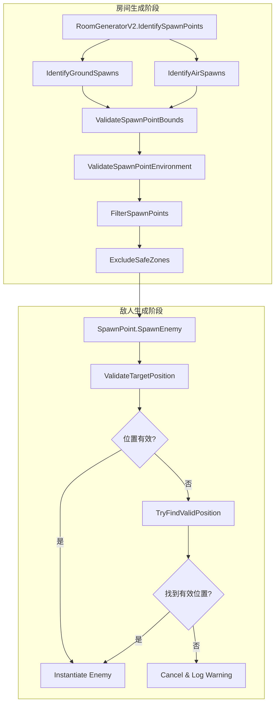

# Design Document: Enemy Spawn Position Fix

## Overview

本设计文档描述了修复怪物生成位置问题的技术方案。主要改进两个核心模块：
1. `RoomGeneratorV2` 中的生成点识别逻辑
2. `SpawnPoint` 中的敌人实例化逻辑

## Architecture



## Components and Interfaces

### 1. SpawnPointValidator (新增静态工具类)

```csharp
namespace CryptaGeometrica.LevelGeneration.SmallRoomV2
{
    /// <summary>
    /// 生成点验证工具类
    /// </summary>
    public static class SpawnPointValidator
    {
        /// <summary>
        /// 验证生成点是否在有效边界内
        /// </summary>
        /// <param name="position">生成点网格坐标</param>
        /// <param name="roomWidth">房间宽度</param>
        /// <param name="roomHeight">房间高度</param>
        /// <param name="edgePadding">边缘填充距离</param>
        /// <returns>是否在有效边界内</returns>
        public static bool IsWithinBounds(Vector2Int position, int roomWidth, int roomHeight, int edgePadding);
        
        /// <summary>
        /// 验证地面生成点周围环境
        /// </summary>
        /// <param name="position">生成点网格坐标</param>
        /// <param name="roomData">房间数据</param>
        /// <param name="requiredHeadroom">需要的头顶空间(默认3)</param>
        /// <param name="requiredSideSpace">需要的左右空间(默认1)</param>
        /// <returns>环境是否有效</returns>
        public static bool ValidateGroundEnvironment(Vector2Int position, RoomDataV2 roomData, int requiredHeadroom = 3, int requiredSideSpace = 1);
        
        /// <summary>
        /// 验证空中生成点周围环境
        /// </summary>
        /// <param name="position">生成点网格坐标</param>
        /// <param name="roomData">房间数据</param>
        /// <returns>周围8格是否都是Floor</returns>
        public static bool ValidateAirEnvironment(Vector2Int position, RoomDataV2 roomData);
        
        /// <summary>
        /// 检查位置是否在安全区内
        /// </summary>
        /// <param name="position">生成点网格坐标</param>
        /// <param name="entrancePos">入口位置</param>
        /// <param name="exitPos">出口位置</param>
        /// <param name="safeDistance">安全距离</param>
        /// <returns>是否在安全区内</returns>
        public static bool IsInSafeZone(Vector2Int position, Vector2Int entrancePos, Vector2Int exitPos, int safeDistance);
    }
}
```

### 2. RoomGeneratorV2 修改

修改 `IdentifyGroundSpawns()` 和 `IdentifyAirSpawns()` 方法，增加边界和环境验证。

### 3. SpawnPoint 修改

修改 `SpawnEnemy()` 方法，增加碰撞检测和位置调整逻辑。

## Data Models

### SpawnPointV2 扩展

```csharp
[Serializable]
public struct SpawnPointV2
{
    // 现有字段...
    
    /// <summary>
    /// 生成点是否通过验证
    /// </summary>
    public bool isValid;
    
    /// <summary>
    /// 验证失败原因（用于调试）
    /// </summary>
    public string invalidReason;
}
```

## Correctness Properties

*A property is a characteristic or behavior that should hold true across all valid executions of a system-essentially, a formal statement about what the system should do. Properties serve as the bridge between human-readable specifications and machine-verifiable correctness guarantees.*

### Property 1: 生成点边界有效性

*For any* 生成的 SpawnPointV2, 其 position 必须满足:
- position.x >= edgePadding
- position.x < roomWidth - edgePadding
- position.y >= edgePadding
- position.y < roomHeight - edgePadding

**Validates: Requirements 1.1, 1.2, 1.3**

### Property 2: 地面生成点环境有效性

*For any* 类型为 Ground 的 SpawnPointV2, 在对应的 RoomDataV2 中:
- position 上方连续3格都是 Floor
- position 左右各1格都是 Floor
- position 下方1格是 Solid (Wall 或 Platform)

**Validates: Requirements 2.1, 2.2**

### Property 3: 空中生成点环境有效性

*For any* 类型为 Air 的 SpawnPointV2, 在对应的 RoomDataV2 中:
- position 周围8个方向的格子都是 Floor

**Validates: Requirements 2.3**

### Property 4: 安全区排除有效性

*For any* 生成的 SpawnPointV2, 其 position 必须满足:
- 与入口位置的曼哈顿距离 >= entranceClearDepth + 2
- 与出口位置的曼哈顿距离 >= entranceClearDepth + 2

**Validates: Requirements 5.1, 5.2**

## Error Handling

| 错误场景 | 处理方式 |
|---------|---------|
| 生成点边界验证失败 | 跳过该位置，不添加到生成点列表 |
| 生成点环境验证失败 | 跳过该位置，记录 invalidReason |
| 敌人实例化位置有碰撞 | 向上偏移查找有效位置，最多5格 |
| 无法找到有效生成位置 | 取消生成，记录 Warning 日志 |

## Testing Strategy

### 单元测试

- 测试 `SpawnPointValidator.IsWithinBounds` 边界条件
- 测试 `SpawnPointValidator.ValidateGroundEnvironment` 各种房间布局
- 测试 `SpawnPointValidator.ValidateAirEnvironment` 各种房间布局
- 测试 `SpawnPointValidator.IsInSafeZone` 安全区计算

### 属性测试

使用 NUnit + FsCheck 或类似框架进行属性测试：

1. **Property 1 测试**: 生成随机房间参数，验证所有生成点都在边界内
2. **Property 2 测试**: 生成随机房间数据，验证所有地面生成点环境有效
3. **Property 3 测试**: 生成随机房间数据，验证所有空中生成点环境有效
4. **Property 4 测试**: 生成随机房间数据，验证所有生成点都不在安全区内

### 集成测试

- 在 Unity Editor 中运行房间生成，验证 Gizmos 显示正确
- 运行游戏，验证敌人不会卡在墙里或生成在房间外
