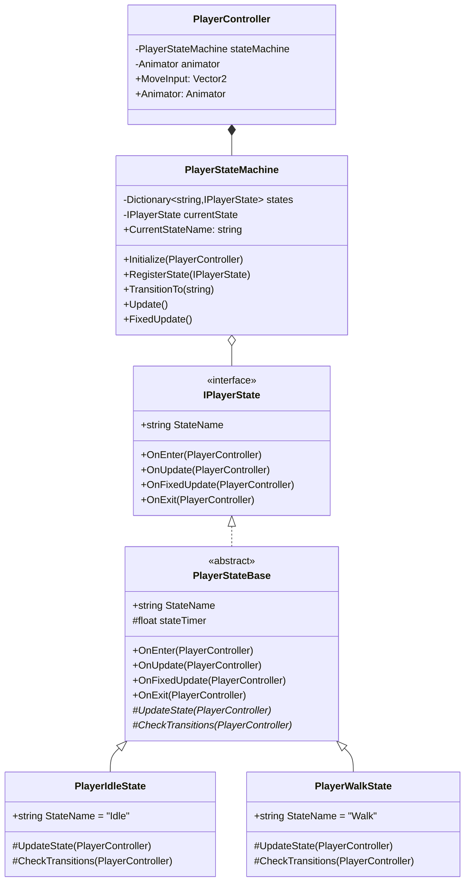
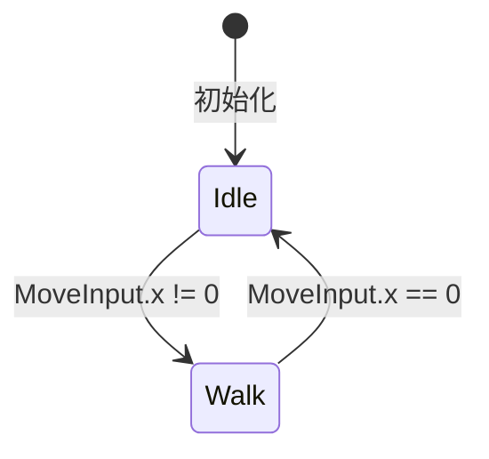

# Design Document: Player State Machine

## Overview

本设计为玩家角色实现一个轻量级状态机系统，用于管理玩家的动画状态。系统架构参考项目中已有的敌人状态机（EnemyStateMachine），但针对玩家场景进行简化，仅关注Idle和Walk两个核心状态。

状态机与现有的PlayerController集成，通过读取移动输入来决定状态转换，并通过Animator组件播放对应动画。

## Architecture



## Components and Interfaces

### IPlayerState Interface

定义玩家状态的标准接口，所有状态必须实现。

```csharp
namespace CryptaGeometrica.PlayerSystem
{
    public interface IPlayerState
    {
        string StateName { get; }
        void OnEnter(PlayerController player);
        void OnUpdate(PlayerController player);
        void OnFixedUpdate(PlayerController player);
        void OnExit(PlayerController player);
    }
}
```

### PlayerStateBase Abstract Class

提供状态的基础实现，包含计时器和生命周期模板方法。

```csharp
namespace CryptaGeometrica.PlayerSystem
{
    public abstract class PlayerStateBase : IPlayerState
    {
        public abstract string StateName { get; }
        protected float stateTimer = 0f;
        
        public virtual void OnEnter(PlayerController player)
        {
            stateTimer = 0f;
        }
        
        public virtual void OnUpdate(PlayerController player)
        {
            stateTimer += Time.deltaTime;
            UpdateState(player);
            CheckTransitions(player);
        }
        
        public virtual void OnFixedUpdate(PlayerController player) { }
        
        public virtual void OnExit(PlayerController player) { }
        
        protected abstract void UpdateState(PlayerController player);
        protected abstract void CheckTransitions(PlayerController player);
    }
}
```

### PlayerStateMachine Class

管理状态的注册、转换和更新。

```csharp
namespace CryptaGeometrica.PlayerSystem
{
    public class PlayerStateMachine
    {
        private Dictionary<string, IPlayerState> states;
        private IPlayerState currentState;
        private PlayerController owner;
        
        public string CurrentStateName => currentState?.StateName ?? "None";
        
        public void Initialize(PlayerController player);
        public void RegisterState(IPlayerState state);
        public bool TransitionTo(string stateName);
        public void Update();
        public void FixedUpdate();
    }
}
```

### PlayerIdleState Class

站立状态，当无水平移动输入时激活，播放Idle动画。

```csharp
namespace CryptaGeometrica.PlayerSystem
{
    public class PlayerIdleState : PlayerStateBase
    {
        public override string StateName => "Idle";
        
        public override void OnEnter(PlayerController player)
        {
            base.OnEnter(player);
            player.Animator.Play("Idle");
        }
        
        protected override void UpdateState(PlayerController player) { }
        
        protected override void CheckTransitions(PlayerController player)
        {
            if (Mathf.Abs(player.MoveInput.x) > 0.01f)
            {
                player.StateMachine.TransitionTo("Walk");
            }
        }
    }
}
```

### PlayerWalkState Class

行走状态，当有水平移动输入时激活，播放Walk动画。

```csharp
namespace CryptaGeometrica.PlayerSystem
{
    public class PlayerWalkState : PlayerStateBase
    {
        public override string StateName => "Walk";
        
        public override void OnEnter(PlayerController player)
        {
            base.OnEnter(player);
            player.Animator.Play("Walk");
        }
        
        protected override void UpdateState(PlayerController player) { }
        
        protected override void CheckTransitions(PlayerController player)
        {
            if (Mathf.Abs(player.MoveInput.x) <= 0.01f)
            {
                player.StateMachine.TransitionTo("Idle");
            }
        }
    }
}
```

## Data Models

### State Transition Flow



### PlayerController Integration

PlayerController需要新增以下成员：

| 成员 | 类型 | 访问级别 | 说明 |
|------|------|----------|------|
| stateMachine | PlayerStateMachine | private | 状态机实例 |
| animator | Animator | private/SerializeField | 动画控制器引用 |
| MoveInput | Vector2 | public (get) | 暴露移动输入供状态读取 |
| Animator | Animator | public (get) | 暴露Animator供状态控制动画 |
| StateMachine | PlayerStateMachine | public (get) | 暴露状态机供状态请求转换 |

## Correctness Properties

*A property is a characteristic or behavior that should hold true across all valid executions of a system-essentially, a formal statement about what the system should do. Properties serve as the bridge between human-readable specifications and machine-verifiable correctness guarantees.*

### Property 1: State Registration Consistency

*For any* set of states registered to the state machine, each state should be retrievable by its StateName, and the total count should match the number of unique states registered.

**Validates: Requirements 1.1, 1.2**

### Property 2: State Transition Lifecycle

*For any* state transition from state A to state B, OnExit should be called on state A before OnEnter is called on state B, and the current state should be B after the transition completes.

**Validates: Requirements 1.3**

### Property 3: Update Forwarding

*For any* state machine with a current state, calling Update() or FixedUpdate() on the state machine should forward the call to the current state's corresponding method.

**Validates: Requirements 1.4**

### Property 4: State Timer Accumulation

*For any* state, the stateTimer should accumulate deltaTime on each OnUpdate call, starting from 0 when the state is entered.

**Validates: Requirements 2.4**

### Property 5: Input-Based State Selection

*For any* horizontal movement input value, if the absolute value is greater than 0.01, the state machine should be in Walk state; if less than or equal to 0.01, it should be in Idle state (after transitions are processed).

**Validates: Requirements 3.1, 3.3, 4.1, 4.3**

## Error Handling

| 场景 | 处理方式 |
|------|----------|
| 注册空状态 | 记录警告日志，忽略注册 |
| 转换到不存在的状态 | 记录错误日志，保持当前状态 |
| 状态机未初始化时调用Update | 静默返回，不执行任何操作 |
| Animator组件缺失 | 状态正常运行，但跳过动画播放 |

## Testing Strategy

### Unit Tests

由于Unity MonoBehaviour的特殊性，核心逻辑测试集中在：
- 状态机的状态注册和检索
- 状态转换的生命周期调用顺序
- 状态计时器的累加逻辑

### Integration Tests (Manual)

在Unity编辑器中进行手动测试：
1. 运行游戏，验证角色初始播放Idle动画
2. 按下移动键，验证切换到Walk动画
3. 松开移动键，验证切换回Idle动画
4. 快速切换输入，验证状态转换的响应性

### Property-Based Testing

使用NUnit + 自定义测试框架验证核心属性：
- 状态注册的一致性
- 状态转换的生命周期正确性
- 输入到状态的映射正确性

测试配置：每个属性测试运行100次迭代。
