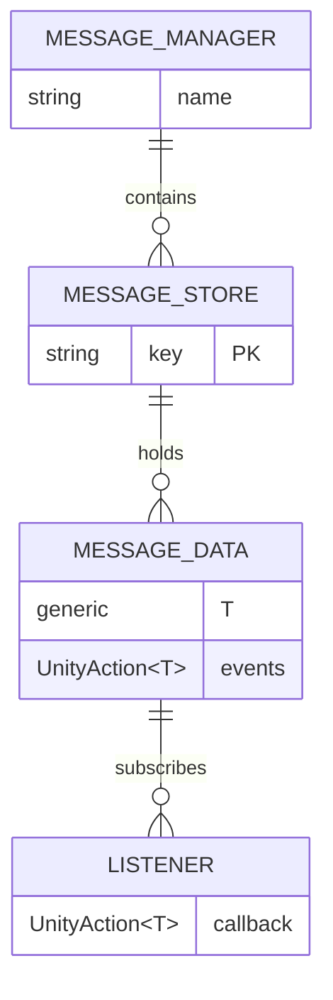
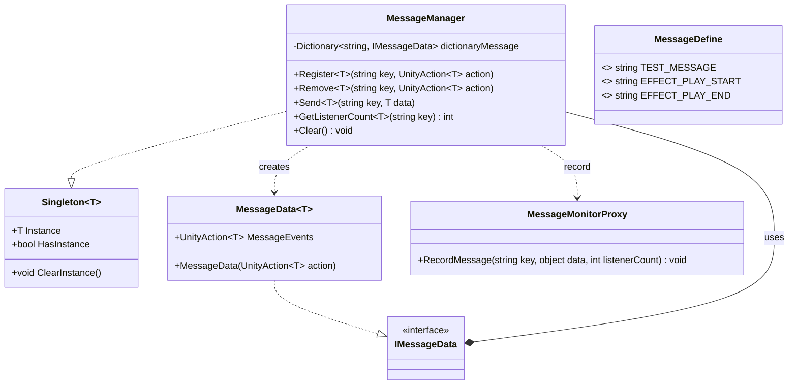
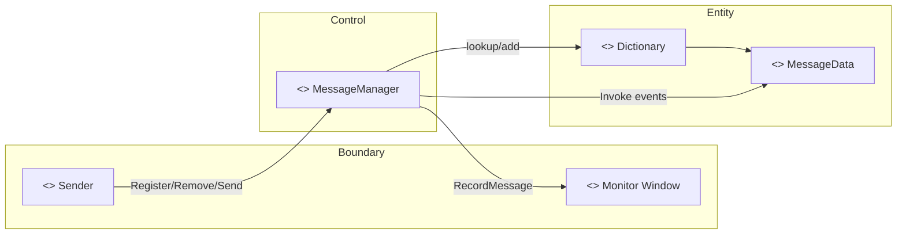
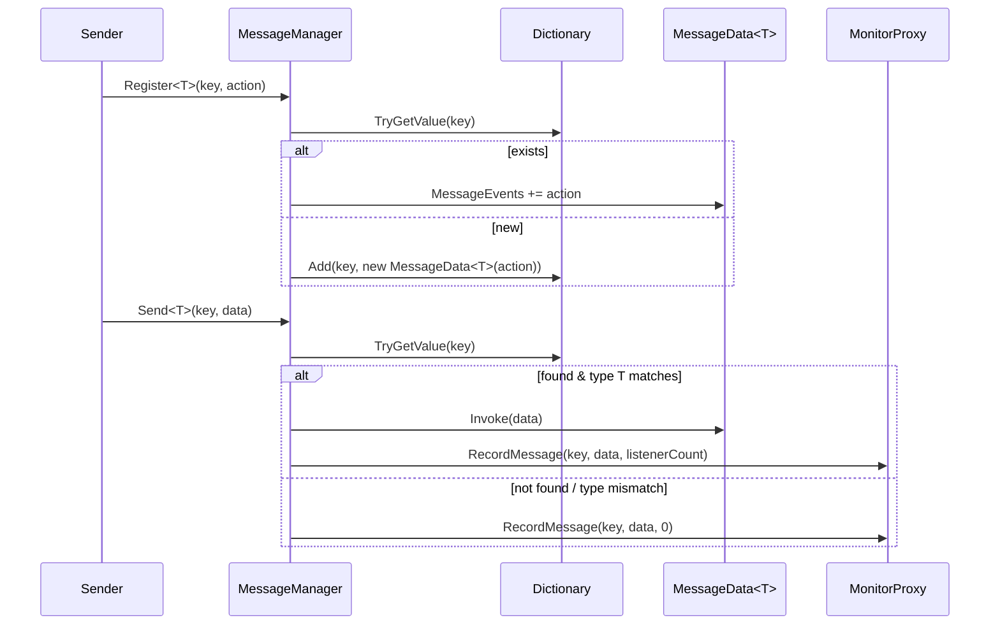
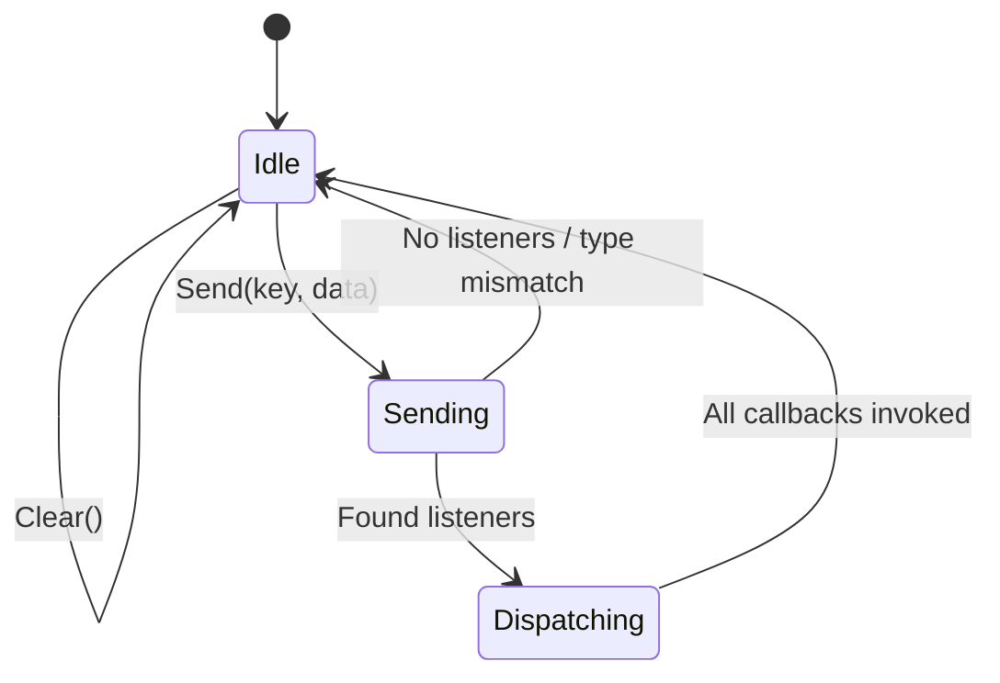

# 消息系统开发文档（Message System）

版本：1.0.0  
适用范围：运行时与编辑器（监控仅在编辑器）

---

## 功能概述
- **类型安全**：通过 `UnityAction<T>` 与 `MessageData<T>` 实现泛型事件，编译期保证类型一致性。
- **解耦通信**：发送端与接收端无需相互引用，仅依赖消息键 `string key` 与数据类型 `T`。
- **多监听者**：同一消息键允许多个监听者；按注册顺序依次调用。
- **可监控**：运行时 `Send` 会通过 `MessageMonitorProxy` 记录到编辑器监控器窗口（不影响打包版本）。
- **统一管理**：`MessageManager` 提供注册、发送、移除、清空、统计等 API。

---

## 系统描述
- `MessageManager` 采用 `Singleton<MessageManager>`（非 MonoBehaviour）作为核心调度中心，内部以 `Dictionary<string, IMessageData>` 维护所有消息键与其数据容器。
- `MessageData<T>` 实现 `IMessageData`，保存 `UnityAction<T> MessageEvents` 委托链。
- `Register<T>(key, action)`：为 `key` 注册一个类型为 `T` 的监听者；若 `key` 首次出现则创建 `MessageData<T>`。
- `Remove<T>(key, action)`：移除监听者；若移除后无监听者，不强制删除字典项（可按需扩展清理策略）。
- `Send<T>(key, data)`：查找 `key` 对应的 `MessageData<T>` 并触发事件；随后调用 `MessageMonitorProxy.RecordMessage` 写入监控。
- `GetListenerCount<T>(key)`：返回给定 `key` 下的监听者数量。
- `Clear()`：清空内部 `Dictionary`。

> 注意：消息键与数据类型 `T` 必须匹配。若 `Send<T>` 的 `T` 与注册时的 `T` 不一致，则不会触发事件。

---

## 关键接口（API 摘要）
- `MessageManager.Instance.Register<T>(string key, UnityAction<T> action)`
- `MessageManager.Instance.Remove<T>(string key, UnityAction<T> action)`
- `MessageManager.Instance.Send<T>(string key, T data)`
- `MessageManager.Instance.GetListenerCount<T>(string key) : int`
- `MessageManager.Instance.Clear()`

> 常量键统一在 `MessageDefine` 中维护。

---

## 数据结构（ER 图）


---

## 类图（Class Diagram）


---

## 鲁棒图（Robustness Diagram）


---

## 时序图（Sequence Diagram）


---

## 状态图（State Diagram）


---

## 消息系统本身
```csharp
// 定义键（建议统一放入 MessageDefine）
const string KEY_HELLO = "HELLO";

// 注册
MessageManager.Instance.Register<string>(KEY_HELLO, OnHello);

// 发送
MessageManager.Instance.Send(KEY_HELLO, "Hello World");

// 移除
MessageManager.Instance.Remove<string>(KEY_HELLO, OnHello);

void OnHello(string msg)
{
    // 处理消息
}
```

---

## 约束与注意
- `Register<T>` / `Send<T>` 的类型 `T` 必须一致，否则不会触发回调。
- `OnDestroy`/生命周期结束时务必成对 `Remove<T>`，避免悬挂委托。
- `MessageMonitorProxy` 仅在编辑器下工作；构建版不产生编辑器负担。
- `Singleton<MessageManager>` 为非 MonoBehaviour，场景切换不会自动销毁；如需重置可调用 `MessageManager.Instance.Clear()`。
