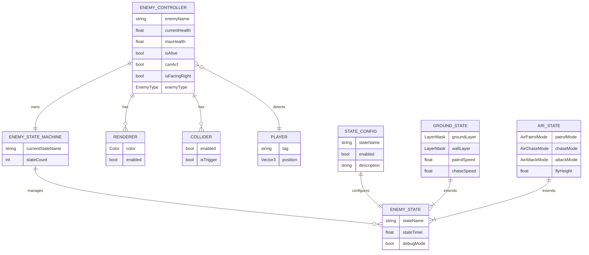

# Enemy State Machine Technical Document

This document provides a systematic explanation of the enemy state machine architecture, data flow, state design, usage and extension methods for developers and level/art designers.

- Code Root: `Assets/Scripts/5_EnemyStateMachine`
- Main Types:
  - `EnemyStateMachine` (State Machine Manager)
  - `IEnemyState`, `EnemyStateBase` (State Interface & Base Class)
  - `EnemyController` (Enemy Controller Abstract Base)
  - `GenericEnemyController` (Generic Enemy Controller)
  - Ground States: `GroundEnemyIdleState`, `GroundEnemyPatrolState`, `GroundEnemyChaseState`, `GroundEnemyAttackState`
  - Air States: `AirEnemyPatrolState`, `AirEnemyChaseState`, `AirEnemyAttackState`
  - Common States: `EnemyHurtState`, `EnemyDeathState`

**State Machine Visualizer Tool**: This system includes a Canvas-style visual editor window similar to Unity's Animator (shortcut `Ctrl+Shift+V`), providing real-time state node graphs, transition relationship visualization, runtime debugging panel, and interactive state switching functionality to help developers and designers intuitively understand and debug enemy behavior logic, supporting canvas dragging, zooming, auto-layout operations, with all states color-coded and icon-labeled, allowing runtime state forcing by clicking nodes for quick testing.

---

## 1. Class Diagram

---

## 2. State Diagram

---

## 3. Sequence Diagrams

### 3.1 State Transition Sequence

### 3.2 Hurt Processing Sequence

### 3.3 Death Processing Sequence

---

## 4. Entity-Relationship Diagram

---

## 5. Robustness Diagram

---

## 6. Gantt Chart - Development Progress

---

## 7. Activity Diagram - State Update Flow

---

## 8. Component Diagram

---

## 9. State Machine Visualizer Window

### 9.1 Overview

The State Machine Visualizer Window is a Canvas-style editor tool similar to Unity's Animator, designed for real-time visualization and debugging of enemy state machines.

**How to Open**:
- Menu Path: `Window > ????? > ??????? (State Machine Visualizer)`
- Shortcut: `Ctrl + Shift + V`

### 9.2 Main Features

#### State Node Visualization
- **Node Layout**: Automatically layouts all enabled state nodes including Idle, Patrol, Chase, Attack, Hurt, Death
- **Color Coding**: Each state uses a unique color for identification
  - Idle: Cyan
  - Patrol: Green
  - Chase: Blue
  - Attack: Light Blue
  - Hurt: Red
  - Death: Black/Gray
- **State Icons**: Each state has an emoji icon for quick recognition
  - ?? Idle | ?? Patrol | ?? Chase | ?? Attack | ?? Hurt | ?? Death

#### State Transition Visualization
- **Transition Lines**: Shows transition relationships between states with directional arrows
- **Transition Labels**: Displays transition conditions on lines (e.g., "Player Detected", "Enter Attack Range")
- **Special Transitions**: Hurt and Death states use dashed lines to indicate they can be entered from any state

#### Runtime Debugging
- **Real-time State Highlight**: Currently active state node is highlighted with a green indicator
- **Runtime Info Panel**: Displays key runtime data
  - State: Current state name
  - Count: Number of registered states
  - Health: Current health value and percentage (color-coded)
  - Alive: Alive status (?/?)
  - Can Act: Can act status (?/?)
- **State Switching**: Left-click on state nodes during runtime to force transition to that state (for testing)

#### Interactive Operations
- **Canvas Dragging**: Right-click drag to move the entire canvas view
- **Zoom Control**: Mouse scroll wheel to zoom canvas (0.5x - 2.0x)
- **Auto Layout**: Click "?? ????" button to reset node positions
- **Reset View**: Click "?? ??" button to restore default view and zoom

#### Legend and Tips
- **Color Legend**: Top bar displays color squares and names for all states
- **Operation Tips**: Bottom bar shows interaction instructions
  - ?? Right-drag canvas | Scroll to zoom | Left-click to switch state (runtime)

### 9.3 Use Cases

1. **State Machine Structure Preview**: View complete state machine structure in the editor
2. **Runtime Debugging**: Monitor enemy state transitions and property changes in real-time
3. **Quick Testing**: Quickly switch states by clicking nodes to test state behaviors
4. **Level Design**: Helps level designers understand enemy behavior logic

### 9.4 Technical Features

- **Auto Selection**: Automatically updates display when selecting a GameObject with `GenericEnemyController` in Hierarchy
- **Real-time Refresh**: Automatically refreshes display during runtime without manual updates
- **Grid Background**: Provides grid background for visual positioning assistance
- **Shadow Effects**: Nodes have shadow effects to enhance visual hierarchy

---

## 10. Enemy Type Configuration

| Type | Description | States Used |
| ---- | ----------- | ----------- |
| GroundEnemy | Ground-based enemy | GroundEnemyXXXState |
| FlyingEnemy | Flying enemy | AirEnemyXXXState |
| BossEnemy | Boss enemy | BossState (TBD) |

---

## 11. State Color Scheme

| State | Color | RGB Value |
| ----- | ----- | --------- |
| Idle/Patrol | Default White | (1, 1, 1) |
| Chase | Blue | (0.3, 0.5, 1) |
| Attack | Light Blue | (0.4, 0.6, 1) |
| Hurt | Flash Red | (1, 0, 0) |
| Death | Black | (0, 0, 0) |

---

## 12. Implementation Progress

| State | Ground Enemy | Flying Enemy |
| ----- | ------------ | ------------ |
| Idle | 73 Complete | 73 Complete |
| Patrol | 73 Complete | 73 Complete |
| Chase | 73 Complete | 73 Complete |
| Attack | 73 Complete | 73 Complete |
| Hurt | 73 Complete | 73 Complete |
| Death | 73 Complete | 73 Complete |

---

## 13. Acceptance Criteria

- Enemy exhibits stable Idle/Patrol cycle without clipping when no player present
- Correctly enters Chase upon player detection and transitions to Attack at attack range
- Returns to Patrol/Idle correctly when player leaves detection range
- Attack has complete timing sequence with effective cooldown and hitbox
- Hurt state correctly displays flash red effect and applies knockback
- Death state correctly executes turn black → disable collision → flash disappear sequence
- Logs and Gizmos clearly reflect current state
