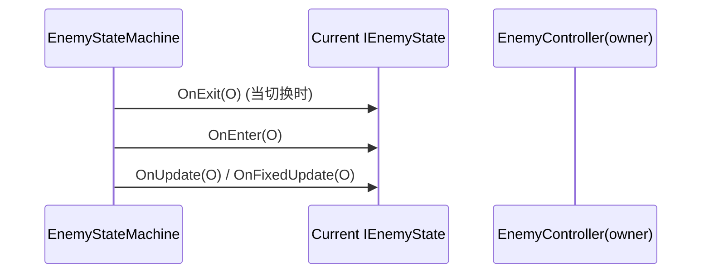
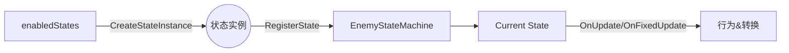
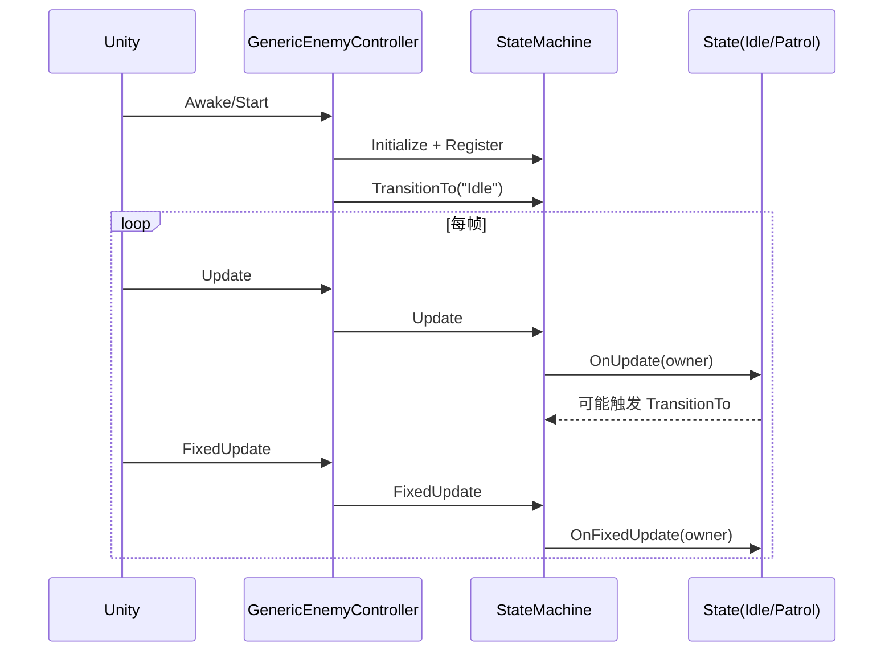

# 敌人状态机 代码拆解文档

本文档逐文件剖析当前实现，说明职责、调用关系、易错点与扩展点。

## 目录结构
```
Assets/
└── Scripts/5_EnemyStateMachine/
    ├── EnemyStateMachine.cs           # 状态机核心：注册/切换/Update/历史
    ├── IEnemyState.cs                 # 状态接口
    ├── EnemyStateBase.cs              # 状态基类：模板方法+工具函数
    ├── EnemyController.cs             # 敌人控制器抽象：对接生命周期与接口
    ├── GenericEnemyController.cs      # 通用控制器：工厂/检测/Gizmos/示例逻辑
    └── States/
        ├── GroundEnemyIdleState.cs    # 待机：扫描玩家/微动/超时转巡逻
        └── GroundEnemyPatrolState.cs  # 巡逻：移动-暂停交替/扫描玩家
```

## 1) EnemyStateMachine.cs
- 维护 `states` 字典与 `currentState`，owner 为 `EnemyController`。
- `TransitionTo/ForceTransitionTo`：退出旧状态 -> 切入新状态 -> 记录历史。
- `Update/FixedUpdate`：委托到当前状态。
- 便于调试：`CurrentStateName`、`GetAllStateNames()`、历史记录等。



## 2) IEnemyState.cs / EnemyStateBase.cs
- 接口规定状态生命周期与转换授权 `CanTransitionTo`。
- 基类封装：
  - 进入/更新/物理/退出的模板流程与计时器。
  - 子类实现 `UpdateState` 与 `CheckTransitionConditions`。
  - 常用工具：超时、百分比进度、时间窗口等。

## 3) EnemyController.cs
- 抽象基类：
  - 在 `Awake` 初始化状态机并调用 `RegisterStates()`。
  - 在 `Start` 进入 `Idle`（若存在）。
  - 在 `Update/FixedUpdate` 推进状态机。
- 抽象接口由具体敌人实现：动画、移动、朝向、攻击、玩家检测与目标获取。
- 提供大量可重写工具方法（击退、音效、物理检测、Gizmos等）。

## 4) GenericEnemyController.cs
- 作用：开箱即用的“胶囊体敌人”控制器，便于场景快速验证。
- 核心点：
  - Inspector 可配置 `enabledStates` 与 `initialState`。
  - `RegisterStates()` 遍历配置，工厂方法创建状态并注册。
  - 工厂：`CreateIdleState/PatrolState` 真实实现；`Chase/Attack` 当前为占位（复用 Patrol/Idle）。
  - 物理检测：`CheckGroundCollision/CheckWallCollision/CheckPlatformEdge` 已实现，待在巡逻/追击中使用。
  - Gizmos：检测范围/巡逻范围/到玩家连线等。



## 5) GroundEnemyIdleState.cs
- 初始化：记录原始位置；无 Animator 时应用“待机色”；停止水平速度。
- 更新：定时 `ScanForPlayer`（射线遮挡），可选“微动”。
- 转换：
  - 发现玩家 -> `Chase`（存在）否则 `Patrol`
  - 待机超时 -> `Patrol`

## 6) GroundEnemyPatrolState.cs
- 简化巡逻：移动时段与暂停时段交替；Rigidbody2D 推进或直接位移。
- 定时 `ScanForPlayer`（遮挡判定）。
- 转换：
  - 发现玩家 -> `Chase`（存在）
  - 巡逻时长结束 -> `Idle`

## 7) 典型执行路径



## 8) 易错点与约束
- 忘记在 `RegisterStates()` 注册状态或未在 `enabledStates` 勾选 -> 初始状态切换失败。
- `CreateStateInstance` 未添加对应 case -> 无法创建新状态实例。
- 物理检测层（`groundLayer/wallLayer/obstacleLayer`）配置错误 -> 检测/遮挡失效。
- `GetPlayerTarget()` 需确保场景存在 `Player` Tag，否则将回退使用主摄像机对象作为目标（仅调试用途）。

## 9) 扩展点与改进建议
- 替换占位 `Chase/Attack` 为真实实现：
  - `Chase`：朝玩家加速逼近；目标丢失回退；进入攻击距离后切 `Attack`。
  - `Attack`：前摇/命中/后摇/冷却；调用 `PerformAttack()`；动画事件驱动命中盒。
- 巡逻完善：
  - 使用 `CheckGroundCollision/CheckWallCollision/CheckPlatformEdge` 与 `maxPatrolDistance` 控制转向与防掉落。
- 受伤/死亡状态：
  - 将 `OnTakeDamage/OnDeath` 流转到 `Hurt/Death` 状态，保持状态机一致性。
- 工厂解耦：
  - 可引入“状态注册表/反射型工厂”，避免 `switch-case` 扩展摩擦。

## 10) 最小可行升级路线（建议顺序）
1. 实装 `Chase`（含回退与进入攻击条件）。
2. 实装 `Attack`（完整时序与命中）。
3. 巡逻使用物理检测与距离边界。
4. `Hurt/Death` 状态。

完成以上 1-4 后，AI 战斗循环达到可玩强度，后续再做数值与动画细化。
