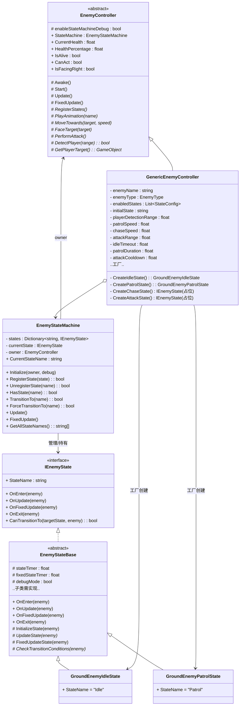
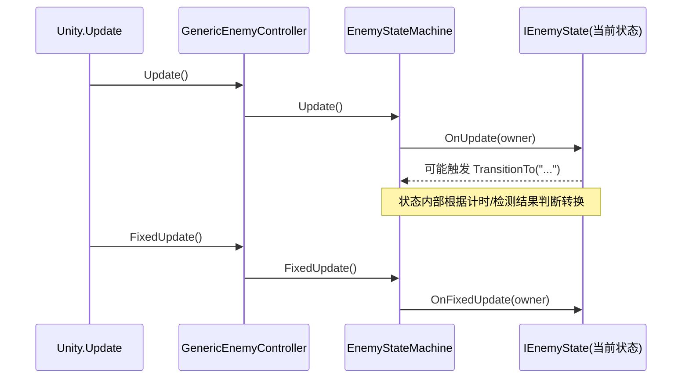
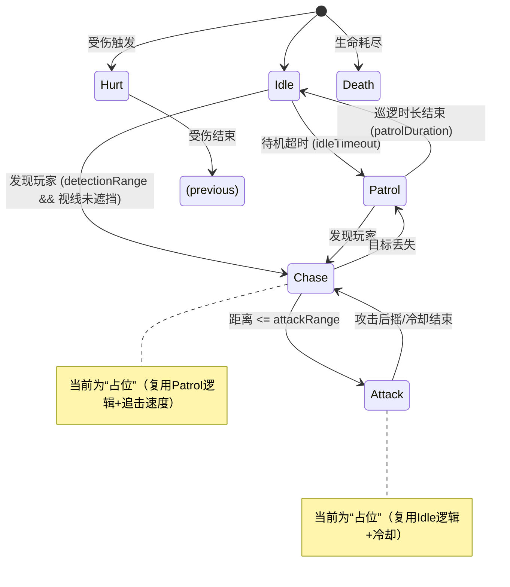
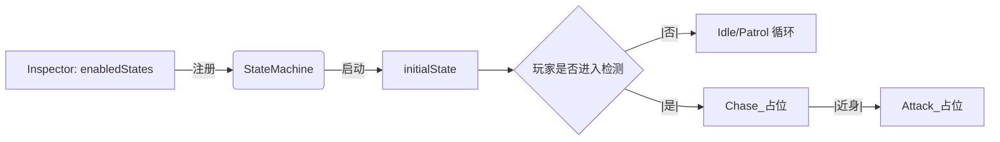

# 敌人状态机 技术文档

本文档面向开发与关卡/美术同学，系统性阐述当前敌人状态机（Enemy State Machine）的架构、数据流、状态设计、使用与扩展方式，并给出运行时示意图与规划路线图。

- 代码根目录：`Assets/Scripts/5_EnemyStateMachine`
- 主要类型：
  - `EnemyStateMachine`（状态机管理器）
  - `IEnemyState`、`EnemyStateBase`（状态接口与基类）
  - `EnemyController`（敌人控制器抽象基类）
  - `GenericEnemyController`（通用胶囊体敌人控制器）
  - `GroundEnemyIdleState`、`GroundEnemyPatrolState`（已实现状态）

## 1. 架构概览

## 2. 运行时数据流

要点：
- `EnemyController.Update/FixedUpdate` 委托给 `EnemyStateMachine.Update/FixedUpdate`，由当前状态执行逻辑与物理。
- 状态内部通过 `enemy.StateMachine.TransitionTo("目标状态")` 请求切换。

## 3. 状态图（当前与规划）

当前已落地：`Idle`、`Patrol` 两个状态；`Chase`/`Attack` 为占位；`Hurt`/`Death` 规划中。

## 4. 关键参数与层级

- 检测类参数
  - `playerDetectionRange`：玩家检测半径（米）
  - `attackRange`：攻击范围（米）
  - `obstacleLayer`：用于视线遮挡 Raycast
- 移动/时序参数
  - `idleTimeout`：待机超时切换到巡逻
  - `patrolDuration`：单次巡逻时长
  - `patrolSpeed`、`chaseSpeed`：移动速度
  - `attackCooldown`：攻击冷却（当前用于占位 Idle 时间）
- 物理检测层
  - `groundLayer`、`wallLayer` 用于地面/墙体检测（巡逻完善时使用）

## 5. 使用与配置

- 将 `GenericEnemyController` 挂载到敌人（胶囊体）上。
- 在 `enabledStates` 中添加需要的状态名（默认已包含 `Idle`、`Patrol`）。
- 选择 `initialState`（默认 `Idle`）。
- 配置检测/移动/时序参数及 `LayerMask`。
- 可启用 `enableStateMachineDebug` 观察状态切换日志。
- Scene 视图可见范围、路径、状态信息 Gizmos（便于调试）。

## 6. 扩展指南（新增一个真实状态）

1) 新建类继承 `EnemyStateBase`，实现：
- `public override string StateName { get; }`
- `UpdateState(…)`、`FixedUpdateState(…)`、`CheckTransitionConditions(…)`

2) 在 `GenericEnemyController` 的工厂方法 `CreateStateInstance(...)` 为该状态名添加 `case`，并在对应 `CreateXXXState()` 中完成参数注入（参考 Idle/Patrol）。

3) 在 Inspector 的 `enabledStates` 加入该状态，按需要设置 `initialState`。

建议：将“占位”的 `Chase/Attack` 逐步替换为真实状态，形成“发现-追击-攻击-回退”的闭环。

## 7. 已知限制与路线图

- 巡逻为“简化版”，暂未使用 `maxPatrolDistance`、地面/墙/边缘检测控制自动转向与掉落防护。
- `Chase/Attack` 为占位：
  - 追击未朝玩家持续逼近、未实现目标丢失与回退。
  - 攻击未调用 `PerformAttack()` 形成完整前/后摇与命中判定。
- 未接入 `Hurt/Death` 独立状态（目前在控制器事件中处理击退/死亡）。

近期实现建议（优先级从高到低）：
1. 真实 `Chase`：朝向玩家移动、丢失回退、接近阈值转 `Attack`。
2. 真实 `Attack`：前摇-命中-后摇-冷却，接入命中盒与动画事件。
3. 巡逻完善：使用地面/墙/边缘检测与 `maxPatrolDistance`。
4. `Hurt/Death` 状态，统一受伤/死亡流转。

## 8. 验收标准（建议）
- 在无玩家时，敌人表现 Idle/Patrol 循环稳定无穿模；
- 发现玩家后能进入 Chase 并在可攻距离切 Attack，脱离后回 Patrol/Idle；
- 攻击具备完整时序，冷却与命中盒有效；
- 受伤能打断并回到合适状态；
- 日志与 Gizmos 直观反映状态。
