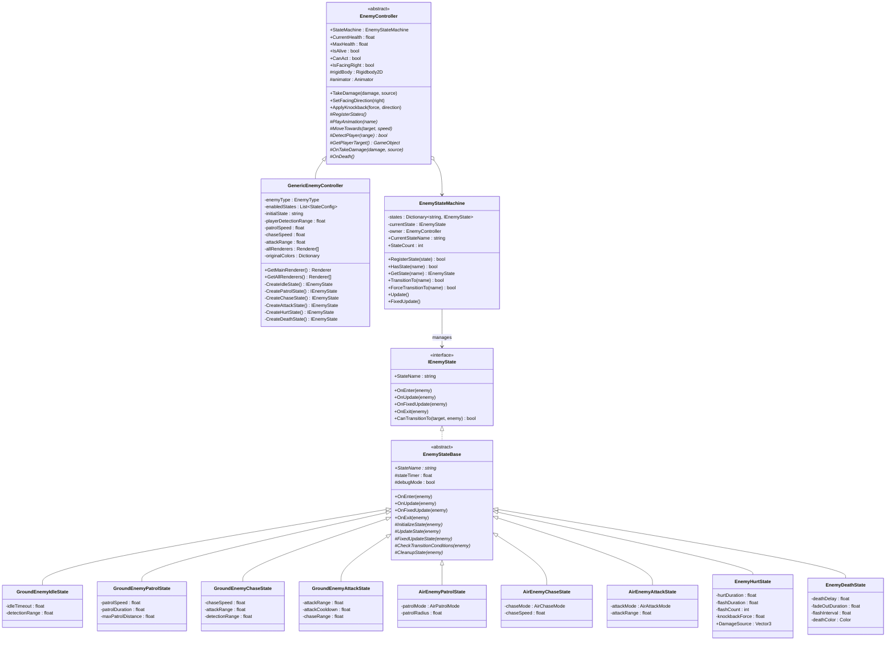
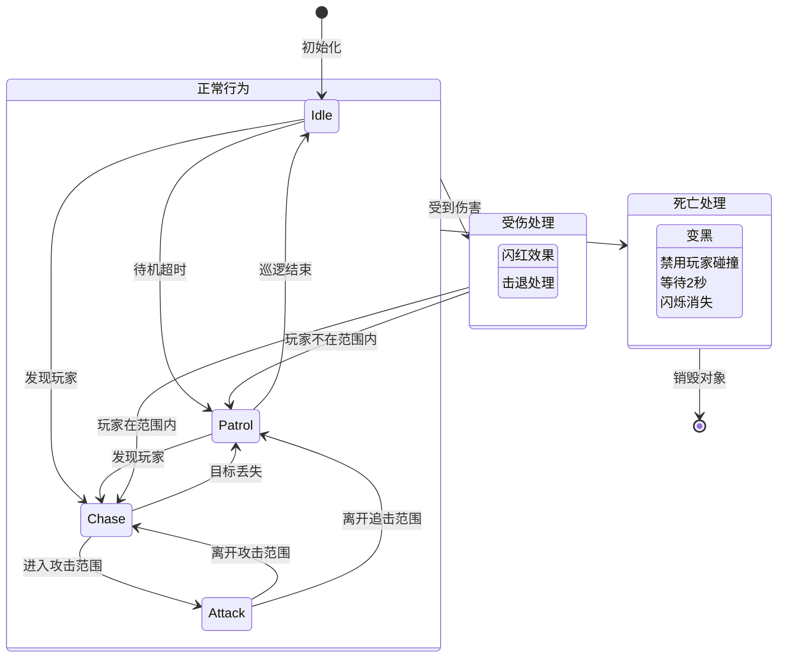
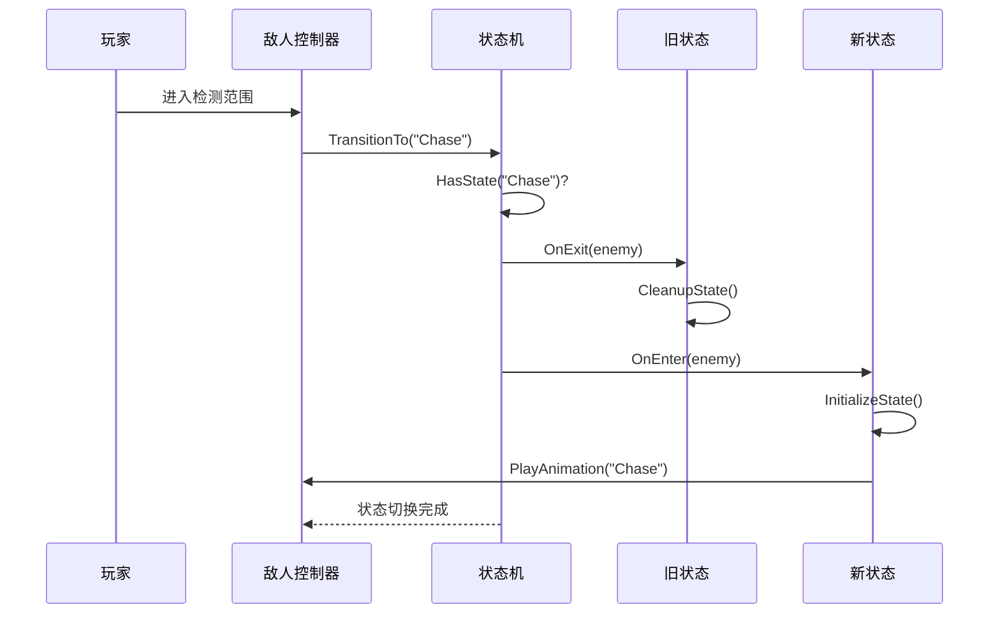
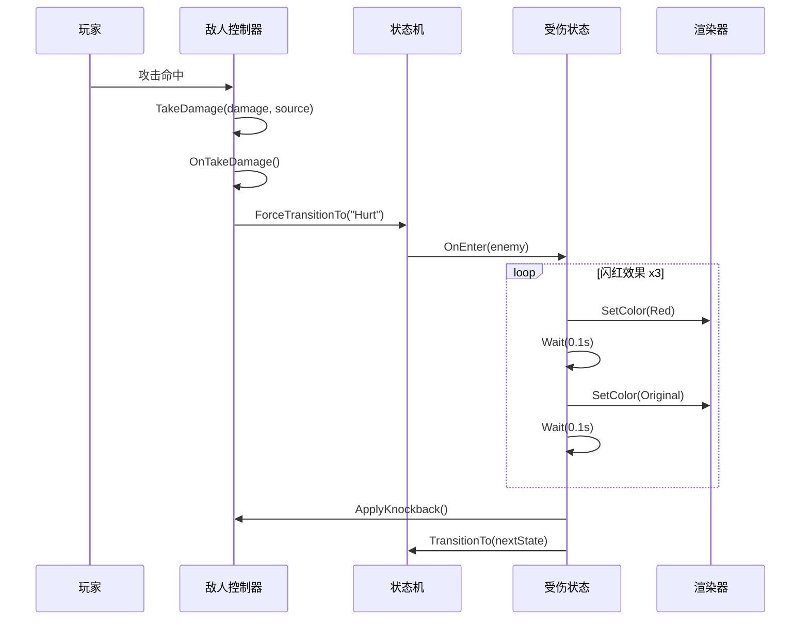
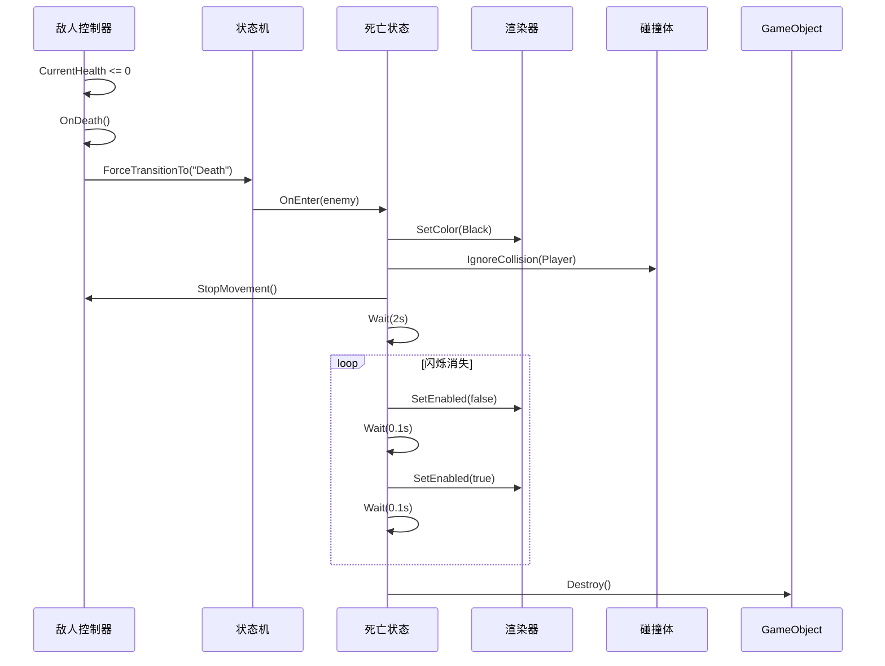
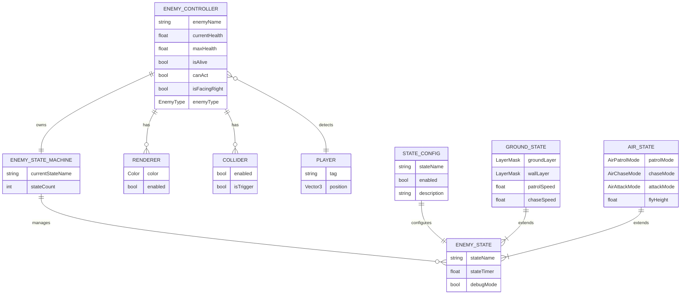
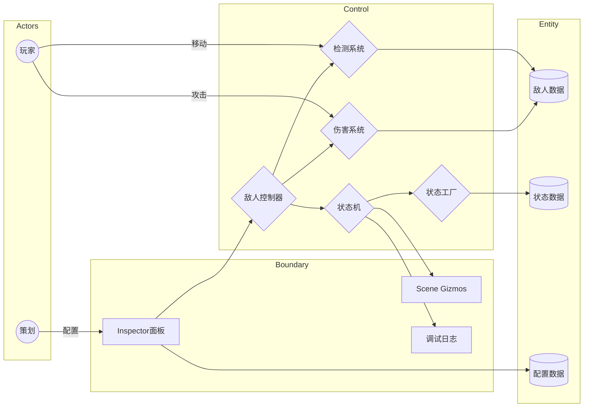
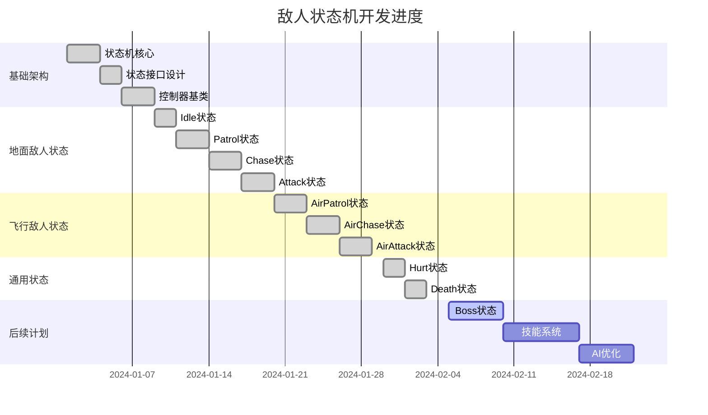
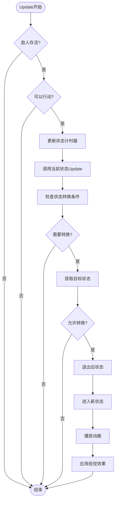
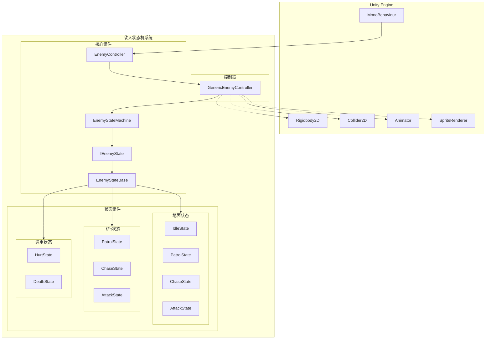

# 敌人状态机 技术文档

本文档面向开发与关卡/美术，系统性阐述当前敌人状态机的架构、数据流、状态设计、使用与扩展方式。

- 代码根目录：`Assets/Scripts/5_EnemyStateMachine`
- 主要类型：
  - `EnemyStateMachine`（状态机管理器）
  - `IEnemyState`、`EnemyStateBase`（状态接口与基类）
  - `EnemyController`（敌人控制器抽象基类）
  - `GenericEnemyController`（通用敌人控制器）
  - 地面状态：`GroundEnemyIdleState`、`GroundEnemyPatrolState`、`GroundEnemyChaseState`、`GroundEnemyAttackState`
  - 飞行状态：`AirEnemyPatrolState`、`AirEnemyChaseState`、`AirEnemyAttackState`
  - 通用状态：`EnemyHurtState`、`EnemyDeathState`

**状态机可视化工具**：本系统配备了一个类似Unity Animator的Canvas风格可视化编辑器窗口（快捷键 `Ctrl+Shift+V`），提供实时状态节点图、转换关系可视化、运行时调试面板和交互式状态切换功能，帮助开发者和设计师直观理解和调试敌人行为逻辑，支持画布拖拽、缩放、自动布局等操作，所有状态使用颜色编码和图标标识，运行时可点击节点强制切换状态进行快速测试。

---

## 1. 类图（Class Diagram）

---

## 2. 状态图（State Diagram）

---

## 3. 时序图（Sequence Diagram）

### 3.1 状态切换时序

### 3.2 受伤处理时序

### 3.3 死亡处理时序

---

## 4. E-R图（Entity-Relationship Diagram）

---

## 5. 鲁棒图（Robustness Diagram）

---

## 6. 甘特图（Gantt Chart）- 开发进度

---

## 7. 活动图（Activity Diagram）- 状态更新流程

---

## 8. 组件图（Component Diagram）

---

## 9. 状态机可视化窗口（State Machine Visualizer）

### 9.1 功能概述

状态机可视化窗口是一个类似Unity Animator的Canvas风格编辑器工具，用于实时可视化和调试敌人状态机的运行状态。

**打开方式**：
- 菜单路径：`Window > 敌人状态机 > 状态机可视化器 (State Machine Visualizer)`
- 快捷键：`Ctrl + Shift + V`

### 9.2 主要功能

#### 状态节点可视化
- **节点布局**：自动布局所有启用的状态节点，包括 Idle、Patrol、Chase、Attack、Hurt、Death
- **颜色编码**：每个状态使用独特的颜色标识
  - Idle: 青色 (Cyan)
  - Patrol: 绿色 (Green)
  - Chase: 蓝色 (Blue)
  - Attack: 浅蓝色 (Light Blue)
  - Hurt: 红色 (Red)
  - Death: 黑色/灰色 (Black/Gray)
- **状态图标**：每个状态配有表情符号图标，便于快速识别
  - 🧍 Idle | 🚶 Patrol | 🏃 Chase | ⚔️ Attack | 💥 Hurt | 💀 Death

#### 状态转换可视化
- **转换连线**：显示状态之间的转换关系，带有箭头指示方向
- **转换标签**：在连线上显示转换条件（如"发现玩家"、"进入攻击范围"）
- **特殊转换**：Hurt 和 Death 状态使用虚线表示可从任意状态进入

#### 运行时调试
- **实时状态高亮**：当前激活的状态节点会高亮显示并带有绿色指示器
- **运行时信息面板**：显示关键运行时数据
  - State: 当前状态名称
  - Count: 已注册状态数量
  - Health: 当前生命值和百分比（带颜色编码）
  - Alive: 存活状态（✅/❌）
  - Can Act: 可行动状态（✅/❌）
- **状态切换**：运行时左键点击状态节点可强制切换到该状态（用于测试）

#### 交互操作
- **画布拖拽**：右键拖拽移动整个画布视图
- **缩放控制**：鼠标滚轮缩放画布（0.5x - 2.0x）
- **自动布局**：点击"📐 自动布局"按钮重置节点位置
- **重置视图**：点击"🔄 重置"按钮恢复默认视图和缩放

#### 图例和提示
- **颜色图例**：顶部显示所有状态的颜色方块和名称
- **操作提示**：底部显示交互操作说明
  - 💡 Right-drag canvas | Scroll to zoom | Left-click to switch state (runtime)

### 9.3 使用场景

1. **状态机结构预览**：在编辑器中查看敌人的完整状态机结构
2. **运行时调试**：实时监控敌人的状态切换和属性变化
3. **快速测试**：通过点击节点快速切换状态，测试各状态表现
4. **关卡设计**：帮助关卡设计师理解敌人的行为逻辑

### 9.4 技术特性

- **自动选择**：在 Hierarchy 中选择带有 `GenericEnemyController` 的 GameObject 时自动更新显示
- **实时刷新**：运行时自动刷新显示，无需手动更新
- **网格背景**：提供网格背景辅助视觉定位
- **阴影效果**：节点带有阴影效果，增强视觉层次

---

## 10. 敌人类型配置

| 类型 | 说明 | 使用的状态 |
| ---- | ---- | ---------- |
| GroundEnemy | 地面敌人 | GroundEnemyXXXState |
| FlyingEnemy | 飞行敌人 | AirEnemyXXXState |
| BossEnemy | Boss敌人 | BossState（待实现） |

---

## 11. 状态颜色方案

| 状态 | 颜色 | RGB值 |
| ---- | ---- | ----- |
| Idle/Patrol | 默认白色 | (1, 1, 1) |
| Chase | 蓝色 | (0.3, 0.5, 1) |
| Attack | 浅蓝色 | (0.4, 0.6, 1) |
| Hurt | 闪红 | (1, 0, 0) |
| Death | 黑色 | (0, 0, 0) |

---

## 12. 当前实现进度

| 状态 | 地面敌人 | 飞行敌人 |
| ---- | -------- | -------- |
| Idle | ✅ 完成 | ✅ 完成 |
| Patrol | ✅ 完成 | ✅ 完成 |
| Chase | ✅ 完成 | ✅ 完成 |
| Attack | ✅ 完成 | ✅ 完成 |
| Hurt | ✅ 完成 | ✅ 完成 |
| Death | ✅ 完成 | ✅ 完成 |

---

## 13. 验收标准

- 在无玩家时，敌人表现 Idle/Patrol 循环稳定无穿模
- 发现玩家后能进入 Chase 并在可攻距离切 Attack
- 玩家脱离后正确回到 Patrol/Idle
- 攻击具备完整时序，冷却与命中盒有效
- 受伤时正确显示闪红效果并应用击退
- 死亡时正确执行变黑→禁用碰撞→闪烁消失流程
- 日志与 Gizmos 直观反映状态
