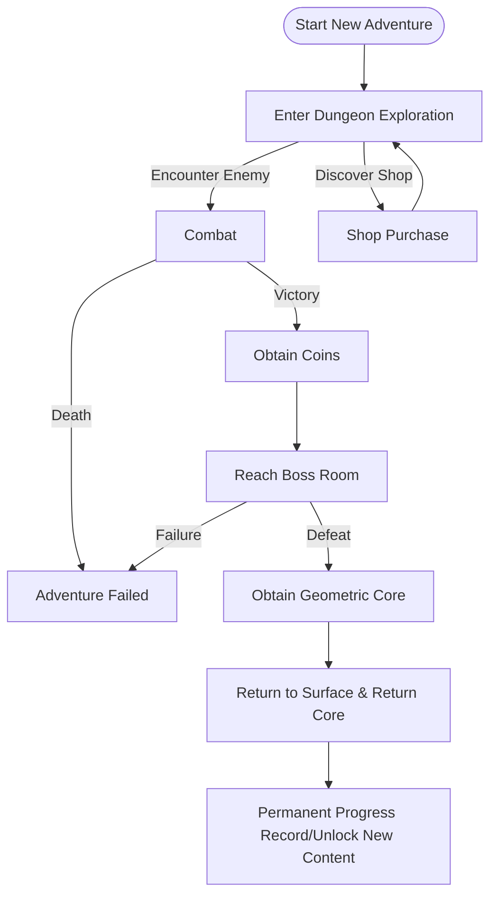
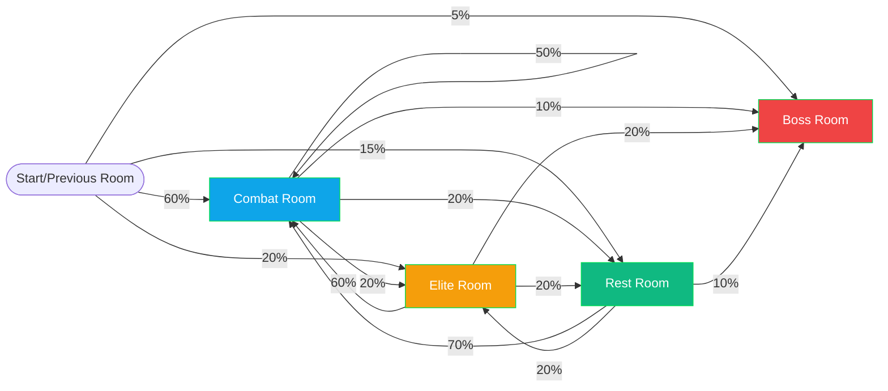
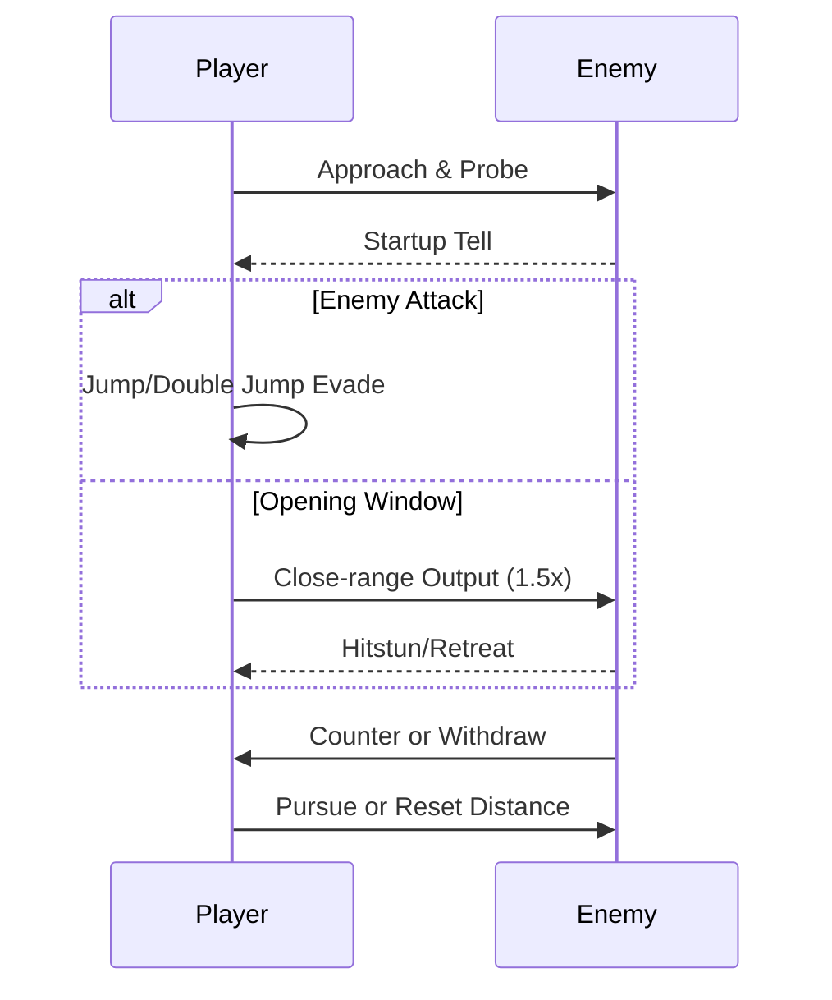
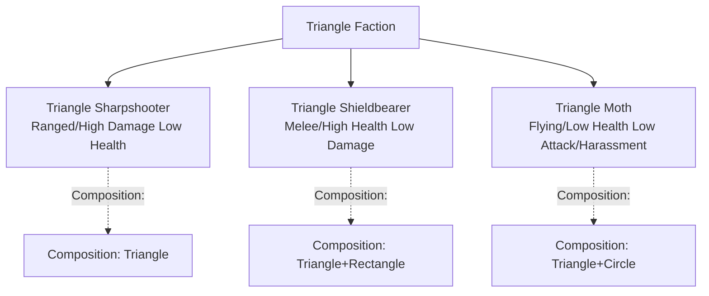
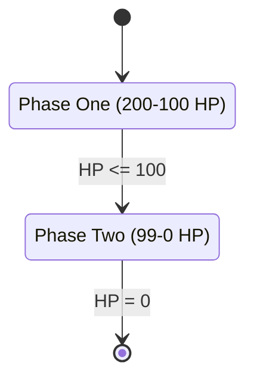

# CRYPTA GEOMETRICA

**CRYPTA GEOMETRICA** — Geometric Dungeon

## Game Overview

**CRYPTA GEOMETRICA** is a side-scrolling action Roguelite game developed by a solo indie developer. The game features a distinctive vector geometric wireframe art style, combined with a cold sci-fi visual tone, creating a world of geometric dungeons filled with unknowns and dangers.

The in-game experience focuses on randomly generated dungeon exploration and combat core mechanics. You need to flexibly use basic actions like jumping to navigate through layered geometric spaces and uncover secrets hidden deep within the dungeon. Defeating enemies in combat will uniformly drop circular coins, which are used solely for purchasing items and services, not directly enhancing character attributes. You can use coins through shops or events in levels to build combat rhythm and resource strategies for the current exploration. The core Roguelite rules run throughout: each death resets the current exploration progress, requiring you to start over.

The meta-narrative revolves around the mission of the "Rectangle Hero." In the geometric matrix world, multiple nations are under threat, and you, as the Rectangle Hero, join the expedition force with the goal of targeting the Triangle Kingdom and the out-of-control composite monsters. You will repeatedly delve into dungeons occupied by composite monsters, resist attacks from Triangle lifeforms along the way, gradually penetrate deep into the dungeon's heart, ultimately eliminate the composite monsters, and reclaim the stolen core geometric components. Each time you defeat a powerful Boss composed of multiple precisely combined geometric bodies, you can obtain a "Geometric Core" treasure; you need to bring it back to the surface after battle and return it to the corresponding geometric matrix nation to promote the reconstruction of world order.

## Inspiration Sources

### 1. Art Style: Geometry Dash

Borrowing from Geometry Dash's extremely simple and pure geometric construction logic, characters and monsters are built around 1-3 basic geometric bodies as the core, while Bosses are assembled through combinations of multiple different geometric bodies, presenting complex and oppressive visual images. On this foundation, sci-fi wireframe lighting effects are integrated, paired with high-contrast neon colors and cold dark backgrounds, strengthening the mysterious and sci-fi atmosphere of the geometric dungeon, maintaining the recognizability of the minimalist style while adding unique immersion.


### 2. Level Design: Dead Cells × Spelunky

The core inherits Dead Cells' "in-game random generation + meta permanent unlocks" dual-track loop mechanism, ensuring freshness in every adventure while providing clear growth feedback for long-term exploration. Level generation adopts a "random walk algorithm planning main path" macro framework, ensuring coherence and exploration logic in the overall dungeon structure; on this basis, it embeds Spelunky-style room seed library design, with each basic room having only 3-5 variant forms, retaining the spatial exploration feel of Metroidvania while effectively controlling the art production complexity of solo development, achieving "low-cost high-diversity" level experience.


### 3. Controls & Combat: Hollow Knight

Referencing Hollow Knight's classic side-scrolling combat action system, building an "approach-output-retreat/defend-pursue" simple combat loop. Combat core emphasizes "risk-reward" and "attack pattern prediction": enemy attacks have clear startup tells, requiring you to precisely grasp dodge timing; close-range output can achieve higher damage returns but also faces greater risks, encouraging players to find balance between cautious judgment and decisive operation. Meanwhile, optimizing basic control feel, jumping supports double jump for landing adjustment, making action transitions smoother and combat experience more satisfying.


## Story Background

In the vast geometric matrix world, the Rectangle, Triangle, and Circle lifeform tribes each established nations, forming a stable ecological balance. The Rectangle Kingdom advocates stability and order, serving as maintainers of world order; the Triangle Kingdom pursues power and expansion, harboring hidden ambitions; the Circle Kingdom excels in balance and mystical energy, guarding the world's energy core.

The peace was shattered by the Triangle King's ambition. He attempted to fuse the core powers of other geometric lifeforms, assembling an invincible composite army to conquer the entire geometric matrix. However, the experiment completely spiraled out of control, with energy backlash causing the Circle King to be transformed into a raging composite geometric monster, losing rationality and wreaking havoc throughout the geometric matrix, causing order to collapse wherever it went. The Triangle Kingdom took advantage of the chaos, imprisoning both the composite monster and the stolen core geometric components from multiple geometric nations in the deep dungeons of their own territory, attempting to use the composite monster's power to intimidate all parties and gradually realize their conquest plan.

Core geometric components are the energy source of each geometric nation, and nations that lose them face extinction crisis. To stop the Triangle Kingdom's conspiracy, eliminate the out-of-control composite monster, reclaim the core geometric components, and rebuild world balance, multiple geometric nations jointly dispatched hero squads. You, as the Rectangle Kingdom's most outstanding hero, shoulder the crucial mission and step into this crisis-filled geometric dungeon, beginning a destined repetitive yet persistent crusade journey.

| Rectangle Kingdom | Triangle Kingdom | Circle Kingdom |
|:--------:|:----------:|:--------:|
|  |  |  |

## Gameplay

### Core Loop: Explore → Combat → Collect → Return

Every adventure follows a clear loop process. You enter the dungeon from the surface, delve deeper layer by layer, engage in combat with enemies in randomly generated rooms, collect dropped resources, ultimately defeat the Boss and obtain the geometric core. After victory, you need to bring the core back to the surface and return it to the corresponding geometric matrix nation, completing a full "crusade cycle."

**Game Loop Flowchart (Mermaid)**



### Level Exploration Mechanics

**Randomly Generated Dungeon Structure**

Dungeons use "random walk algorithm" to plan main paths, ensuring that the overall dungeon structure maintains coherence and logic in every adventure. On this foundation, each basic room has 3-5 variant forms, achieving "low-cost high-diversity" level experience through room seed library combination and assembly. This means you might encounter familiar room layouts in your second adventure, but their internal enemy configurations, trap positions, and treasure chest distributions will be different.

**Level Generation Data Flow & Module Relationships (Mermaid)**

```mermaid
flowchart LR
    Seed[Seed] --> RNG[Random Number Engine]
    RNG --> Params[Generation Parameters (Room Count/Branch Probability/Difficulty Curve)]
    Params --> TemplateLib[Room Template Library (3-5 Variants/Semantic Tags)]
    TemplateLib --> Generator[Level Generator]
    RNG --> Generator
    Generator --> Graph[Connectivity Graph (Main Path + Branches)]
    Graph --> Assembler[Assembler (Tiles/Connectors)]
    Assembler --> Spawner[Spawn System (Enemies/Events/Shops)]
    Spawner --> Decorator[Decorator (Traps/Items/Art Details)]
    Decorator --> Validator[Validator (Reachability/Difficulty Budget/Resource Density)]
    Validator -->|Pass| Level[Level Instance]
    Validator -- Fail/Rollback Parameters --> Generator
    Level --> Telemetry[Telemetry/Difficulty Feedback]
    Telemetry --> Params
```

**Spatial Exploration & Secret Discovery**

The dungeon hides multiple branch routes and secret rooms. Through careful environmental observation and trying different jumping routes, you can discover hidden treasure chests, shops, or event rooms. These secret areas often provide additional coins, rare goods, or key information, encouraging players to conduct thorough exploration.

### Room Type Design

- **Combat Room**
  - Function: Basic combat and resource acquisition
  - Layout: 2-3 layer platforms, left-right entrances; no dash dependency, passable with jump/double jump only
  - Enemies: 2-4 units, mainly Triangle Sharpshooters and Triangle Moths; add 1 Triangle Shieldbearer in difficult situations
  - Rewards: 10-25 coins; Small Recovery Potion (30 HP) low probability

- **Elite Room**
  - Function: Medium-short high-pressure challenge, providing higher drops
  - Layout: Central large platform + four corner narrow platforms; no camping spots
  - Enemies: 1 Shieldbearer + 2 Sharpshooters or 1 Shieldbearer + 3 Moths
  - Rewards: 25-50 coins; Medium Recovery Potion (60 HP) high probability

- **Rest Room (Camp)**
  - Function: Recovery and rhythm buffer (safe zone)
  - Interaction: Spend 20 coins to recover 50 HP; one-time use

- **Boss Room**
  - Function: Two-phase Boss battle
  - Layout: Open field, simple cover, ensuring space for pattern reading and positioning
  - Description: Victory grants "Geometric Core" that must be brought back and returned

**Room Type Distribution/Transition Relationships in Level Progress (Mermaid)**



### Combat System

**Four Phases of Combat Loop**

1. **Approach**: Observe enemy positioning and attack startup, flexibly use jumping to approach targets.

2. **Output**: Perform close-range output during enemy attack gaps. Close-range attacks deal higher damage but also carry greater risk—you need to precisely grasp dodge timing, finding balance between damage and safety.

3. **Retreat/Defense**: When enemies launch attacks, avoid damage through jumping or defensive actions. Double jump can help you adjust landing points, changing direction in mid-air to dodge pursuit.

4. **Pursue**: After enemies are hit, they have brief hitstun or retreat, which is the optimal time to continue output or readjust positioning.

**Combat Interaction Sequence Diagram (Mermaid)**



**Enemy Attack Prediction**

Every enemy attack comes with clear startup tells—whether it's charging light effects, body turning, or specific action postures. Learning to recognize these signals and precisely predict enemy attack timing is key to mastering combat rhythm.

### Resource Management: Coins & Purchase System

**Coin Drops & Usage**

After defeating enemies, enemies uniformly drop circular coins. Coins are your primary resource in the dungeon, used to purchase items and services in shops or events. Coins **do not directly enhance character attributes**, but indirectly strengthen combat capabilities through purchases.

**Shops & Events**

Multiple shops and event rooms are scattered throughout the dungeon. In shops, you can use coins to purchase:

- **One-time Consumables**: Potions that restore health, temporary enhancement elixirs
- **Temporary Boost Items**: Relics that provide special abilities during the current adventure (such as increased damage, enhanced defense, special skills)
- **Information & Hints**: Purchase map information, enemy weakness tips, or hidden room locations

Event rooms provide random choice scenarios: you might encounter NPC trades, gambling opportunities, or toll passages that require coin payment.

**Strategic Value of Coins**

Since coins are only valid for the current adventure, you need to make strategic decisions during exploration: whether to immediately purchase recovery potions to maintain health, or save coins to buy enhancement items before the Boss battle? This resource management tension reinforces the importance of every decision.

### Roguelite Core Rules: Death & Reset

**Cost of Death**

When your health drops to zero, the current adventure is declared failed. You will lose all coins, temporary items, and boost effects obtained in that run, and be teleported back to the surface. This means you need to start from scratch and re-enter the dungeon for the next crusade.

**Permanent Progress vs Temporary Gains**

While each death resets your temporary resources, your **permanent progress** is not lost. Whenever you successfully defeat a Boss and bring back a geometric core, that core is permanently recorded in your collection list. As cores accumulate, you will gradually unlock new dungeon areas, new enemy types, or new shop merchandise. This "in-game reset + meta permanent unlock" dual-track mechanism ensures every adventure feels fresh while providing clear growth feedback for long-term exploration.

### Boss Battles & Geometric Cores

**Boss Design Philosophy**

Each Boss is precisely assembled from multiple different geometric bodies, presenting complex and oppressive visual images. Boss attack patterns are more complex and varied, requiring you to comprehensively apply all learned combat techniques: precise prediction, flexible positioning, decisive output.

**Obtaining & Returning Geometric Cores**

After defeating a Boss, you will obtain a "Geometric Core" treasure. This treasure is the energy source of the nation to which that Boss belongs, and the corresponding nation faces extinction crisis due to losing it. Your mission is to safely bring the core back to the surface and, with the expedition team's assistance, return it to the corresponding geometric matrix nation.

**Non-Permanence of Cores**

Note that geometric cores are **not permanent enhancement items**. Their value lies in promoting world order reconstruction, not directly enhancing your combat power. Each core represents a nation's hope and the mission you shoulder as the Rectangle Hero.

### Long-term Goals & World Order Reconstruction

**Significance of Crusade Cycles**

Each completed crusade cycle (enter dungeon → defeat Boss → return core) pushes forward the reconstruction of geometric matrix world order. As more and more cores are returned, various geometric nations gradually recover their vitality, and the Triangle Kingdom's conspiracy will gradually be exposed and dismantled.

**Motivation for Repeated Adventures**

While each death resets progress, this "destined repetitive yet persistent" setting gives the game unique narrative tension. You're not pursuing one-time victory, but conducting a persistent, unknown-filled crusade journey. Every failure is learning, every success is a step toward the ultimate goal.

### Control Feel & Satisfaction Design

**Basic Action Optimization**

- **Jumping**: Supports double jump, allowing you to adjust landing points in mid-air. Double jump height and direction are controllable, providing more operational space for dodging and attacking.
- **Attack**: Close-range attacks have clear impact feel and feedback, with enemies showing obvious hitstun or knockback effects when hit.

**Smooth Action Transitions**

All basic actions are optimized to ensure smooth transitions. You can attack while jumping, immediately jump after attacking, forming coherent action chains. This smooth operational experience enhances combat satisfaction, letting players feel character responsiveness in every operation.

### Art Style & Immersion

**Vector Geometric Wireframe Aesthetics**

The game adopts extremely simple and pure geometric construction logic. Characters and regular enemies are built around 1-3 basic geometric bodies as the core, while Bosses are assembled through combinations of multiple different geometric bodies, presenting complex and oppressive visual images. This design maintains the recognizability of minimalist style while creating rich visual variation through geometric combinations.

**Sci-fi Wireframe Lighting Effects**

On the foundation of minimalist geometric bodies, the game integrates sci-fi wireframe lighting effects. Paired with high-contrast neon colors and cold dark backgrounds, it strengthens the mysterious and sci-fi atmosphere of the geometric dungeon, creating a game world that is both alien and captivating for players.

---

## Numerical Design

### Character Base Attributes

|     Attribute     |  Value  |              Description              |
| :----------: | :----: | :----------------------------: |
|    Health    | 100 HP |    Initial health, game ends on death    |
|    Attack Power    | 10 DPS |     Damage per close-range attack     |
|    Defense    |   0    | No base defense, relies on dodging & temporary boosts |
|   Movement Speed   | 6 m/s  |          Normal movement speed          |
|  First Jump Height  | 2.5 m |        Height of first jump        |
|  Second Jump Height  |  4 m  |        Height of second jump        |
| Attack Action Time | 0.4 s |     Time from input to damage calculation     |
|   Attack Cooldown   | 0.6 s |       Interval between two attacks       |

**Character Traits**

|   Trait   |   Effect   |                       Description                       |
| :------: | :------: | :----------------------------------------------: |
| Rectangle Hero | Base Attributes |                Player character identity                |
|  Double Jump  | Mid-air Adjustment |    Supports second jump in mid-air, can adjust landing point and direction    |
| Melee Specialization | Damage Bonus | Close-range (0-1m) attack damage increased by 50%, long-range damage reduced |
| Dodge Reflexes | Passive Ability |    Player can dodge enemy attacks through precise operation, no base defense    |

**Survival & Recovery**

|     Mechanism     |   Value    |                Description                |
| :----------: | :-------: | :--------------------------------: |
|  Initial Health  |  100 HP   |         Starting health for each adventure         |
|  Health Cap  |  100 HP   |     Cannot increase cap through equipment or boosts     |
|   Natural Recovery   |    None     | No natural recovery mechanism, requires potions |
| Recovery Potion Effect | 30-100 HP |          Varies by potion grade          |
|   Death Condition   |   0 HP    |  Immediate death when health reaches 0, adventure ends   |

**Damage Calculation**

|     Factor     |  Multiplier  |        Description        |
| :----------: | :----: | :----------------: |
|   Base Damage   | 10 DPS |  Player's base attack power  |
|  Close-range Bonus  |  1.5x  | Attacks within 0-1m range |
|  Mid-range Damage  |  1.0x  | Attacks within 1-2m range |
|  Long-range Penalty  |  0.5x  |   Attacks beyond 2m   |
| Damage Enhancement Potion |  1.5x  |    Temporary boost effect    |
|   Critical Hit   |  1.2x  |  Precise hit on enemy weak point  |

**Adventure Loop Mechanics**

|    Phase    |       Description       |            Impact            |
| :--------: | :--------------: | :------------------------: |
|  Enter Dungeon  |   Start new adventure   | Coins reset to 0, temporary boosts cleared |
| Explore & Combat | Defeat enemies to gain coins |      Accumulate resources for purchases      |
|  Shop Purchase  |   Use coins for enhancement   |     Gain temporary boosts or recovery     |
| Defeat Boss  |   Obtain geometric core   |    Adventure success, must return to surface    |
|  Death Failure  |    Health drops to 0    | Lose all temporary resources, restart |
|  Return Core  |     Return to surface     |  Permanently record progress, unlock new content  |

### Enemy Design

#### Triangle Enemy Faction

**Enemy Faction Structure Diagram (Mermaid)**



**1. Triangle Sharpshooter (Ranged Enemy)**

|   Attribute   |    Value    |             Description             |
| :------: | :--------: | :--------------------------: |
|   Composition   |  Pure Triangle  |      Sharp triangular geometric body      |
|   Health   |   15 HP    |       Low health, easily killed       |
|  Attack Power  |   18 DPS   |     High damage, ranged projectile attack     |
| Attack Range | 8 m |         Ranged attack distance         |
| Attack Cooldown |   1.5 s   |        Longer cooldown time        |
| Movement Speed |   4 m/s    |  Low movement speed, tends to keep distance  |
| Attack Startup |   0.8 s   |   Obvious charging action, easy to predict   |
|   Difficulty   |     ★★     |           Medium difficulty           |
| Coin Drop | 12-18 coins |       Varies based on kill method       |
|   Trait   |  Ranged Threat  | Retreats when player approaches, maintains distance |

**2. Triangle Shieldbearer (Melee Enemy)**

|   Attribute   |     Value      |              Description              |
| :------: | :-----------: | :----------------------------: |
|   Composition   | Triangle + Rectangle | Triangle as head, rectangle as body and shield |
|   Health   |     45 HP     |        High health, strong durability        |
|  Attack Power  |     8 DPS     |        Low damage, slow advance        |
| Attack Range |    1.5 m     |         Close-range contact attack         |
| Attack Cooldown |    2.0 s     |      Longer cooldown, slow rhythm      |
| Movement Speed |    3.5 m/s    |         Lower movement speed         |
| Attack Startup |    1.2 s     |      Slow charging, easy to dodge      |
|  Defense  |     3 points      |      Rectangle shield provides base defense      |
|   Difficulty   |      ★★       |            Medium difficulty            |
| Coin Drop |  15-22 coins   |        High health enemy reward        |
|   Trait   |   Steady Advance    |   Charges straight at player, hard to change direction   |

**3. Triangle Moth (Flying Harassment Enemy)**

|   Attribute   |     Value      |                        Description                        |
| :------: | :-----------: | :------------------------------------------------: |
|   Composition   | Triangle + Circle |             Circle as head, triangle as wings             |
|   Health   |     8 HP      |                 Extremely low health, one-shot kill                 |
|  Attack Power  |     4 DPS     |                 Extremely low damage, mainly harassment                 |
| Attack Range |    0.8 m     |                   Close-range contact damage                   |
| Attack Cooldown |    0.6 s     |                   Fast attack frequency                   |
| Movement Speed |     7 m/s     |                High movement speed, agile flight                |
| Flight Height |    2-5 m     |              Flies in air, hard to attack directly              |
| Attack Startup |    0.2 s     |                Almost no startup, hard to predict                |
|   Difficulty   |       ★       |                    Low difficulty but annoying                    |
| Coin Drop |   5-8 coins    |                     Low value enemy                     |
|   Trait   |   Harassment Bombing    | Fast circular flight, frequent small damage attacks; hovers above player |

#### Enemy Configuration Suggestions

**Room Combination Examples**

- **Simple Room**: 2-3 Triangle Sharpshooters
- **Standard Room**: 1 Triangle Shieldbearer + 2 Triangle Sharpshooters
- **Difficult Room**: 1 Triangle Shieldbearer + 1 Triangle Sharpshooter + 3-4 Triangle Moths
- **Elite Room**: 2 Triangle Shieldbearers + 2 Triangle Sharpshooters + 2 Triangle Moths

**Combat Strategy Tips**

- **Against Triangle Sharpshooters**: Quickly approach and kill, use double jump to dodge ranged attacks
- **Against Triangle Shieldbearers**: Circle around their shield for side or back attacks, exploit their low movement speed
- **Against Triangle Moths**: Use double jump to pursue in air, or wait for them to lower altitude before attacking

### Boss Design

#### Composite Guardian

**Base Attributes**

|    Attribute    |         Value         |                Description                |
| :--------: | :------------------: | :--------------------------------: |
|    Name    |      Composite Guardian      |       Triangle Kingdom's Guardian Boss        |
|    Composition    | Rectangle + Triangle + Circle | Rectangle body, triangle spikes, circle energy core |
|   Total Health   |        200 HP        |             Two phases             |
| Base Attack Power |        12 DPS        |            Single target attack damage            |
|    Difficulty    |         ★★★★         |            High difficulty Boss             |
|    Drop    |       Geometric Core       |          Treasure obtained after victory          |
|  Coin Drop  |      50-80 coins      |         Boss battle high reward          |

**Appearance Design**

- **Body**: Composed of 3 large rectangles stacked to form a stable tower-like body
- **Head**: A sharp triangle pointing skyward, representing aggression
- **Energy Core**: A glowing circle in the center that pulses with health changes

**Combat Phases**

|   Phase   |  Health Range  |   Characteristics   |                 Skill Usage                 |
| :------: | :--------: | :------: | :--------------------------------------: |
| Phase One | 200-100 HP | Stable Offense |        Single target attacks mainly, occasional AOE        |
| Phase Two |  99-0 HP   | Accelerated Offense | Alternates between two skills, increased frequency, double single target damage |

**Boss Two-Phase State Diagram (Mermaid)**



---

**Skill 1: Spike Thrust (Single Target Attack)**

|   Attribute   |         Value         |           Description           |
| :------: | :------------------: | :----------------------: |
| Skill Name |       Spike Thrust       | Sharp attack launched by triangle spike |
|   Damage   |        25 DPS        |       High single hit damage       |
| Attack Range |         2 m         |      Close-range single target attack      |
| Attack Startup |        1.2 s        |      Sufficient prediction time      |
| Cooldown Time |        2.0 s        |        Longer cooldown        |
| Target Selection |      Nearest Player      |  Prioritizes closest target  |
|   Visual Effect   |    Triangle spike glows    |       Obvious visual tell       |
| Dodge Method | Double jump dodge or side movement |       Requires precise prediction       |

**Skill 2: Energy Explosion (AOE Skill)**

|   Attribute   |           Value           |            Description             |
| :------: | :----------------------: | :-------------------------: |
| Skill Name |         Energy Explosion         | Area attack released by circular energy core  |
|   Damage   |          15 DPS          |   Lower area damage but wide coverage    |
| Explosion Range |         6 m radius         |  Circular area centered on Boss   |
| Attack Startup |          1.5 s          | Boss central circle begins to expand and glow |
| Cooldown Time |          3.0 s          |       Longer cooldown time        |
| Explosion Count |           1 time           |    Single explosion, no sustained damage     |
|   Visual Effect   |       Circular expansion explosion       |        Strong visual impact         |
| Dodge Method | Quickly move away from Boss or jump dodge |        Requires advance movement         |

---

**Combat Flow & Skill Usage Patterns**

**Phase One (200-100 HP)**

- Skill usage order: Spike Thrust → Spike Thrust → Energy Explosion → Repeat
- Movement characteristics: Slowly advances toward player
- Attack frequency: Medium (one complete cycle every 5 seconds)
- Difficulty: Relatively mild, player has sufficient reaction time

**Phase Two (99-0 HP)**

- Skill usage order: Spike Thrust → Energy Explosion → Spike Thrust → Energy Explosion → Repeat
- Movement characteristics: Accelerated movement, frequent position changes
- Attack frequency: Fast (one complete cycle every 3.5 seconds)
- Spike Thrust damage: Doubles to 50 DPS
- Difficulty: High difficulty, tests player reaction speed and dodge skills
- Visual feedback: Circle energy core flashing accelerates, entire Boss emits blinding light

**Character Overview Descriptions**

### 1. Rectangle Hero (Player)

- **Visual Style**:
  - **Main Colors**: Deep Blue with Cyan highlight outlines.
  - **Overall Impression**: Stable, agile, standard Q-version humanoid structure.
- **Component Breakdown**:
  - **Head**: A standard deep blue square with glowing cyan rectangular eyes in the center, no mouth, calm expression.
  - **Body**: A smaller deep blue rectangle (with rounded corners/dashed outlines) as the core connecting limbs.
  - **Hands**: Two elongated rectangles, floating or connected to body sides.
  - **Feet**: Two small squares as feet.
  - **Weapon**: A **rectangular pixel-style longsword**. Blade is deep blue, edge has cyan highlights, simple straight crossguard.
- **Action/Attack Description**:
  - **Idle**: Body has slight breathing motion, holding longsword naturally downward.
  - **Attack**: Swings longsword for melee slashing. Due to component structure, swinging creates cyan rectangular trails (aftereffect).
  - **Jump**: During double jump, small rectangular particles may spray from feet.

### 2. Triangle Sharpshooter

- **Visual Style**:
  - **Main Colors**: Dark Red with Orange core and outlines.
  - **Overall Impression**: Sharp, dangerous, floating assassin.
- **Component Breakdown**:
  - **Head**: A large inverted isosceles triangle. Center has inverted orange small triangle as single eye/core.
  - **Body**: A slender inverted triangle, point downward, like a floating cone.
  - **Hands**: Two small triangles floating on body sides, no feet (floating movement).
  - **Weapon**: An extremely thin **red needle-like spear/laser launcher**. Spear body thin as needle, sharp tip, with energy aura.
- **Action/Attack Description**:
  - **Movement**: Floats at certain height above ground, body slightly bobbing up and down.
  - **Attack**: Raises thin needle spear, tip charges (orange light gathers), then fires ranged triangular energy bullets or performs ultra-long-range thrust.

### 3. Triangle Shieldbearer

- **Visual Style**:
  - **Main Colors**: Dark Red + Dark Blue body.
  - **Overall Impression**: Heavy, strong defense, heavy infantry.
- **Component Breakdown**:
  - **Head**: Same as Sharpshooter, dark red inverted triangle with orange core center.
  - **Body**: A dark blue diamond (or 45-degree rotated square), representing heavy torso.
  - **Hands**: Two red triangular hands.
  - **Feet**: Two dark blue small squares, standing firmly on ground.
  - **Shield**: A large **dark blue rectangular shield** with orange inverted triangle symbol in center, dashed outline edges.
  - **Weapon**: A dark blue heavy sword with thick, wide blade.
- **Action/Attack Description**:
  - **Movement**: Heavy steps, body doesn't bounce much, shield always held in front.
  - **Attack**: Shield bash (forward thrust, knockback) or slash (block then side swing).
  - **Defense**: When hit frontally, shield flashes orange light and makes metallic sound, completely blocks damage.

### 4. Triangle Moth

- **Visual Style**:
  - **Main Colors**: Dark Red core + Green circular aura.
  - **Overall Impression**: Chaotic, fast, toxic.
- **Component Breakdown**:
  - **Head**: **Green ring** surrounding red inverted triangle core, like a glowing eye.
  - **Wings**: Two pairs (total four) irregular red triangle patches on body sides, simulating wing shape.
  - **Horns/Antennae**: Two small red spikes on head top.
  - **No hands/feet/weapons**: Relies on body collision or poison dart shooting.
- **Action/Attack Description**:
  - **Movement**: Wings vibrate at high frequency, making irregular figure-8 flight patterns in air.
  - **Attack**: Green ring in body center flashes, dives down to ram player, or drops green triangular bullet hell from air.

### 5. Composite Guardian (Boss)

- **Visual Style**:
  - **Main Colors**: Deep Blue + Dark Red + Gold + Green core.
  - **Overall Impression**: Massive mechanical chimera with all faction characteristics, strong oppressive presence.
- **Component Breakdown**:
  - **Head**: Massive **golden complex geometric body** (diamond and spike combination), like crown or halo, red core center.
  - **Body**: Massive deep blue rectangular torso, composed of three large stacked rectangles. Chest has huge **green circular core** with dashed suture marks around.
  - **Shoulders**: Two massive red inverted triangle shoulder guards.
  - **Arms**: Thick deep blue rectangular arms.
  - **Legs**: Heavy rectangular base.
- **Action/Attack Description**:
  - **Spike Thrust (Single Target High Damage)**: Golden triangle in head charges (1.2s) then thrusts like spear toward player, extremely high damage (25-50 DPS). Obvious glowing startup tell.
  - **Energy Explosion (AOE)**: Green circular core in chest charges (1.5s) and expands, releasing 6m radius ring shockwave. Lower damage (15 DPS) but wide coverage, requires jumping to dodge.
  - **Berserk Mode**: Phase two core turns red, movement accelerates, alternates above skills.
