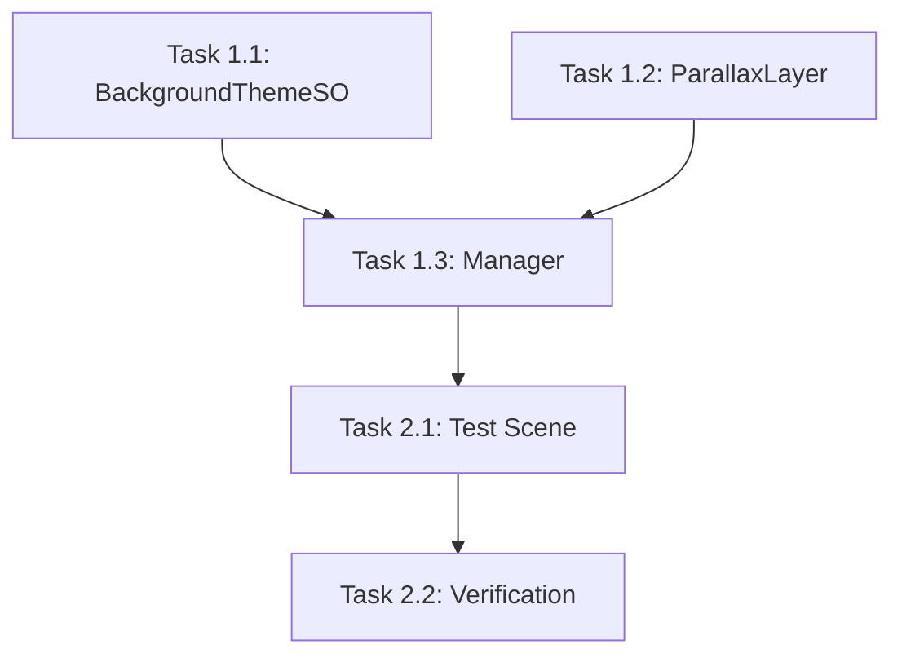

# 任务分解文档：无限背景系统 (Infinite Background System)

## 1. 任务清单

### 阶段 1: 数据结构与基础组件 (Data & Core)
- [ ] **Task 1.1**: 创建数据配置类 `BackgroundThemeSO` 和 `LayerConfig`。
    - 目标：定义背景主题的数据结构。
    - 输出：`Assets/Scripts/InfiniteBackground/Data/BackgroundThemeSO.cs`
- [ ] **Task 1.2**: 实现单层控制器 `ParallaxLayer`。
    - 目标：实现单层背景的初始化、视差移动和无限循环逻辑。
    - 输出：`Assets/Scripts/InfiniteBackground/Core/ParallaxLayer.cs`
- [ ] **Task 1.3**: 实现总控制器 `InfiniteBackgroundManager`。
    - 目标：管理所有层级，处理摄像机跟随。
    - 输出：`Assets/Scripts/InfiniteBackground/Core/InfiniteBackgroundManager.cs`

### 阶段 2: 场景集成与测试 (Integration & Test)
- [ ] **Task 2.1**: 创建测试场景 `InfiniteBackgroundTest`。
    - 目标：验证背景系统的实际运行效果。
    - 操作：
        - 创建一个新的 Scene。
        - 配置一个 `BackgroundThemeSO` 资源。
        - 设置 `InfiniteBackgroundManager` 并挂载测试数据。
- [ ] **Task 2.2**: 验证验收标准。
    - 测试点：
        - [ ] X轴无限循环。
        - [ ] 视差效果正确（不同层速度不同）。
        - [ ] Y轴跟随表现。
        - [ ] 边界处无缝隙。

## 2. 依赖关系

## 3. 详细任务说明

### Task 1.1: BackgroundThemeSO
- **Input**: 无
- **Output**: `BackgroundThemeSO.cs`
- **Details**: 包含 `LayerConfig` 结构体（Sprite, Order, ParallaxFactor）。

### Task 1.2: ParallaxLayer
- **Input**: `Sprite`, `LayerConfig`, `Camera`
- **Output**: `ParallaxLayer.cs`
- **Details**:
    - `Start()`: 生成 3 个子对象 (Left, Center, Right)。
    - `Update()`: 实现 `temp` 和 `dist` 计算，处理 `startPosition` 的重置。

### Task 1.3: InfiniteBackgroundManager
- **Input**: `BackgroundThemeSO`
- **Output**: `InfiniteBackgroundManager.cs`
- **Details**:
    - 在 `Start` 中根据 SO 配置实例化多个 `ParallaxLayer`。
    - 在 `LateUpdate` 中驱动所有 Layer 刷新。
