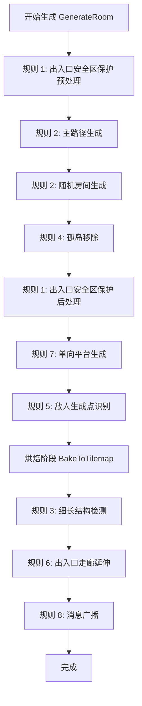

# 房间生成器 (Room Generator) v0.1 - 规则实现详解

本文档详细说明房间生成器中实现的所有规则，包括规则的目的、实现位置、算法步骤和代码示例。

---

## 规则 1: 出入口安全区保护 (Entrance/Exit Safety Clearing)

### 1.1 规则目的

防止随机生成的墙壁或房间堵住左侧入口和右侧出口，确保玩家始终能够进出房间。

### 1.2 实现位置

- **方法**：`ClearEntranceExitArea()`
- **文件**：`RoomGenerator.cs`
- **调用时机**：
  - 在 `GenerateMainPath()` 之前（预处理）
  - 在 `PostProcessPlatforms()` 之后（后处理）

### 1.3 实现细节

#### 清理范围

- **左侧入口**：从 x=0 向内延伸 4 格，Y 轴范围为 `startPos.y` 到 `startPos.y + 1`（2 格高）
- **右侧出口**：从 x=width-1 向内延伸 4 格，Y 轴范围为 `endPos.y` 到 `endPos.y + 1`（2 格高）

#### 清理操作

```csharp
private void ClearEntranceExitArea()
{
    int clearDistance = 4; // 向内打通4格距离

    // 清理左侧入口
    for (int x = 0; x < clearDistance; x++)
    {
        if (x >= currentRoom.width) break;
        for (int y = 0; y < 2; y++) // 2格高
        {
            int targetY = currentRoom.startPos.y + y;
            if (targetY < currentRoom.height)
            {
                currentRoom.SetTile(x, targetY, TileType.Floor);
            }
        }
        // 确保下方有地面支撑
        if (currentRoom.startPos.y - 1 >= 0)
        {
            currentRoom.SetTile(x, currentRoom.startPos.y - 1, TileType.Wall);
        }
    }

    // 清理右侧出口（对称操作）
    for (int x = 0; x < clearDistance; x++)
    {
        int targetX = currentRoom.width - 1 - x;
        if (targetX < 0) break;
        for (int y = 0; y < 2; y++)
        {
            int targetY = currentRoom.endPos.y + y;
            if (targetY < currentRoom.height)
            {
                currentRoom.SetTile(targetX, targetY, TileType.Floor);
            }
        }
        // 确保下方有地面支撑
        if (currentRoom.endPos.y - 1 >= 0)
        {
            currentRoom.SetTile(targetX, currentRoom.endPos.y - 1, TileType.Wall);
        }
    }
}
```

### 1.4 关键参数

| 参数            | 值  | 说明                        |
| --------------- | --- | --------------------------- |
| `clearDistance` | 4   | 向内清理的距离（格子数）    |
| 高度            | 2   | 出入口的高度（固定为 2 格） |

### 1.5 规则约束

- 清理操作会覆盖之前生成的任何内容
- 下方必须保留墙壁，确保玩家有地面站立
- 二次清理确保没有后续步骤意外覆盖

---

## 规则 2: 单向平台与墙壁分层 (Dual Tilemap Separation)

### 2.1 规则目的

将单向平台和实体墙壁分别放置在不同的 Tilemap 上，以支持不同的碰撞和物理特性：

- **Wall Tilemap**：使用 `CompositeCollider2D`，完全阻挡
- **Platform Tilemap**：使用 `PlatformEffector2D`，允许从下方通过

### 2.2 实现位置

- **方法**：`BakeToTilemap()`
- **文件**：`RoomGenerator.cs`
- **关键字段**：
  - `public Tilemap targetTilemap;` （墙壁层）
  - `public Tilemap platformTilemap;` （平台层）

### 2.3 实现细节

#### Tilemap 选择逻辑

```csharp
public void BakeToTilemap()
{
    if (targetTilemap == null || currentRoom == null) return;

    targetTilemap.ClearAllTiles();
    if (platformTilemap != null) platformTilemap.ClearAllTiles();

    int bakePadding = 3;

    for (int x = -bakePadding; x < currentRoom.width + bakePadding; x++)
    {
        for (int y = -bakePadding; y < currentRoom.height + bakePadding; y++)
        {
            Vector3Int tilePos = new Vector3Int(x, y, 0);

            if (currentRoom.IsValid(x, y))
            {
                TileType type = currentRoom.GetTile(x, y);

                if (type == TileType.Platform)
                {
                    // 平台专用 Tilemap
                    Tilemap destMap = platformTilemap != null ?
                        platformTilemap : targetTilemap;

                    // 检查是否为孤立平台
                    bool isSingle = CheckIfSinglePlatform(x, y);

                    if (isSingle && currentTheme.singlePlatformTile != null)
                    {
                        destMap.SetTile(tilePos, currentTheme.singlePlatformTile);
                    }
                    else if (currentTheme.platformTile != null)
                    {
                        destMap.SetTile(tilePos, currentTheme.platformTile);
                    }
                }
                else if (type == TileType.Wall)
                {
                    // 墙壁放在主 Tilemap
                    targetTilemap.SetTile(tilePos, currentTheme.wallTile);
                }
                else if (type == TileType.Floor)
                {
                    // 地面（空气）
                    if (currentTheme.backgroundTile != null)
                        targetTilemap.SetTile(tilePos, currentTheme.backgroundTile);
                    else
                        targetTilemap.SetTile(tilePos, null);
                }
            }
        }
    }
}
```

### 2.4 编辑器配置

在 `RoomGenerator` 组件中配置两个 Tilemap：

```csharp
[Tooltip("Assign the Tilemap for Solid Walls here")]
public Tilemap targetTilemap;

[Tooltip("Assign a separate Tilemap for One-Way Platforms here")]
public Tilemap platformTilemap;
```

### 2.5 规则约束

- 如果 `platformTilemap` 为空，平台会被放在 `targetTilemap` 上
- 平台 Tilemap 必须配置 `PlatformEffector2D` 组件
- 墙壁 Tilemap 必须配置 `CompositeCollider2D` 组件

---

## 规则 3: 细长结构检测 (Thin Structure Detection)

### 3.1 规则目的

识别孤立的 1x1 墙壁、横梁（上下都不是墙）和立柱（左右都不是墙），使用专门的瓦片渲染，提升视觉效果。

### 3.2 实现位置

- **方法**：`BakeToTilemap()` 内的墙壁处理部分
- **文件**：`RoomGenerator.cs`

### 3.3 实现细节

#### 细长结构检测算法

```csharp
if (type == TileType.Wall)
{
    // 定义局部函数检查是否为实体墙
    bool IsSolidWall(int tx, int ty)
    {
        if (!currentRoom.IsValid(tx, ty)) return true; // 边界外视为墙
        return currentRoom.GetTile(tx, ty) == TileType.Wall;
    }

    // 检查是否是"细长"的墙壁结构
    // 1. 横梁: 上下都不是墙
    bool isBeam = !IsSolidWall(x, y + 1) && !IsSolidWall(x, y - 1);

    // 2. 立柱: 左右都不是墙
    bool isPillar = !IsSolidWall(x - 1, y) && !IsSolidWall(x + 1, y);

    if ((isBeam || isPillar) && currentTheme.singlePlatformTile != null)
    {
        // 使用独立瓦片渲染细长结构
        targetTilemap.SetTile(tilePos, currentTheme.singlePlatformTile);
    }
    else
    {
        // 普通墙壁
        if (currentTheme.wallTile != null)
            targetTilemap.SetTile(tilePos, currentTheme.wallTile);
    }
}
```

### 3.4 检测条件

| 结构类型 | 条件         | 用途           |
| -------- | ------------ | -------------- |
| **横梁** | 上下都不是墙 | 天花板、悬挂物 |
| **立柱** | 左右都不是墙 | 支柱、柱子     |
| **孤立** | 四周都不是墙 | 浮岛、装饰     |

### 3.5 瓦片配置

在 `RoomTheme` 中配置：

```csharp
public TileBase singlePlatformTile; // 独立的 1x1 瓦片
```

---

## 规则 4: 孤岛移除 (Disconnected Island Removal)

### 4.1 规则目的

移除无法从入口到达的所有地板区域，确保房间内所有可行走区域都是连通的。

### 4.2 实现位置

- **方法**：`RemoveDisconnectedIslands()`
- **文件**：`RoomGenerator.cs`
- **调用时机**：在 `GenerateRandomRooms()` 之后

### 4.3 实现细节

#### BFS 洪泛填充算法

```csharp
private void RemoveDisconnectedIslands()
{
    // 从 StartPos 进行洪泛填充，标记所有可达的格子
    bool[,] reachable = new bool[parameters.roomWidth, parameters.roomHeight];
    Queue<Vector2Int> queue = new Queue<Vector2Int>();

    queue.Enqueue(currentRoom.startPos);
    reachable[currentRoom.startPos.x, currentRoom.startPos.y] = true;

    Vector2Int[] dirs = { Vector2Int.up, Vector2Int.down,
                         Vector2Int.left, Vector2Int.right };

    while (queue.Count > 0)
    {
        Vector2Int p = queue.Dequeue();

        foreach (var dir in dirs)
        {
            Vector2Int n = p + dir;
            if (currentRoom.IsValid(n.x, n.y) &&
                currentRoom.GetTile(n.x, n.y) != TileType.Wall &&
                !reachable[n.x, n.y])
            {
                reachable[n.x, n.y] = true;
                queue.Enqueue(n);
            }
        }
    }

    // 将不可达的非墙壁格子转换为墙壁
    for (int x = 0; x < parameters.roomWidth; x++)
    {
        for (int y = 0; y < parameters.roomHeight; y++)
        {
            if (currentRoom.GetTile(x, y) != TileType.Wall && !reachable[x, y])
            {
                currentRoom.SetTile(x, y, TileType.Wall);
            }
        }
    }

    // 重建 floorTiles 列表
    currentRoom.floorTiles.Clear();
    for (int x = 0; x < parameters.roomWidth; x++)
    {
        for (int y = 0; y < parameters.roomHeight; y++)
        {
            if (currentRoom.GetTile(x, y) == TileType.Floor)
            {
                currentRoom.floorTiles.Add(new Vector2Int(x, y));
            }
        }
    }
}
```

### 4.4 算法复杂度

- **时间**：O(width × height)
- **空间**：O(width × height)（reachable 数组）

### 4.5 规则约束

- 只检查 4 方向连通性（不包括对角线）
- 从 `startPos` 开始搜索
- 所有不可达的非墙壁格子都会被填充为墙壁

---

## 规则 5: 敌人生成点识别 (Spawn Point Identification)

### 5.1 规则目的

自动识别适合放置敌人的位置，分为地面敌人和空中敌人两类。

### 5.2 实现位置

- **方法**：`IdentifySpawnPoints()`
- **文件**：`RoomGenerator.cs`
- **子方法**：`IdentifyGroundSpawns()`, `IdentifyAirSpawns()`

### 5.3 地面敌人生成点 (Ground Spawns)

#### 识别条件

```csharp
private void IdentifyGroundSpawns()
{
    // 扫描每一行，寻找连续的地面
    for (int y = 0; y < parameters.roomHeight; y++)
    {
        int consecutiveFloor = 0;
        int startX = -1;

        for (int x = 0; x < parameters.roomWidth; x++)
        {
            bool isFloor = currentRoom.GetTile(x, y) == TileType.Floor;

            // 条件 1: 当前位置是地面
            bool hasGroundBelow = y == 0 ||
                currentRoom.GetTile(x, y - 1) == TileType.Wall ||
                currentRoom.GetTile(x, y - 1) == TileType.Platform;

            // 条件 2: 下方有实心块（墙或平台）
            bool hasHeadroom = true;
            for (int h = 1; h <= 2; h++)
            {
                // 条件 3: 上方 2 格必须是空气（地面）
                if (!currentRoom.IsValid(x, y + h) ||
                    currentRoom.GetTile(x, y + h) != TileType.Floor)
                {
                    hasHeadroom = false;
                    break;
                }
            }

            if (isFloor && hasGroundBelow && hasHeadroom)
            {
                if (startX == -1) startX = x;
                consecutiveFloor++;
            }
            else
            {
                // 序列断裂，检查是否满足最小长度
                if (consecutiveFloor >= parameters.minGroundSpan)
                {
                    AddGroundSpawns(startX, x - 1, y);
                }
                consecutiveFloor = 0;
                startX = -1;
            }
        }

        // 行末检查
        if (consecutiveFloor >= parameters.minGroundSpan)
        {
            AddGroundSpawns(startX, parameters.roomWidth - 1, y);
        }
    }
}

private void AddGroundSpawns(int startX, int endX, int y)
{
    // 在连续地面的中点放置生成点
    int centerX = (startX + endX) / 2;
    currentRoom.potentialSpawns.Add(new SpawnPoint
    {
        position = new Vector2Int(centerX, y),
        type = SpawnType.Ground
    });
}
```

#### 识别条件总结

| 条件              | 说明                                                   |
| ----------------- | ------------------------------------------------------ |
| 当前位置是地面    | `GetTile(x, y) == TileType.Floor`                      |
| 下方有实心块      | `GetTile(x, y-1) == Wall 或 Platform`                  |
| 上方有 2 格净空   | `GetTile(x, y+1) == Floor && GetTile(x, y+2) == Floor` |
| 连续长度 ≥ 最小值 | `consecutiveFloor >= minGroundSpan`                    |

### 5.4 空中敌人生成点 (Air Spawns)

#### 识别条件

```csharp
private void IdentifyAirSpawns()
{
    for (int x = 1; x < parameters.roomWidth - 1; x++)
    {
        for (int y = 1; y < parameters.roomHeight - 1; y++)
        {
            if (currentRoom.GetTile(x, y) != TileType.Floor) continue;

            // 条件 1: 周围 1 格内都是地面（开放空间）
            if (currentRoom.GetTile(x + 1, y) != TileType.Floor ||
                currentRoom.GetTile(x - 1, y) != TileType.Floor ||
                currentRoom.GetTile(x, y + 1) != TileType.Floor ||
                currentRoom.GetTile(x, y - 1) != TileType.Floor)
            {
                continue;
            }

            // 条件 2: 距地面的高度 ≥ 最小值
            int distToGround = 0;
            bool groundFound = false;
            for (int dy = 1; y - dy >= 0; dy++)
            {
                if (currentRoom.GetTile(x, y - dy) == TileType.Wall ||
                    currentRoom.GetTile(x, y - dy) == TileType.Platform)
                {
                    distToGround = dy;
                    groundFound = true;
                    break;
                }
            }

            if (groundFound && distToGround >= parameters.minAirHeight)
            {
                // 条件 3: 20% 概率选择（避免过密集）
                if (Random.value < 0.2f)
                {
                    currentRoom.potentialSpawns.Add(new SpawnPoint
                    {
                        position = new Vector2Int(x, y),
                        type = SpawnType.Air
                    });
                }
            }
        }
    }
}
```

#### 识别条件总结

| 条件                | 说明                              |
| ------------------- | --------------------------------- |
| 当前位置是地面      | `GetTile(x, y) == TileType.Floor` |
| 周围开放            | 上下左右都是地面                  |
| 距地面高度 ≥ 最小值 | `distToGround >= minAirHeight`    |
| 随机选择            | `Random.value < 0.2f`             |

### 5.5 生成点筛选

```csharp
// 筛选：最多保留 maxEnemies 个，相邻距离 ≥ minSpawnDistance
List<SpawnPoint> selected = new List<SpawnPoint>();
foreach (var candidate in currentRoom.potentialSpawns)
{
    if (selected.Count >= parameters.maxEnemies) break;

    bool tooClose = false;
    foreach (var s in selected)
    {
        if (Vector2Int.Distance(candidate.position, s.position)
            < parameters.minSpawnDistance)
        {
            tooClose = true;
            break;
        }
    }

    if (!tooClose) selected.Add(candidate);
}
currentRoom.potentialSpawns = selected;
```

---

## 规则 6: 出入口走廊延伸 (Entrance/Exit Corridor Extension)

### 6.1 规则目的

在烘焙阶段，将出入口的通道延伸到房间边界之外（Padding 区域），形成视觉上通透的走廊，防止出入口看起来被墙壁包围。

### 6.2 实现位置

- **方法**：`BakeToTilemap()` 内的 Padding 处理部分
- **文件**：`RoomGenerator.cs`

### 6.3 实现细节

#### Padding 区域处理逻辑

```csharp
public void BakeToTilemap()
{
    // ... 前面的代码 ...

    int bakePadding = 3;

    for (int x = -bakePadding; x < currentRoom.width + bakePadding; x++)
    {
        for (int y = -bakePadding; y < currentRoom.height + bakePadding; y++)
        {
            Vector3Int tilePos = new Vector3Int(x, y, 0);

            if (currentRoom.IsValid(x, y))
            {
                // ... 房间内部的处理 ...
            }
            else
            {
                // 范围外 (Padding 区域)
                bool isEntrancePath = false;
                bool isExitPath = false;

                // 检查左侧入口通道 (x < 0)
                if (x < 0)
                {
                    // 对应 StartPos 的 Y 轴范围 (高度2)
                    if (y >= currentRoom.startPos.y &&
                        y < currentRoom.startPos.y + 2)
                    {
                        isEntrancePath = true;
                    }
                }

                // 检查右侧出口通道 (x >= width)
                if (x >= currentRoom.width)
                {
                    // 对应 EndPos 的 Y 轴范围 (高度2)
                    if (y >= currentRoom.endPos.y &&
                        y < currentRoom.endPos.y + 2)
                    {
                        isExitPath = true;
                    }
                }

                if (isEntrancePath || isExitPath)
                {
                    // 如果是通道路径，不填墙，留空 (null)
                    targetTilemap.SetTile(tilePos, null);
                }
                else
                {
                    // 其他区域强制填充墙壁，作为边缘的支撑
                    if (currentTheme.wallTile != null)
                        targetTilemap.SetTile(tilePos, currentTheme.wallTile);
                }
            }
        }
    }
}
```

### 6.4 关键参数

| 参数          | 值  | 说明                             |
| ------------- | --- | -------------------------------- |
| `bakePadding` | 3   | Padding 区域的厚度（格子数）     |
| 通道高度      | 2   | 出入口通道的高度（与出入口一致） |

### 6.5 规则约束

- Padding 区域范围：`[-bakePadding, width+bakePadding) × [-bakePadding, height+bakePadding)`
- 只有对齐出入口 Y 坐标的位置才会被留空
- 其他 Padding 区域必须填充墙壁（支撑 Rule Tile 的连接规则）

---

## 规则 7: 单向平台生成约束 (One-Way Platform Generation Constraints)

### 7.1 规则目的

在垂直落差处自动生成单向平台，但需要满足多项约束条件，确保平台既能帮助玩家跳跃，又不会过于密集或阻挡通行。

### 7.2 实现位置

- **方法**：`PostProcessPlatforms()`
- **文件**：`RoomGenerator.cs`

### 7.3 实现细节

#### 平台生成算法

```csharp
private void PostProcessPlatforms()
{
    int placed = 0;
    List<RectInt> exclusionZones = new List<RectInt>();
    int exclusionRadius = 4;
    int safetyMargin = 5;    // 绝对安全距离
    int seedMargin = 6;      // 种子安全距离

    for (int x = 1; x < parameters.roomWidth - 1; x++)
    {
        if (placed >= parameters.maxPlatforms) break;

        // 约束 1: 出入口保护
        if (Mathf.Abs(x - currentRoom.startPos.x) < seedMargin ||
            Mathf.Abs(x - currentRoom.endPos.x) < seedMargin)
            continue;

        int lastStandableY = -1;
        for (int y = 0; y < parameters.roomHeight; y++)
        {
            TileType t = currentRoom.GetTile(x, y);
            if (t == TileType.Wall || t == TileType.Platform)
            {
                lastStandableY = y;
            }
            else
            {
                int gap = y - lastStandableY;

                // 约束 2: 垂直落差 > 3
                if (gap > 3)
                {
                    int platY = lastStandableY + 3;

                    // 约束 3: 头顶空间
                    if (platY + 2 >= parameters.roomHeight) continue;

                    // 约束 4: 排斥区检查
                    if (IsInExclusionZone(x, platY, exclusionZones))
                        continue;

                    // 约束 5: 避免与其他平台接触
                    if (IsTouchingPlatform(x, platY))
                        continue;

                    // 约束 6: 向左/右扫描可用宽度
                    int l = 0, r = 0;

                    // 向左扫描
                    for (int i = 1; i <= 2; i++)
                    {
                        int tx = x - i;
                        if (!currentRoom.IsValid(tx, platY) ||
                            currentRoom.GetTile(tx, platY) != TileType.Floor)
                            break;
                        if (IsTouchingPlatform(tx, platY)) break;
                        if (Mathf.Abs(tx - currentRoom.startPos.x) < safetyMargin ||
                            Mathf.Abs(tx - currentRoom.endPos.x) < safetyMargin)
                            break;
                        if (IsInExclusionZone(tx, platY, exclusionZones))
                            break;

                        // 约束 7: 下方净空检查
                        if (currentRoom.GetTile(tx, platY - 1) != TileType.Floor ||
                            currentRoom.GetTile(tx, platY - 2) != TileType.Floor)
                            break;

                        l++;
                    }

                    // 向右扫描（类似）
                    for (int i = 1; i <= 2; i++)
                    {
                        int tx = x + i;
                        // ... 类似的检查 ...
                        r++;
                    }

                    int width = 1 + l + r;

                    // 约束 8: 最小宽度 ≥ 3
                    if (width >= 3)
                    {
                        // 放置平台
                        currentRoom.SetTile(x, platY, TileType.Platform);
                        for(int i=1; i<=l; i++)
                            currentRoom.SetTile(x-i, platY, TileType.Platform);
                        for(int i=1; i<=r; i++)
                            currentRoom.SetTile(x+i, platY, TileType.Platform);

                        // 添加排斥区
                        int startX = x - l;
                        RectInt zone = new RectInt(
                            startX - exclusionRadius,
                            platY - exclusionRadius,
                            width + exclusionRadius * 2,
                            1 + exclusionRadius * 2
                        );
                        exclusionZones.Add(zone);

                        placed++;
                        lastStandableY = platY;
                    }
                }
            }
        }
    }
}
```

### 7.4 约束条件总结

| 约束              | 条件                                | 目的               |
| ----------------- | ----------------------------------- | ------------------ |
| **1. 出入口保护** | `Abs(x - startPos.x) >= seedMargin` | 防止堵住出入口     |
| **2. 垂直落差**   | `gap > 3`                           | 只在需要的地方生成 |
| **3. 头顶空间**   | `platY + 2 < height`                | 确保玩家能跳上去   |
| **4. 排斥区**     | 不在 exclusionZone 内               | 防止平台过密集     |
| **5. 平台接触**   | `!IsTouchingPlatform()`             | 避免平台相连       |
| **6. 水平扫描**   | 向左右各扫描 2 格                   | 确定平台宽度       |
| **7. 下方净空**   | 下方 2 格都是地面                   | 确保通行空间       |
| **8. 最小宽度**   | `width >= 3`                        | 平台必须足够宽     |

### 7.5 关键参数

| 参数              | 值  | 说明               |
| ----------------- | --- | ------------------ |
| `exclusionRadius` | 4   | 排斥区半径         |
| `safetyMargin`    | 5   | 出入口绝对安全距离 |
| `seedMargin`      | 6   | 平台种子安全距离   |
| `maxPlatforms`    | 4   | 最多生成数量       |

---

## 规则 8: 消息广播 (Message Broadcasting)

### 8.1 规则目的

在房间生成完成后，通过消息系统广播出入口的位置信息（网格坐标、世界坐标、方位），供其他系统（如敌人生成、传送门放置）使用。

### 8.2 实现位置

- **方法**：`BroadcastRoomAnchors()`
- **文件**：`RoomGenerator.cs`
- **调用时机**：在 `BakeToTilemap()` 完成后

### 8.3 实现细节

#### 广播逻辑

```csharp
private void BroadcastRoomAnchors()
{
    if (currentRoom == null || targetTilemap == null) return;

    // 步骤 1: 计算世界坐标
    Vector3 startWorld = targetTilemap.CellToWorld(
        new Vector3Int(currentRoom.startPos.x, currentRoom.startPos.y, 0)
    ) + targetTilemap.tileAnchor;

    Vector3 endWorld = targetTilemap.CellToWorld(
        new Vector3Int(currentRoom.endPos.x, currentRoom.endPos.y, 0)
    ) + targetTilemap.tileAnchor;

    // 步骤 2: 确定方位
    Vector2Int startDir = Vector2Int.left;   // (-1, 0)
    Vector2Int endDir = Vector2Int.right;    // (1, 0)

    // 步骤 3: 构建数据结构
    RoomAnchorsData data = new RoomAnchorsData
    {
        startGridPos = currentRoom.startPos,
        endGridPos = currentRoom.endPos,
        startWorldPos = startWorld,
        endWorldPos = endWorld,
        startDirection = startDir,
        endDirection = endDir
    };

    // 步骤 4: 根据运行模式选择广播方式
    if (Application.isPlaying)
    {
        // 运行时：通过消息系统广播
        MessageManager.Instance.Send(
            MessageDefine.ROOM_ANCHORS_UPDATE,
            data
        );
    }
    else
    {
        // 编辑器模式：打印详细日志
        string ToDirText(Vector2Int dir)
        {
            if (dir == Vector2Int.left) return "Left (左)";
            if (dir == Vector2Int.right) return "Right (右)";
            if (dir == Vector2Int.up) return "Up (上)";
            if (dir == Vector2Int.down) return "Down (下)";
            return "Unknown";
        }

        Debug.Log($"[RoomGenerator] Room Generated.\n" +
                  $"[方位/Direction] Entrance: {ToDirText(data.startDirection)} | Exit: {ToDirText(data.endDirection)}\n" +
                  $"[瓦片坐标/Grid] Entrance: {data.startGridPos} | Exit: {data.endGridPos}\n" +
                  $"[世界坐标/World] Entrance: {data.startWorldPos} | Exit: {data.endWorldPos}");
    }
}
```

### 8.4 消息数据结构

```csharp
public struct RoomAnchorsData
{
    public Vector2Int startGridPos;      // 入口网格坐标
    public Vector2Int endGridPos;        // 出口网格坐标
    public Vector3 startWorldPos;        // 入口世界坐标
    public Vector3 endWorldPos;          // 出口世界坐标
    public Vector2Int startDirection;    // 入口方位
    public Vector2Int endDirection;      // 出口方位
}
```

### 8.5 消息监听示例

```csharp
// 注册监听
MessageManager.Instance.Register<RoomAnchorsData>(
    MessageDefine.ROOM_ANCHORS_UPDATE,
    OnRoomGenerated
);

// 回调处理
void OnRoomGenerated(RoomAnchorsData data)
{
    Debug.Log($"房间已生成");
    Debug.Log($"入口: Grid{data.startGridPos}, World{data.startWorldPos}");
    Debug.Log($"出口: Grid{data.endGridPos}, World{data.endWorldPos}");

    // 在此处放置角色、敌人、传送门等
    SpawnPlayerAtPosition(data.startWorldPos);
    SpawnPortalAtPosition(data.endWorldPos);
}

// 取消监听
MessageManager.Instance.Remove<RoomAnchorsData>(
    MessageDefine.ROOM_ANCHORS_UPDATE,
    OnRoomGenerated
);
```

### 8.6 运行模式差异

| 模式            | 行为                      | 用途           |
| --------------- | ------------------------- | -------------- |
| **Play Mode**   | 发送消息到 MessageManager | 运行时系统集成 |
| **Editor Mode** | 打印 Debug.Log            | 开发调试       |

---

## 规则执行顺序



---

_Last Updated: v0.1_
