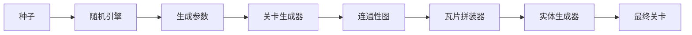
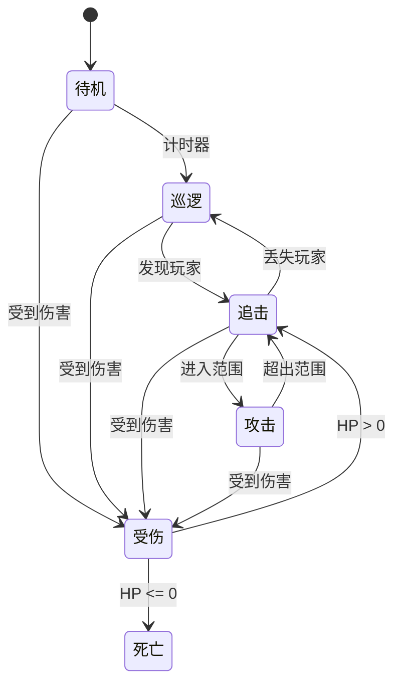
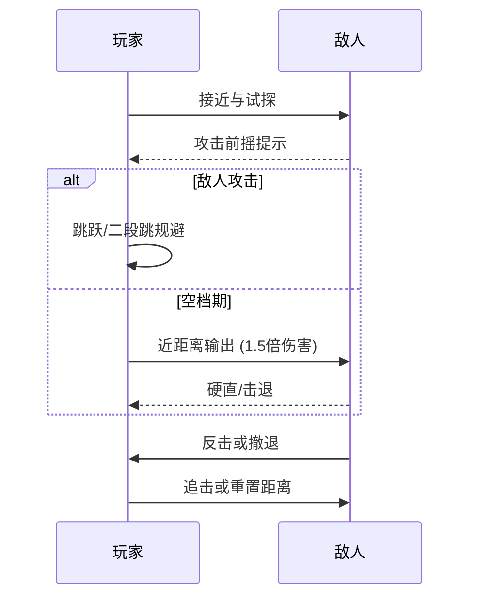
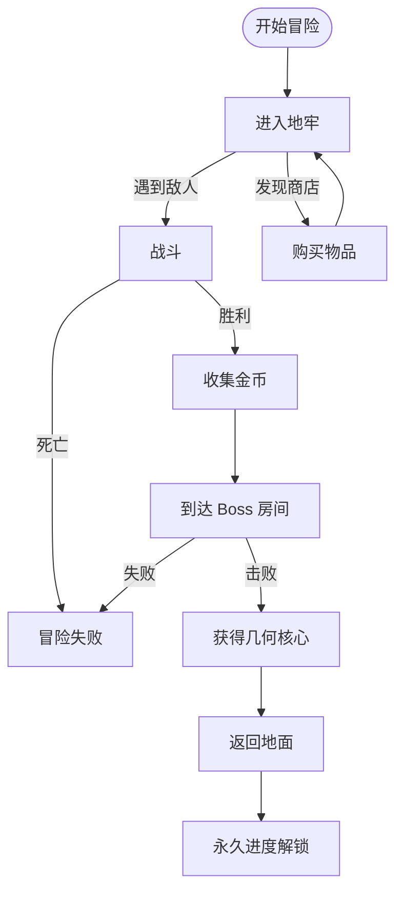

# CRYPTA GEOMETRICA

<p align="center">
  
</p>

<p align="center">
  <strong>🎮 程序化地牢生成的 2D 动作 Roguelite 游戏</strong>
</p>

<p align="center">
  
  
  
  
</p>

<p align="center">
  <a href="../README.md">English</a> •
  <a href="#中文">中文</a> •
  <a href="README_FI.md">Suomi</a> •
  <a href="README_SV.md">Svenska</a> •
  <a href="README_DA.md">Dansk</a>
</p>

---

## 中文

### 🎮 项目简介

**CRYPTA GEOMETRICA**（几何地窖）是一款由单人独立开发的横板动作类 Roguelite 游戏。游戏采用极具辨识度的矢量几何线框美术风格，搭配冷峻科幻的视觉基调，构建出一个充满未知与危险的几何地下城世界。

本项目灵感来源于《死亡细胞》、《空洞骑士》和《几何冲刺》，展示了先进的程序化生成技术、基于状态机的 AI 系统以及精细的 2D 战斗机制。

<p align="center">
  
  
  
</p>

---

### ✨ 核心特性与技术亮点

#### 🏗️ 程序化关卡生成系统

实现了行业标准算法的多层地牢生成系统：

| 系统 | 算法 | 描述 |
|------|------|------|
| **房间生成器 V1** | 随机游走 + 规则约束 | 基础房间生成，支持自定义约束 |
| **房间生成器 V2** | BSP + Delaunay + MST | 高级空间分割与图论走廊连接 |
| **关卡生成器** | 多房间组装 | 完整地牢关卡，包含入口、战斗和 Boss 房间 |



**技术实现：**
- **BSP（二叉空间分割）**：递归空间划分用于房间放置
- **Delaunay 三角剖分**：最优走廊路径计算
- **最小生成树**：确保连通性同时避免冗余路径
- **生成点验证**：基于 Physics2D 的碰撞检测确保敌人放置合理

#### 🤖 敌人 AI 状态机

通用、可扩展的敌人行为状态机架构：



**功能特点：**
- 可视化状态机调试器（编辑器窗口）
- 运行时状态切换和调试
- 可配置的状态转换和行为
- 支持待机、巡逻、追击、攻击、受伤、死亡状态

#### ⚔️ 战斗系统

参考《空洞骑士》经典战斗循环：



**战斗机制：**
- 风险-回报近战系统（近距离 1.5 倍伤害）
- 二段跳空中机动
- 清晰的攻击前摇便于预判
- 基于状态的玩家控制器，流畅的动作衔接

---

### 🎨 美术风格与视觉设计

游戏采用极简纯粹的几何体构成逻辑：

| 元素 | 设计 |
|------|------|
| **玩家** | 1-3 个基础几何体（矩形勇者） |
| **敌人** | 三角形为主的敌对阵营，轮廓分明 |
| **Boss** | 多几何体复杂组合 |
| **环境** | 科幻线框风格配霓虹点缀 |

<p align="center">
  
  
  
</p>

---

### 🛠️ 技术栈

| 类别 | 技术 |
|------|------|
| **引擎** | Unity 2022.3+ (URP) |
| **语言** | C# 10.0 |
| **UI 框架** | Odin Inspector |
| **物理** | Physics2D |
| **渲染** | Tilemap 系统 |
| **AI** | 有限状态机 (FSM) |
| **关卡生成** | BSP、Delaunay、MST 算法 |

---

### 📁 项目架构

```
Assets/
├── Scripts/
│   ├── 2_PlayerSystem/           # 玩家状态机与控制
│   │   ├── PlayerController.cs   # 主玩家控制器
│   │   ├── PlayerStateBase.cs    # 抽象状态基类
│   │   └── States/               # 具体玩家状态
│   │
│   ├── 3_LevelGeneration/
│   │   ├── RoomGeneratorV1/      # 基础房间生成
│   │   │   ├── RoomGenerator.cs
│   │   │   ├── RoomData.cs
│   │   │   └── RoomGenParams.cs
│   │   │
│   │   ├── RoomGeneratorV2/      # 高级 BSP 生成
│   │   │   ├── Core/             # RoomGeneratorV2, RoomGenParamsV2
│   │   │   ├── Data/             # RoomDataV2, RoomGraph, BSPNode
│   │   │   ├── Generators/       # BSP、走廊、平台生成器
│   │   │   ├── Utils/            # Delaunay、MST 算法
│   │   │   └── Settings/         # ScriptableObject 配置
│   │   │
│   │   └── LevelGenerator/       # 多房间关卡系统
│   │       ├── Core/             # LevelGenerator, RoomSeedPool
│   │       ├── Data/             # LevelData, PlacedRoom, RoomType
│   │       └── Generators/       # LinearRoomPlacer, LCorridorBuilder
│   │
│   └── 5_EnemyStateMachine/      # 敌人 AI 系统
│       ├── GenericEnemyController.cs
│       ├── EnemyStateBase.cs
│       └── States/               # Idle, Patrol, Chase, Attack 等
│
├── Editor/
│   ├── RoomGeneratorV1/          # V1 编辑器工具
│   ├── RoomGeneratorV2/          # V2 编辑器窗口
│   └── LevelGenerator/           # 关卡生成器窗口与 Gizmos
│
└── Documents/
    ├── RoomGeneratorV1/          # V1 技术文档
    ├── RoomGeneratorV2/          # V2 API 参考与设计
    ├── Game_Design_Document_EN.md
    └── 策划_基础框架.md
```

---

### 🎯 游戏设计概览

#### 核心循环



#### 房间类型

| 房间类型 | 功能 | 敌人数量 | 奖励 |
|----------|------|----------|------|
| **战斗房** | 基础战斗 | 2-4 | 10-25 金币 |
| **精英房** | 高压挑战 | 3-6 | 25-50 金币 |
| **休息房** | 恢复（安全区） | 0 | HP 恢复 |
| **Boss 房** | 两阶段 Boss 战 | 1 Boss | 几何核心 |

#### 敌人阵营：三角形国度

| 敌人 | 构成 | HP | 伤害 | 定位 |
|------|------|-----|------|------|
| **三角锐枪手** | 纯三角形 | 15 | 18 | 远程输出 |
| **三角盾卫** | 三角形 + 矩形 | 45 | 8 | 坦克 |
| **三角飞蛾** | 三角形 + 圆形 | 8 | 4 | 骚扰 |

---

### 🎭 角色设计

#### 矩形勇者 (Rectangle Hero)
矩形国度的精英战士，深蓝色矩形构成的 Q 版人形，正方形头部配青色矩形眼睛，手持青色矩形长剑。动作敏捷流畅，攻击留下青色轨迹，二段跳时脚下喷射矩形粒子。

#### 三角锐枪手 (Triangle Sharpshooter)
远程攻击单位，暗红色倒三角形构成，中心橙色三角核心如独眼，细长锥形身体悬浮移动。枪尖蓄力发射三角弹幕或超远突刺，低血高伤的玻璃大炮。

#### 三角盾卫 (Triangle Shieldbearer)
重装防御单位，暗红倒三角头部，深蓝菱形身体，手持巨大矩形盾牌和重剑。移动缓慢防御强，正面格挡完全免伤。

#### 三角飞蛾 (Triangle Moth)
骚扰型飞行单位，红色倒三角核心被绿色圆环包裹，两侧不规则三角翅膀。俯冲撞击或撒绿色三角弹幕，低威胁高烦人。

#### 复合守卫者 (Composite Guardian - Boss)
失控实验产物，矩形、三角、圆形三大几何体强制融合的巨型 Boss。深蓝矩形躯干堆叠成塔，金黄几何王冠，胸口绿色圆形能量核心。两阶段战斗：一阶段稳定进攻，二阶段狂暴加速。

---

### 🚀 快速开始

#### 环境要求
- Unity 2022.3 或更高版本
- Odin Inspector（用于编辑器工具）

#### 安装
```bash
git clone https://github.com/yourusername/crypta-geometrica.git
cd crypta-geometrica
# 使用 Unity Hub 打开
```

#### 快速体验
1. 打开 `Scenes/4_Level.unity`
2. 按 Play 测试关卡生成
3. 使用 `Window > 敌人状态机 > 状态机可视化器` (Ctrl+Shift+V) 调试敌人 AI

---

### 📖 文档

| 文档 | 描述 |
|------|------|
| [游戏设计文档（英文）](Game_Design_Document_EN.md) | 完整 GDD 英文版 |
| [策划基础框架](策划_基础框架.md) | 游戏设计中文版 |
| [程序化地牢生成](程序化地牢生成.md) | 算法调研文档 |
| [房间生成器 V1 文档](RoomGeneratorV1/) | V1 技术文档 |
| [房间生成器 V2 API](RoomGeneratorV2/API_REFERENCE.md) | V2 API 参考 |
| [技术设计 V2](RoomGeneratorV2/TECHNICAL_DESIGN.md) | V2 架构设计 |

---

### 🎓 技能展示

本项目展示了以下技术能力：

- **程序化内容生成**：BSP、随机游走、图论算法
- **游戏 AI**：有限状态机、行为模式
- **Unity 开发**：编辑器工具、ScriptableObjects、Physics2D
- **软件架构**：整洁代码、SOLID 原则、模块化设计
- **技术文档**：包含图表的完整文档

---

### 📜 许可证

本项目仅用于教育和作品集展示目的。

### 🤝 贡献

欢迎提交贡献、问题和功能请求！

---

<p align="center">使用 ❤️ 和 Unity 制作</p>
<p align="center">单人开发项目 | 2024-2025</p>
