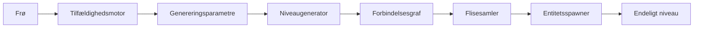
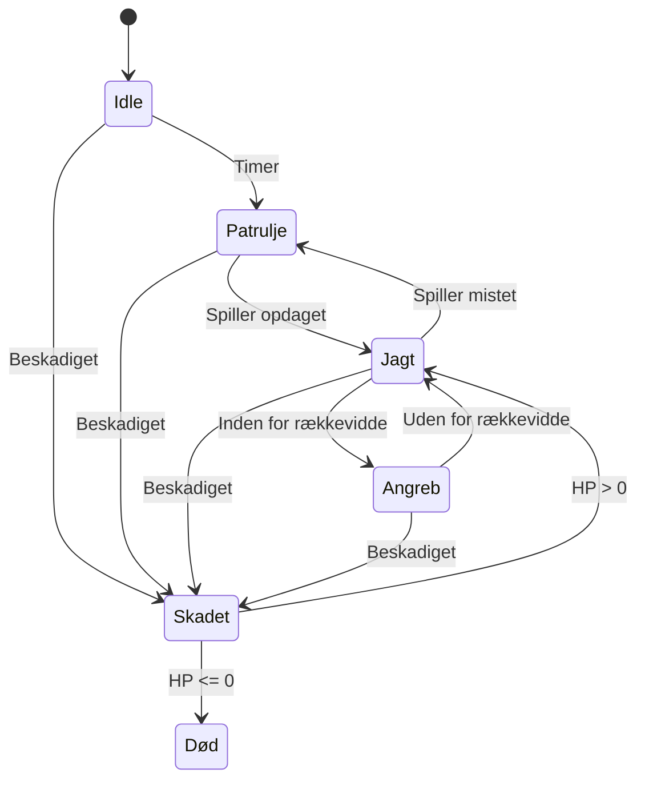
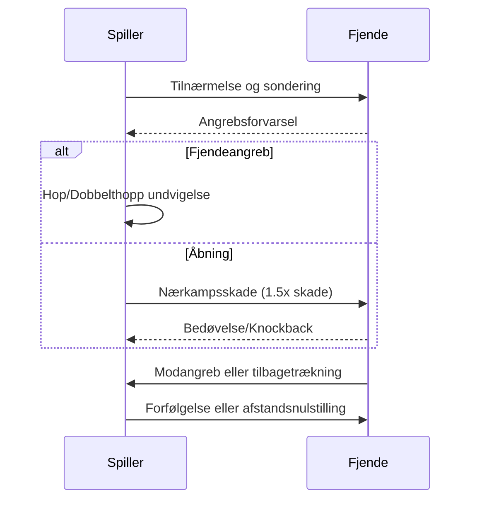
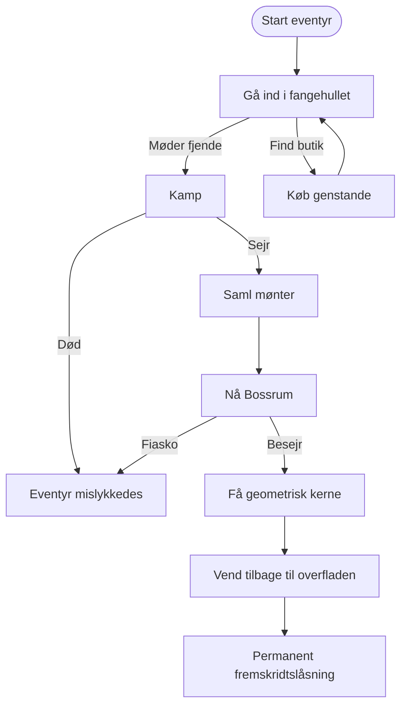

# CRYPTA GEOMETRICA

<p align="center">
  
</p>

<p align="center">
  <strong>🎮 2D Action Roguelite med proceduremæssig fangehulsgenerering</strong>
</p>

<p align="center">
  
  
  
  
</p>

<p align="center">
  <a href="../README.md">English</a> •
  <a href="README_CN.md">中文</a> •
  <a href="README_FI.md">Suomi</a> •
  <a href="README_SV.md">Svenska</a> •
  <a href="#dansk">Dansk</a>
</p>

---

## Dansk

### 🎮 Om projektet

**CRYPTA GEOMETRICA** (Geometrisk fangehul) er et sidescrollende action-Roguelite-spil udviklet af en solo indie-udvikler.

Spillet bruger en karakteristisk vektorgeometrisk trådramme-stil kombineret med en kold sci-fi-visuel tone, der skaber en verden af geometriske fangehuller fyldt med ukendte farer.

Inspireret af **Dead Cells**, **Hollow Knight** og **Geometry Dash**, viser dette projekt avancerede proceduregenereringsteknikker, tilstandsmaskinbaserede AI-systemer og polerede 2D-kampmekanikker.

<p align="center">
  
  
  
</p>

---

### ✨ Nøglefunktioner og tekniske højdepunkter

#### 🏗️ Proceduremæssigt niveaugenereringssystem

Et sofistikeret flerlagsfangehulsgenereringssystem, der implementerer branchestandardalgoritmer:

| System | Algoritme | Beskrivelse |
|--------|-----------|-------------|
| **Rumgenerator V1** | Tilfældig vandring + Regler | Grundlæggende rumgenerering med tilpasselige begrænsninger |
| **Rumgenerator V2** | BSP + Delaunay + MST | Avanceret rumsopdeling med grafbaserede korridorforbindelser |
| **Niveaugenerator** | Flerrumsmontage | Komplette fangehulsniveauer med indgangs-, kamp- og bossrum |



**Teknisk implementering:**
- **BSP (Binary Space Partitioning)**: Rekursiv rumsopdeling til rumsplacering
- **Delaunay-triangulering**: Optimal korridorvejsberegning
- **Minimalt udspændende træ**: Sikrer forbindelse og undgår overflødige stier
- **Spawn-punktvalidering**: Physics2D-baseret kollisionsdetektion til fjendeplacering


#### 🤖 Fjende-AI-tilstandsmaskine

En generisk, udvidelig tilstandsmaskinarkitektur til fjendeadfærd:



**Funktioner:**
- Visuel tilstandsmaskindebugger (editorvindue)
- Køretidstilstandsskift og debugging
- Konfigurerbare overgange og adfærd
- Understøttelse af Idle-, Patrulje-, Jagt-, Angreb-, Skadet- og Død-tilstande

#### ⚔️ Kampsystem

Refererer til Hollow Knights klassiske kamploop:




---

### 🎨 Kunststil og visuelt design

Spillet bruger minimalistisk geometrisk konstruktionslogik:

| Element | Design |
|---------|--------|
| **Spiller** | 1-3 grundlæggende geometriske former (Rektangelhelt) |
| **Fjender** | Trekantsbaseret fraktion med distinkte silhuetter |
| **Bosser** | Komplekse multigeometriske sammensætninger |
| **Miljø** | Sci-fi-trådramme med neonaccenter |

<p align="center">
  
  
  
</p>

---

### 🛠️ Teknisk stak

| Kategori | Teknologi |
|----------|-----------|
| **Motor** | Unity 2022.3+ (URP) |
| **Sprog** | C# 10.0 |
| **UI-ramme** | Odin Inspector |
| **Fysik** | Physics2D |
| **Rendering** | Tilemap-system |
| **AI** | Endelig tilstandsmaskine (FSM) |
| **Niveaugenerering** | BSP-, Delaunay-, MST-algoritmer |

---

### 📁 Projektarkitektur

```
Assets/
├── Scripts/
│   ├── 2_PlayerSystem/           # Spillerens tilstandsmaskine og kontroller
│   ├── 3_LevelGeneration/
│   │   ├── RoomGeneratorV1/      # Grundlæggende rumgenerering
│   │   ├── RoomGeneratorV2/      # Avanceret BSP-generering
│   │   └── LevelGenerator/       # Flerrumsniveausystem
│   └── 5_EnemyStateMachine/      # Fjende-AI-system
│
├── Editor/                       # Tilpassede editorværktøjer
└── Documents/                    # Design- og tekniske dokumenter
```


---

### 🎯 Spildesignoversigt

#### Kerneloop



#### Rumtyper

| Rumtype | Funktion | Fjendeantal | Belønninger |
|---------|----------|-------------|-------------|
| **Kamp** | Grundlæggende kampe | 2-4 | 10-25 mønter |
| **Elite** | Højtryksudfordring | 3-6 | 25-50 mønter |
| **Hvile** | Genopretning (sikker zone) | 0 | HP-genopretning |
| **Boss** | Tofaset bosskamp | 1 Boss | Geometrisk kerne |

#### Fjendefraktion: Trekantsriget

| Fjende | Sammensætning | HP | Skade | Rolle |
|--------|---------------|-----|-------|-------|
| **Skarpskytte** | Ren trekant | 15 | 18 | Afstands-DPS |
| **Skjoldvagt** | Trekant + Rektangel | 45 | 8 | Tank |
| **Møl** | Trekant + Cirkel | 8 | 4 | Chikane |

---

### 🚀 Kom i gang

#### Forudsætninger
- Unity 2022.3 eller nyere
- Odin Inspector (til editorværktøjer)

#### Installation
```bash
git clone https://github.com/yourusername/crypta-geometrica.git
cd crypta-geometrica
# Åbn med Unity Hub
```

#### Hurtigstart
1. Åbn `Scenes/4_Level.unity`
2. Tryk Play for at teste niveaugenerering
3. Brug `Window > 敌人状态机 > 状态机可视化器` (Ctrl+Shift+V) til at debugge fjende-AI


---

### 📖 Dokumentation

| Dokument | Beskrivelse |
|----------|-------------|
| [Spildesigndokument](Game_Design_Document_EN.md) | Komplet GDD på engelsk |
| [Rumgenerator V1 Dokumenter](RoomGeneratorV1/) | V1 teknisk dokumentation |
| [Rumgenerator V2 API](RoomGeneratorV2/API_REFERENCE.md) | V2 API-reference |
| [Teknisk design V2](RoomGeneratorV2/TECHNICAL_DESIGN.md) | V2 arkitekturdesign |

---

### 🎓 Demonstrerede færdigheder

Dette projekt demonstrerer kompetence inden for:

- **Proceduremæssig indholdsoprettelse**: BSP, tilfældig vandring, grafalgoritmer
- **Spil-AI**: Endelige tilstandsmaskiner, adfærdsmønstre
- **Unity-udvikling**: Editorværktøjer, ScriptableObjects, Physics2D
- **Softwarearkitektur**: Ren kode, SOLID-principper, modulært design
- **Teknisk dokumentation**: Omfattende dokumenter med diagrammer

---

### 📜 Licens

Dette projekt er beregnet til uddannelses- og portfolioformål.

### 🤝 Bidrag

Bidrag, problemer og funktionsanmodninger er velkomne!

---

<p align="center">Lavet med ❤️ og Unity</p>
<p align="center">Soludviklerprojekt | 2024-2025</p>
