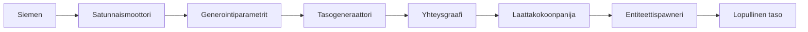
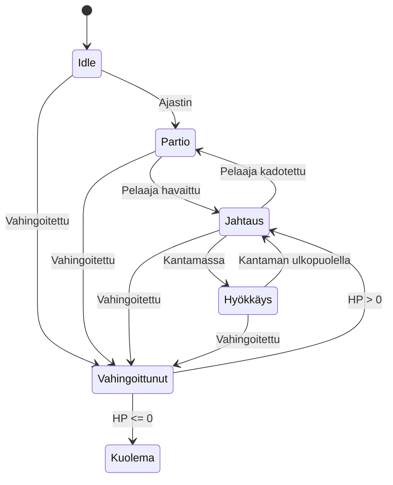
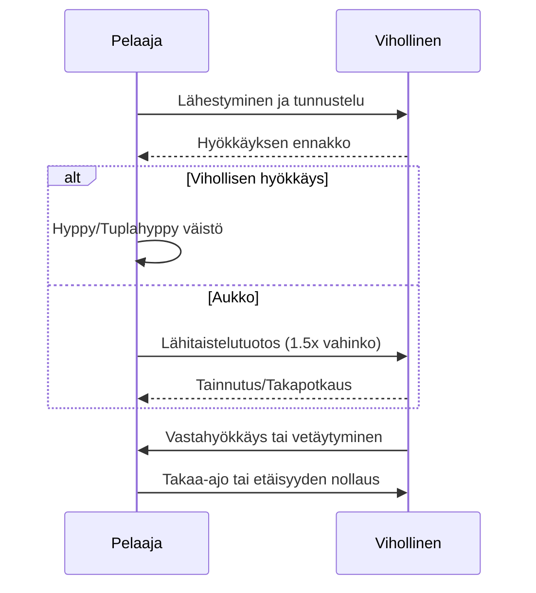
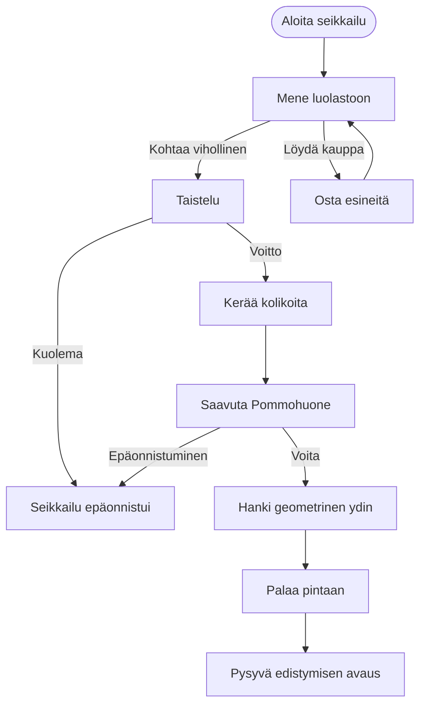

# CRYPTA GEOMETRICA

<p align="center">
  
</p>

<p align="center">
  <strong>🎮 2D-toiminta-Roguelite proseduraalisella luolastogeneroinnilla</strong>
</p>

<p align="center">
  
  
  
  
</p>

<p align="center">
  <a href="../README.md">English</a> •
  <a href="README_CN.md">中文</a> •
  <a href="#suomi">Suomi</a> •
  <a href="README_SV.md">Svenska</a> •
  <a href="README_DA.md">Dansk</a>
</p>

---

## Suomi

### 🎮 Tietoja projektista

**CRYPTA GEOMETRICA** (Geometrinen luolasto) on sivuttain vieritettävä toiminta-Roguelite-peli, jonka on kehittänyt yksi indie-kehittäjä. Peli käyttää tunnistettavaa vektorigeometrista rautalankataidetyylä yhdistettynä kylmään sci-fi-visuaaliseen sävyyn, luoden tuntemattomia ja vaaroja täynnä olevan geometrisen luolaston maailman.

Inspiraationa ovat toimineet **Dead Cells**, **Hollow Knight** ja **Geometry Dash**. Projekti esittelee edistyneitä proseduraalisen generoinnin tekniikoita, tilakoneisiin perustuvia tekoälyjärjestelmiä ja hiottuja 2D-taistelumekaniikkoja.

<p align="center">
  
  
  
</p>

---

### ✨ Keskeiset ominaisuudet ja tekniset kohokohdat

#### 🏗️ Proseduraalinen tasogenerointijärjestelmä

Kehittynyt monikerroksinen luolastogenerointijärjestelmä, joka toteuttaa alan standardialgoritmeja:

| Järjestelmä | Algoritmi | Kuvaus |
|-------------|-----------|--------|
| **Huonegeneraattori V1** | Satunnaiskävely + Säännöt | Perushuoneiden generointi mukautettavilla rajoituksilla |
| **Huonegeneraattori V2** | BSP + Delaunay + MST | Edistynyt tilanjakaminen graafiteoriaan perustuvilla käytäväyhteyksillä |
| **Tasogeneraattori** | Monihuonekokoonpano | Täydelliset luolastotasot sisäänkäynti-, taistelu- ja pommohuoneilla |



**Tekninen toteutus:**
- **BSP (Binary Space Partitioning)**: Rekursiivinen tilanjakaminen huoneiden sijoitteluun
- **Delaunay-triangulaatio**: Optimaalinen käytäväpolkujen laskenta
- **Minimaalinen virittävä puu**: Varmistaa yhteyden välttäen turhia polkuja
- **Spawn-pisteen validointi**: Physics2D-pohjainen törmäystunnistus vihollisten sijoitteluun

#### 🤖 Vihollisten tekoälytilakone

Yleinen, laajennettava tilakone-arkkitehtuuri viholliskäyttäytymisille:



**Ominaisuudet:**
- Visuaalinen tilakoneen debuggeri (editori-ikkuna)
- Ajonaikainen tilanvaihto ja debuggaus
- Konfiguroitavat siirtymät ja käyttäytymiset
- Tuki Idle-, Partio-, Jahtaus-, Hyökkäys-, Vahingoittunut- ja Kuolema-tiloille

#### ⚔️ Taistelujärjestelmä

Viittaa Hollow Knightin klassiseen taistelusilmukkaan:



---

### 🎨 Taidetyyli ja visuaalinen suunnittelu

Peli käyttää minimalistista geometrista rakennuslogiikkaa:

| Elementti | Suunnittelu |
|-----------|-------------|
| **Pelaaja** | 1-3 perusgeometrista muotoa (Suorakulmiosankari) |
| **Viholliset** | Kolmiopohjainen ryhmittymä erottuvilla silueteilla |
| **Pommot** | Monimutkaiset monigeometriset kokoonpanot |
| **Ympäristö** | Sci-fi-rautalanka neonkorostuksilla |

<p align="center">
  
  
  
</p>

---

### 🛠️ Teknologiapino

| Kategoria | Teknologia |
|-----------|------------|
| **Moottori** | Unity 2022.3+ (URP) |
| **Kieli** | C# 10.0 |
| **UI-kehys** | Odin Inspector |
| **Fysiikka** | Physics2D |
| **Renderöinti** | Tilemap-järjestelmä |
| **Tekoäly** | Äärellinen tilakone (FSM) |
| **Tasogenerointi** | BSP-, Delaunay-, MST-algoritmit |

---

### 📁 Projektiarkkitehtuuri

```
Assets/
├── Scripts/
│   ├── 2_PlayerSystem/           # Pelaajan tilakone ja ohjaus
│   ├── 3_LevelGeneration/
│   │   ├── RoomGeneratorV1/      # Perushuoneiden generointi
│   │   ├── RoomGeneratorV2/      # Edistynyt BSP-generointi
│   │   └── LevelGenerator/       # Monihuonetasojärjestelmä
│   └── 5_EnemyStateMachine/      # Vihollisten tekoälyjärjestelmä
│
├── Editor/                       # Mukautetut editorityökalut
└── Documents/                    # Suunnittelu- ja tekniset dokumentit
```

---

### 🎯 Pelisuunnittelun yleiskatsaus

#### Ydinsilmukka



#### Huonetyypit

| Huonetyyppi | Toiminto | Vihollismäärä | Palkinnot |
|-------------|----------|---------------|-----------|
| **Taistelu** | Perustaistelut | 2-4 | 10-25 kolikkoa |
| **Eliitti** | Korkean paineen haaste | 3-6 | 25-50 kolikkoa |
| **Lepo** | Palautuminen (turva-alue) | 0 | HP-palautus |
| **Pommo** | Kaksivaiheinen pommotaistelu | 1 Pommo | Geometrinen ydin |

#### Vihollisryhmittymä: Kolmiovaltakunta

| Vihollinen | Koostumus | HP | Vahinko | Rooli |
|------------|-----------|-----|---------|-------|
| **Tarkka-ampuja** | Puhdas kolmio | 15 | 18 | Etä-DPS |
| **Kilpikantaja** | Kolmio + Suorakulmio | 45 | 8 | Tankki |
| **Koi** | Kolmio + Ympyrä | 8 | 4 | Häirintä |

---

### 🚀 Aloittaminen

#### Vaatimukset
- Unity 2022.3 tai uudempi
- Odin Inspector (editorityökaluille)

#### Asennus
```bash
git clone https://github.com/yourusername/crypta-geometrica.git
cd crypta-geometrica
# Avaa Unity Hubilla
```

#### Pikaopas
1. Avaa `Scenes/4_Level.unity`
2. Paina Play testataksesi tasogenerointia
3. Käytä `Window > 敌人状态机 > 状态机可视化器` (Ctrl+Shift+V) vihollisten tekoälyn debuggaukseen

---

### 📖 Dokumentaatio

| Dokumentti | Kuvaus |
|------------|--------|
| [Pelisuunnitteludokumentti](Game_Design_Document_EN.md) | Täydellinen GDD englanniksi |
| [Huonegeneraattori V1 Dokumentit](RoomGeneratorV1/) | V1 tekninen dokumentaatio |
| [Huonegeneraattori V2 API](RoomGeneratorV2/API_REFERENCE.md) | V2 API-viite |
| [Tekninen suunnittelu V2](RoomGeneratorV2/TECHNICAL_DESIGN.md) | V2 arkkitehtuurisuunnittelu |

---

### 🎓 Esitellyt taidot

Tämä projekti osoittaa osaamista seuraavilla alueilla:

- **Proseduraalinen sisällöntuotanto**: BSP, satunnaiskävely, graafialgoritmit
- **Pelitekoäly**: Äärelliset tilakoneet, käyttäytymismallit
- **Unity-kehitys**: Editorityökalut, ScriptableObjects, Physics2D
- **Ohjelmistoarkkitehtuuri**: Puhdas koodi, SOLID-periaatteet, modulaarinen suunnittelu
- **Tekninen dokumentaatio**: Kattavat dokumentit kaavioilla

---

### 📜 Lisenssi

Tämä projekti on tarkoitettu opetus- ja portfoliotarkoituksiin.

### 🤝 Osallistuminen

Osallistumiset, ongelmat ja ominaisuuspyynnöt ovat tervetulleita!

---

<p align="center">Tehty ❤️:lla ja Unityllä</p>
<p align="center">Yksin kehittäjän projekti | 2024-2025</p>
