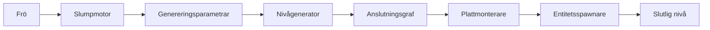
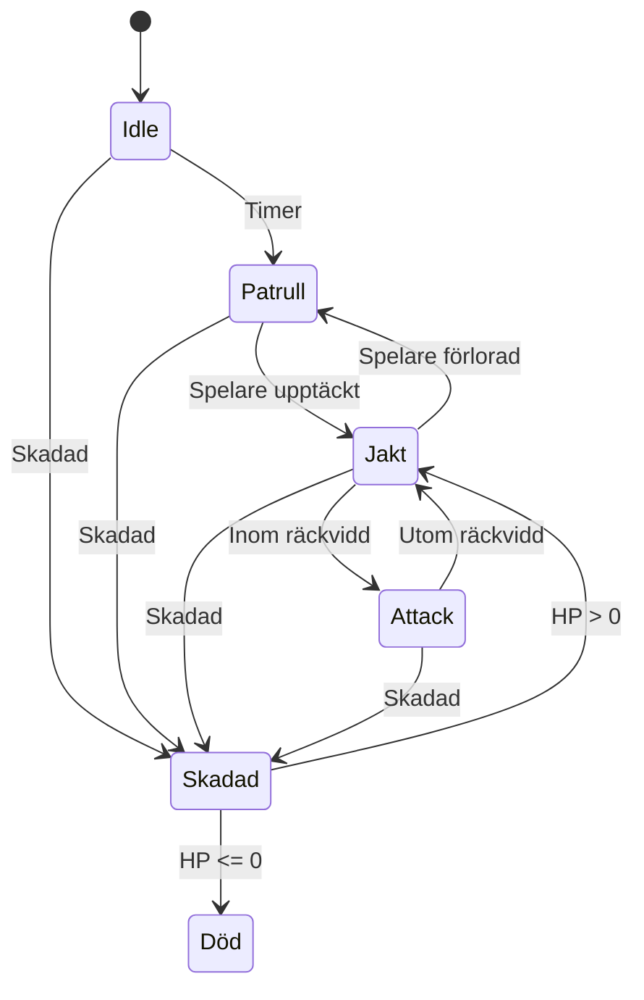
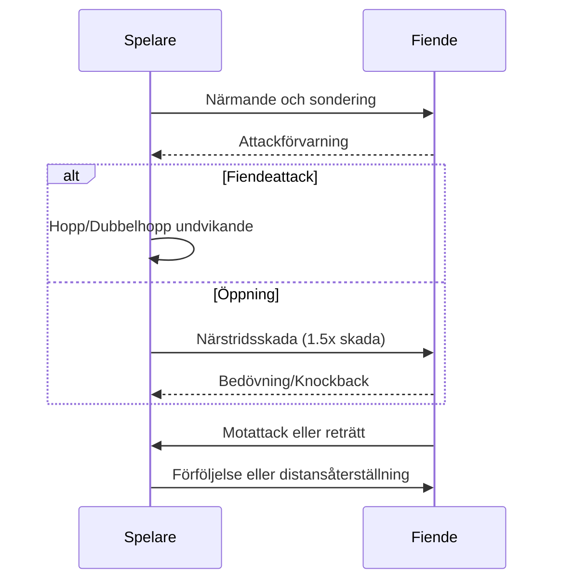
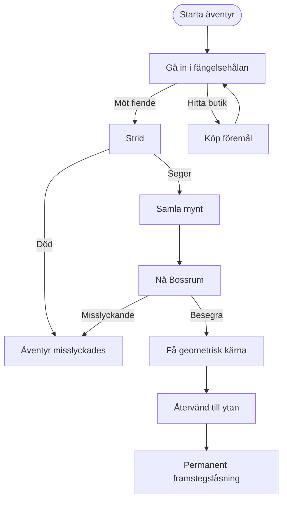

# CRYPTA GEOMETRICA

<p align="center">
  
</p>

<p align="center">
  <strong>🎮 2D Action Roguelite med procedurgenererade fängelsehålor</strong>
</p>

<p align="center">
  
  
  
  
</p>

<p align="center">
  <a href="../README.md">English</a> •
  <a href="README_CN.md">中文</a> •
  <a href="README_FI.md">Suomi</a> •
  <a href="#svenska">Svenska</a> •
  <a href="README_DA.md">Dansk</a>
</p>

---

## Svenska

### 🎮 Om projektet

**CRYPTA GEOMETRICA** (Geometrisk fängelsehåla) är ett sidoscrollande action-Roguelite-spel utvecklat av en ensam indie-utvecklare. Spelet använder en distinkt vektorgeometrisk trådramsstil kombinerad med en kall sci-fi-visuell ton, vilket skapar en värld av geometriska fängelsehålor fyllda med okända faror.

Inspirerat av **Dead Cells**, **Hollow Knight** och **Geometry Dash**, visar detta projekt avancerade procedurgenereringstekniker, tillståndsmaskinbaserade AI-system och polerade 2D-stridmekaniker.

<p align="center">
  
  
  
</p>

---

### ✨ Nyckelfunktioner och tekniska höjdpunkter

#### 🏗️ Procedurellt nivågenereringssystem

Ett sofistikerat flerskiktat fängelsehålegenereringssystem som implementerar branschstandardalgoritmer:

| System | Algoritm | Beskrivning |
|--------|----------|-------------|
| **Rumsgenerator V1** | Slumpmässig vandring + Regler | Grundläggande rumsgenerering med anpassningsbara begränsningar |
| **Rumsgenerator V2** | BSP + Delaunay + MST | Avancerad rumsuppdelning med grafbaserade korridoranslutningar |
| **Nivågenerator** | Flerrumsmontage | Kompletta fängelsehålenivåer med entré-, strid- och bossrum |



**Teknisk implementation:**
- **BSP (Binary Space Partitioning)**: Rekursiv rumsuppdelning för rumsplacering
- **Delaunay-triangulering**: Optimal korridorvägsberäkning
- **Minimalt spännande träd**: Säkerställer anslutning samtidigt som överflödiga vägar undviks
- **Spawn-punktvalidering**: Physics2D-baserad kollisionsdetektering för fiendeplacering

#### 🤖 Fiende-AI-tillståndsmaskin

En generisk, utbyggbar tillståndsmaskinarkitektur för fiendbeteenden:



**Funktioner:**
- Visuell tillståndsmaskin-debugger (editorfönster)
- Körtidstillståndsväxling och debugging
- Konfigurerbara övergångar och beteenden
- Stöd för Idle-, Patrull-, Jakt-, Attack-, Skadad- och Död-tillstånd

#### ⚔️ Stridsystem

Refererar till Hollow Knights klassiska stridloop:



---

### 🎨 Konststil och visuell design

Spelet använder minimalistisk geometrisk konstruktionslogik:

| Element | Design |
|---------|--------|
| **Spelare** | 1-3 grundläggande geometriska former (Rektangelhjälte) |
| **Fiender** | Triangelbaserad fraktion med distinkta silhuetter |
| **Bossar** | Komplexa multigeometriska sammansättningar |
| **Miljö** | Sci-fi-trådram med neonaccenter |

<p align="center">
  
  
  
</p>

---

### 🛠️ Teknisk stack

| Kategori | Teknologi |
|----------|-----------|
| **Motor** | Unity 2022.3+ (URP) |
| **Språk** | C# 10.0 |
| **UI-ramverk** | Odin Inspector |
| **Fysik** | Physics2D |
| **Rendering** | Tilemap-system |
| **AI** | Ändlig tillståndsmaskin (FSM) |
| **Nivågenerering** | BSP-, Delaunay-, MST-algoritmer |

---

### 📁 Projektarkitektur

```
Assets/
├── Scripts/
│   ├── 2_PlayerSystem/           # Spelarens tillståndsmaskin och kontroller
│   ├── 3_LevelGeneration/
│   │   ├── RoomGeneratorV1/      # Grundläggande rumsgenerering
│   │   ├── RoomGeneratorV2/      # Avancerad BSP-generering
│   │   └── LevelGenerator/       # Flerrumsnivåsystem
│   └── 5_EnemyStateMachine/      # Fiende-AI-system
│
├── Editor/                       # Anpassade editorverktyg
└── Documents/                    # Design- och tekniska dokument
```

---

### 🎯 Speldesignöversikt

#### Kärnloop



#### Rumstyper

| Rumstyp | Funktion | Fiendeantal | Belöningar |
|---------|----------|-------------|------------|
| **Strid** | Grundläggande strider | 2-4 | 10-25 mynt |
| **Elit** | Högtrycksutmaning | 3-6 | 25-50 mynt |
| **Vila** | Återhämtning (säker zon) | 0 | HP-återställning |
| **Boss** | Tvåfas bossstrid | 1 Boss | Geometrisk kärna |

#### Fiendefraktion: Triangelriket

| Fiende | Sammansättning | HP | Skada | Roll |
|--------|----------------|-----|-------|------|
| **Prickskytt** | Ren triangel | 15 | 18 | Distans-DPS |
| **Sköldvakt** | Triangel + Rektangel | 45 | 8 | Tank |
| **Mal** | Triangel + Cirkel | 8 | 4 | Trakassering |

---

### 🚀 Komma igång

#### Förutsättningar
- Unity 2022.3 eller senare
- Odin Inspector (för editorverktyg)

#### Installation
```bash
git clone https://github.com/yourusername/crypta-geometrica.git
cd crypta-geometrica
# Öppna med Unity Hub
```

#### Snabbstart
1. Öppna `Scenes/4_Level.unity`
2. Tryck Play för att testa nivågenerering
3. Använd `Window > 敌人状态机 > 状态机可视化器` (Ctrl+Shift+V) för att debugga fiende-AI

---

### 📖 Dokumentation

| Dokument | Beskrivning |
|----------|-------------|
| [Speldesigndokument](Game_Design_Document_EN.md) | Komplett GDD på engelska |
| [Rumsgenerator V1 Dokument](RoomGeneratorV1/) | V1 teknisk dokumentation |
| [Rumsgenerator V2 API](RoomGeneratorV2/API_REFERENCE.md) | V2 API-referens |
| [Teknisk design V2](RoomGeneratorV2/TECHNICAL_DESIGN.md) | V2 arkitekturdesign |

---

### 🎓 Demonstrerade färdigheter

Detta projekt demonstrerar kompetens inom:

- **Procedurellt innehållsskapande**: BSP, slumpmässig vandring, grafalgoritmer
- **Spel-AI**: Ändliga tillståndsmaskiner, beteendemönster
- **Unity-utveckling**: Editorverktyg, ScriptableObjects, Physics2D
- **Mjukvaruarkitektur**: Ren kod, SOLID-principer, modulär design
- **Teknisk dokumentation**: Omfattande dokument med diagram

---

### 📜 Licens

Detta projekt är avsett för utbildnings- och portfolioändamål.

### 🤝 Bidra

Bidrag, problem och funktionsförfrågningar är välkomna!

---

<p align="center">Gjord med ❤️ och Unity</p>
<p align="center">Soloutvecklarprojekt | 2024-2025</p>
