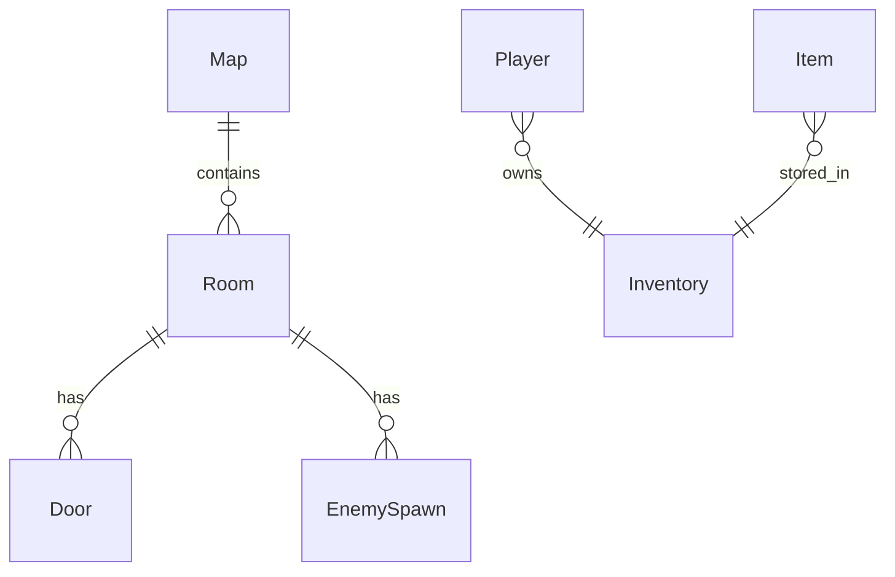
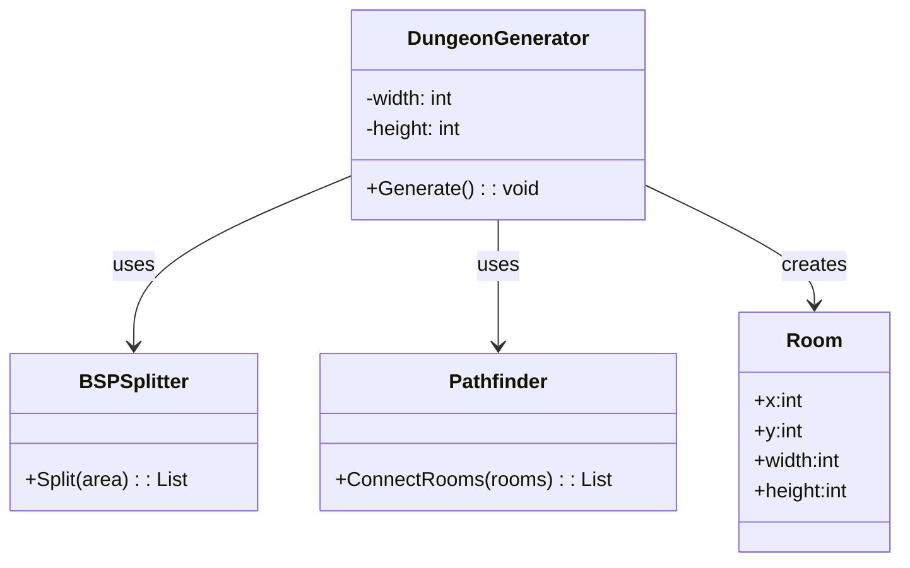
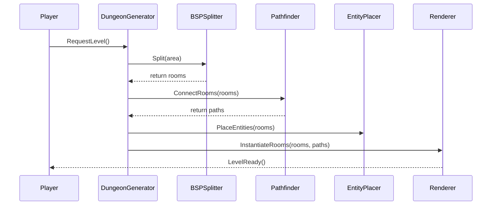
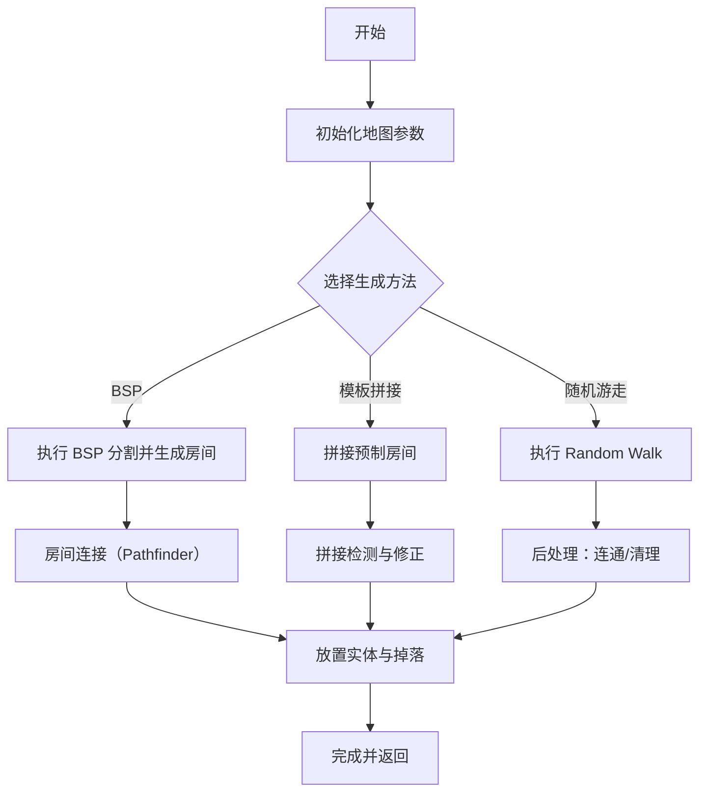

# 银河恶魔城&肉鸽类地牢程序化调研方案

## 一、项目背景

银河恶魔城/肉鸽类游戏以其非线性探索、程序化地牢、丰富多样的关卡与敌对交互著称，典型代表有《死亡细胞》《空洞骑士》等。本调研方案旨在为类似产品的开发提供思路和技术参考。

---

## 二、调研目标

1. 分析程序化地牢（以《死亡细胞》等为代表）的关卡生成、样式设计及主要算法原理。
2. 探究《空洞骑士》玩家角色的攻击系统与敌人 AI 的设计实现。

---

## 三、调研内容与框架

### 1. 地牢样式设计

- 关卡美术风格（暗黑、科技、奇幻等）
- 地牢结构元素（房间、走廊、关键节点、隐藏区等）
- 环境互动要素（陷阱、机关、可破坏环境等）

### 2. 地牢关卡连接方式

- 房间/节点的拓扑结构：线性、分支型、网状、环型等
- 关卡间传送门/电梯/单向门设计
- 回溯与捷径机制设计
- 例：《死亡细胞》采用节点-走廊房间系统，每一关有多条变体路径
  

### 3. 程序化地牢生成常见算法解析

#### 随机游走算法（Random Walk）

- 算法基础：在网格/节点上设定起点，每一步以随机方向延伸，生成连续可达的路径或空间
- 优点：生成结果自然、不规则，适合洞穴、地下城等随机感较强的地牢
- 缺点：难以精细控制整体结构与可玩性

```csharp
// 简化版：在二维网格内随机游走生成路径
int width = 50, height = 50;
bool[,] map = new bool[width, height];
int x = width / 2, y = height / 2;
map[x, y] = true;
for (int i = 0; i < 1000; i++) {
    int dir = Random.Range(0, 4);
    if (dir == 0 && x > 0) x--;       // 左
    else if (dir == 1 && x < width-1) x++;   // 右
    else if (dir == 2 && y > 0) y--;       // 上
    else if (dir == 3 && y < height-1) y++;  // 下
    map[x, y] = true;
}
```

#### BSP 分割法（二叉空间分割，Binary Space Partitioning）

- 算法过程：递归地将地牢划分为若干矩形区域，生成房间后用通道连接
- 优点：结构清晰，大小房间可变，易于设计多样玩法
- 应用：《以撒的结合》等多数肉鸽地牢游戏使用 BSP

```csharp
// 简化版：递归分割空间，记录所有房间矩形
class Rect { public int x, y, w, h; }
List<Rect> rooms = new List<Rect>();
void Split(Rect area, int minSize) {
    if (area.w > minSize * 2 || area.h > minSize * 2) {
        bool splitHoriz = area.w > area.h;
        int split = splitHoriz ? Random.Range(minSize, area.w-minSize) : Random.Range(minSize, area.h-minSize);
        if (splitHoriz) {
            Split(new Rect { x=area.x, y=area.y, w=split, h=area.h }, minSize);
            Split(new Rect { x=area.x+split, y=area.y, w=area.w-split, h=area.h }, minSize);
        } else {
            Split(new Rect { x=area.x, y=area.y, w=area.w, h=split }, minSize);
            Split(new Rect { x=area.x, y=area.y+split, w=area.w, h=area.h-split }, minSize);
        }
    } else {
        rooms.Add(area);
    }
}
// 用法示意：Split(new Rect { x=0, y=0, w=100, h=100 }, 20);
```

#### 预设模板与随机拼接（Template + Shuffle）

- 设计若干预制房间（Prefab），用随机算法拼接
- 控制游戏节奏、难度曲线，使关卡既有新鲜感又具设计感
- 常见于含有剧情/谜题设计的游戏

```csharp
// 伪代码：随机选取预制房间进行拼接
List<GameObject> roomPrefabs; // 预制体集合
List<GameObject> levelRooms = new List<GameObject>();
Shuffle(roomPrefabs);
Vector3 pos = Vector3.zero;
foreach (var prefab in roomPrefabs) {
    var room = Instantiate(prefab, pos, Quaternion.identity);
    levelRooms.Add(room);
    pos += new Vector3(room.width, 0, 0); // 假设依次向右拼接
}
```

#### 节点连接与图搜索（Graph-Based）

- 用图结构管理房间节点，通过 A\*、Dijkstra 等算法连接入口/出口关键路径，辅以子任务/捷径
- 易于实现多重结局、分支任务

```csharp
// 伪代码：A*算法连接关键节点生成路径
class Node { public int x, y; public List<Node> neighbors; }
List<Node> OpenSet = new List<Node>();  // 开放列表
HashSet<Node> ClosedSet = new HashSet<Node>();
Dictionary<Node, float> gScore, fScore;
Node start, goal;
// 每轮从OpenSet选fScore最低节点扩展，直到goal
```

#### ER 图（实体关系图）

- 说明：展示地图、房间、门、生成点等核心实体及其关系。



#### 类图（Class Diagram）

- 说明：展示负责生成、分割、路径连接与房间表示的主要类与方法接口。



#### 时序图（Sequence Diagram）

- 说明：展示执行一次关卡生成时主要组件之间的交互顺序（示例为 BSP → 连接 → 实例化 的流程）。



#### 流程图（Flowchart）

- 说明：展示高层生成流程决策与主要步骤，便于将算法模块化并支持多种生成策略切换。



### 4. 本项目拟定生成方案

#### 方案 A：双层随机游走（Nested Random Walk）—— _主方案_

这是一个分层生成的嵌套模式，结合了宏观布局与微观细节的随机性。

- **微观层（小房间生成）**：
  - 使用 **随机游走（Random Walk）** 配合 **规则约束**（如最小面积、平台密度）。
  - 生成具体且不规则的单个房间地形数据。
- **宏观层（大地牢布局）**：
  - 再次使用 **随机游走** 算法规划房间之间的拓扑关系。
  - 将生成的“小房间”作为节点填入宏观路径，并用走廊连接。
- **特点**：类似《死亡细胞》的结构，既有宏观的路线变化，又有微观的地形随机性。

#### 方案 B：模板驱动随机串联（Template-Based Random Walk）—— _备份方案_

这是一种稳健的生成方式，保证关卡设计质量的同时提供随机体验。

- **预设准备**：
  - 人工设计多套高质量的 **房间模板（Prefabs）**（涵盖战斗、解谜、奖励等类型）。
  - 设定统一的接口规则（入口/出口位置）。
- **串联生成**：
  - 使用 **随机游走** 算法生成宏观地图路径。
  - 在路径节点上随机填充预设的模板房间。
- **特点**：类似《洞穴冒险》的组合方式，关卡局部质量高，整体结构随机。

#### 通用生成流程实例

- 1）确定整体地图结构（节点图拓扑）
- 2）根据方案 A 或 B 生成基础房间/地牢区域
- 3）确定主要路径及隐藏区
- 4）布局怪物、道具、陷阱、Boss 房等
- 5）最终美化与元素细化

---

### 5. 《空洞骑士》战斗与 AI 机制调研

#### 玩家攻击系统

- 普通攻击（挥砍）：短距离、定向攻击，依赖动作“帧数据”
- 技能攻击：蓄力斩、法术、冲撞等
- 上下左右多方向体感判定（根据玩家按键与动作切换）
- 攻击判定：碰撞盒判定，与敌人 Hitbox 或 Hurtbox 碰撞产生伤害
- 攻击可取消、连段、冲刺斩等动作流畅性细节
- 技能升级与收集机制（“符文搭配”影响攻击方式）

#### 敌人 AI 攻击方式

- 简单 AI：巡逻、接近玩家、直线冲刺、间歇性攻击
- 进阶 AI：预测玩家位置、区分近远程攻击、阶段性行为（Boss 战常见）
- 怪物类型分工（自爆、诱导、远程、盾牌型、空中型等）
- 配合地形：部分 AI 结合环境进行特殊攻击（如空降、跳跃等）
- Boss AI 机制：多阶段、多技能轮换、特定血量/回合解锁新动作
- AI 行为树（Behavior Tree）或有限状态机（FSM）作为主流实现架构

---
