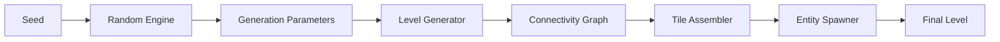
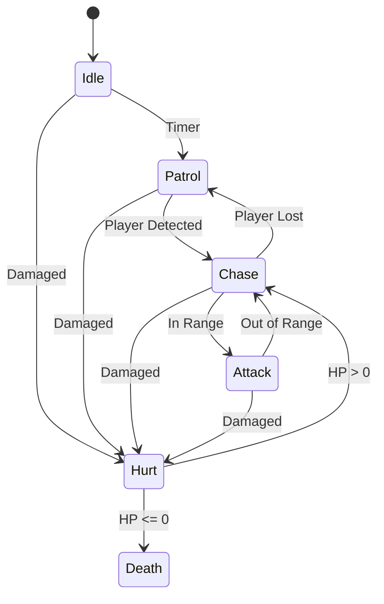
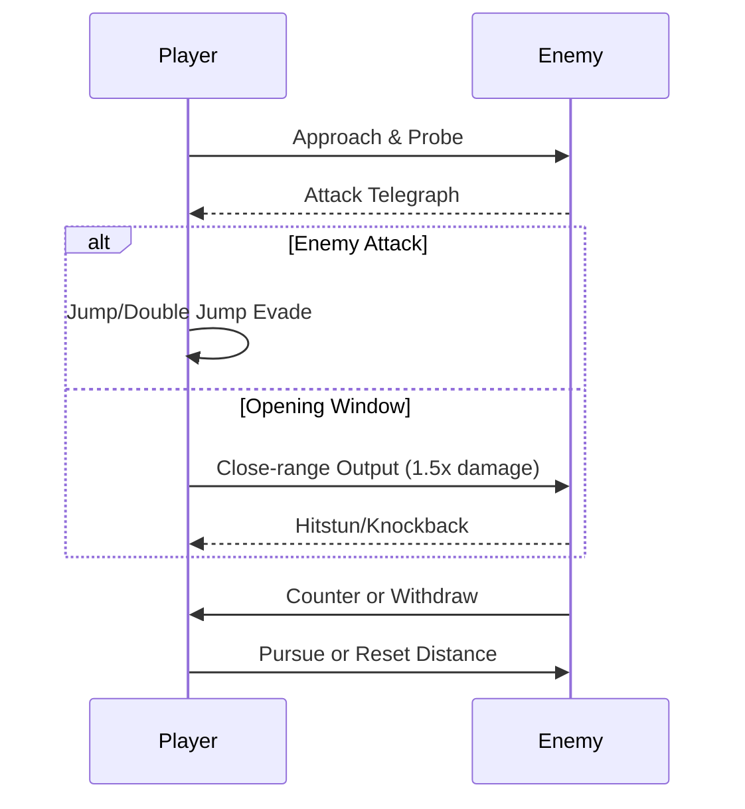
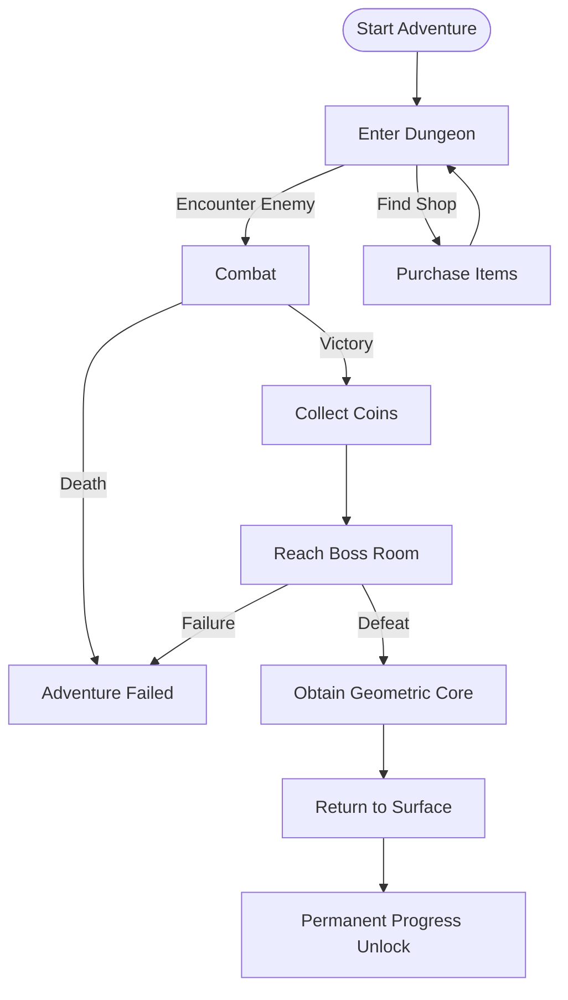

# CRYPTA GEOMETRICA

> [!CAUTION]
> ## 🚨 项目已归档 | Project Archived
> 
> **此仓库已不再维护。** 本项目已被全新的重制版 (Remastered Edition) 完全替代。
> 
> **This repository is no longer maintained.** This project has been fully superseded by a brand-new Remastered Edition.
> 
> ---
> 
> ### ✨ 重制版亮点 | Remastered Highlights
> 
> 新项目采用了完全重构的代码架构，提供以下增强功能：
> 
> - 🏗️ **更强大的程序化生成系统** - 全新的 Level Generation V4 生成器
> - ⚡ **性能优化** - 更高效的内存管理与异步策略
> - 📚 **完善的文档体系** - 详尽的技术文档与 API 参考
> 
> ---
> 
> ### 🔗 前往新项目 | Visit New Project
> 
> <p align="center">
>   <a href="https://github.com/EstellaNines/Crypta-Geometrica-RE">
>     
>   </a>
> </p>
> 
> **👉 [https://github.com/EstellaNines/Crypta-Geometrica-RE](https://github.com/EstellaNines/Crypta-Geometrica-RE)**

---

<p align="center">
  
</p>

<p align="center">
  <strong>🎮 A 2D Action Roguelite with Procedural Dungeon Generation</strong>
</p>

<p align="center">
  
  
  
  
</p>

<p align="center">
  <a href="#english">English</a> •
  <a href="Documents/README_CN.md">中文</a> •
  <a href="Documents/README_FI.md">Suomi</a> •
  <a href="Documents/README_SV.md">Svenska</a> •
  <a href="Documents/README_DA.md">Dansk</a>
</p>

---

## English

### 🎮 About The Project

**CRYPTA GEOMETRICA** (Geometric Dungeon) is a side-scrolling action Roguelite game developed by a solo indie developer. The game features a distinctive vector geometric wireframe art style, combined with a cold sci-fi visual tone, creating a world of geometric dungeons filled with unknowns and dangers.

Inspired by **Dead Cells**, **Hollow Knight**, and **Geometry Dash**, this project showcases advanced procedural generation techniques, state machine-based AI systems, and polished 2D combat mechanics.

<p align="center">
  
  
  
</p>

---

### ✨ Key Features & Technical Highlights

#### 🏗️ Procedural Level Generation System

A sophisticated multi-layered dungeon generation system implementing industry-standard algorithms:

| System | Algorithm | Description |
|--------|-----------|-------------|
| **Room Generator V1** | Random Walk + Rules | Basic room generation with customizable constraints |
| **Room Generator V2** | BSP + Delaunay + MST | Advanced spatial partitioning with graph-based corridor connections |
| **Level Generator** | Multi-Room Assembly | Complete dungeon levels with entrance, combat, and boss rooms |



**Technical Implementation:**
- **BSP (Binary Space Partitioning)**: Recursive space division for room placement
- **Delaunay Triangulation**: Optimal corridor path calculation
- **Minimum Spanning Tree**: Ensures connectivity while avoiding redundant paths
- **Spawn Point Validation**: Physics2D-based collision detection for enemy placement

#### 🤖 Enemy AI State Machine

A generic, extensible state machine architecture for enemy behaviors:



**Features:**
- Visual State Machine Debugger (Editor Window)
- Runtime state switching and debugging
- Configurable transitions and behaviors
- Support for Idle, Patrol, Chase, Attack, Hurt, Death states

#### ⚔️ Combat System

Referencing Hollow Knight's classic combat loop:



**Combat Mechanics:**
- Risk-reward close combat (1.5x damage at close range)
- Double jump for aerial maneuvers
- Clear attack telegraphs for prediction-based gameplay
- State-based player controller with smooth transitions

---

### 🎨 Art Style & Visual Design

The game adopts a minimalist geometric construction logic:

| Element | Design |
|---------|--------|
| **Player** | 1-3 basic geometric shapes (Rectangle Hero) |
| **Enemies** | Triangle-based faction with distinct silhouettes |
| **Bosses** | Complex multi-geometry assemblies |
| **Environment** | Sci-fi wireframe with neon accents |

<p align="center">
  
  
  
</p>

---

### 🛠️ Technical Stack

| Category | Technology |
|----------|------------|
| **Engine** | Unity 2022.3+ (URP) |
| **Language** | C# 10.0 |
| **UI Framework** | Odin Inspector |
| **Physics** | Physics2D |
| **Rendering** | Tilemap System |
| **AI** | Finite State Machine (FSM) |
| **Level Gen** | BSP, Delaunay, MST Algorithms |

---

### 📁 Project Architecture

```
Assets/
├── Scripts/
│   ├── 2_PlayerSystem/           # Player state machine & controls
│   │   ├── PlayerController.cs   # Main player controller
│   │   ├── PlayerStateBase.cs    # Abstract state base class
│   │   └── States/               # Concrete player states
│   │
│   ├── 3_LevelGeneration/
│   │   ├── RoomGeneratorV1/      # Basic room generation
│   │   │   ├── RoomGenerator.cs
│   │   │   ├── RoomData.cs
│   │   │   └── RoomGenParams.cs
│   │   │
│   │   ├── RoomGeneratorV2/      # Advanced BSP generation
│   │   │   ├── Core/             # RoomGeneratorV2, RoomGenParamsV2
│   │   │   ├── Data/             # RoomDataV2, RoomGraph, BSPNode
│   │   │   ├── Generators/       # BSP, Corridor, Platform generators
│   │   │   ├── Utils/            # Delaunay, MST algorithms
│   │   │   └── Settings/         # ScriptableObject configs
│   │   │
│   │   └── LevelGenerator/       # Multi-room level system
│   │       ├── Core/             # LevelGenerator, RoomSeedPool
│   │       ├── Data/             # LevelData, PlacedRoom, RoomType
│   │       └── Generators/       # LinearRoomPlacer, LCorridorBuilder
│   │
│   └── 5_EnemyStateMachine/      # Enemy AI system
│       ├── GenericEnemyController.cs
│       ├── EnemyStateBase.cs
│       └── States/               # Idle, Patrol, Chase, Attack, etc.
│
├── Editor/
│   ├── RoomGeneratorV1/          # V1 editor tools
│   ├── RoomGeneratorV2/          # V2 editor window
│   └── LevelGenerator/           # Level generator window & gizmos
│
└── Documents/
    ├── RoomGeneratorV1/          # V1 technical docs
    ├── RoomGeneratorV2/          # V2 API reference & design
    ├── Game_Design_Document_EN.md
    └── 策划_基础框架.md
```

---

### 🎯 Game Design Overview

#### Core Loop



#### Room Types

| Room Type | Function | Enemy Count | Rewards |
|-----------|----------|-------------|---------|
| **Combat** | Basic battles | 2-4 | 10-25 coins |
| **Elite** | High-pressure challenge | 3-6 | 25-50 coins |
| **Rest** | Recovery (safe zone) | 0 | HP restore |
| **Boss** | Two-phase boss fight | 1 Boss | Geometric Core |

#### Enemy Faction: Triangle Kingdom

| Enemy | Composition | HP | Damage | Role |
|-------|-------------|-----|--------|------|
| **Sharpshooter** | Pure Triangle | 15 | 18 | Ranged DPS |
| **Shieldbearer** | Triangle + Rectangle | 45 | 8 | Tank |
| **Moth** | Triangle + Circle | 8 | 4 | Harassment |

---

### 🚀 Getting Started

#### Prerequisites
- Unity 2022.3 or later
- Odin Inspector (for editor tools)

#### Installation
```bash
git clone https://github.com/yourusername/crypta-geometrica.git
cd crypta-geometrica
# Open with Unity Hub
```

#### Quick Start
1. Open `Scenes/4_Level.unity`
2. Press Play to test level generation
3. Use `Window > 敌人状态机 > 状态机可视化器` (Ctrl+Shift+V) to debug enemy AI

---

### 📖 Documentation

| Document | Description |
|----------|-------------|
| [Game Design Document](Documents/Game_Design_Document_EN.md) | Complete GDD in English |
| [策划基础框架](Documents/策划_基础框架.md) | Game design in Chinese |
| [Room Generator V1 Docs](Documents/RoomGeneratorV1/) | V1 technical documentation |
| [Room Generator V2 API](Documents/RoomGeneratorV2/API_REFERENCE.md) | V2 API reference |
| [Technical Design V2](Documents/RoomGeneratorV2/TECHNICAL_DESIGN.md) | V2 architecture design |

---

### 🎓 Skills Demonstrated

This project demonstrates proficiency in:

- **Procedural Content Generation**: BSP, Random Walk, Graph algorithms
- **Game AI**: Finite State Machines, Behavior patterns
- **Unity Development**: Editor tools, ScriptableObjects, Physics2D
- **Software Architecture**: Clean code, SOLID principles, modular design
- **Technical Documentation**: Comprehensive docs with diagrams

---

### 📜 License

This project is for educational and portfolio purposes.

### 🤝 Contributing

Contributions, issues, and feature requests are welcome!

---

<p align="center">Made with ❤️ and Unity</p>
<p align="center">Solo Developer Project | 2025-2026</p>
