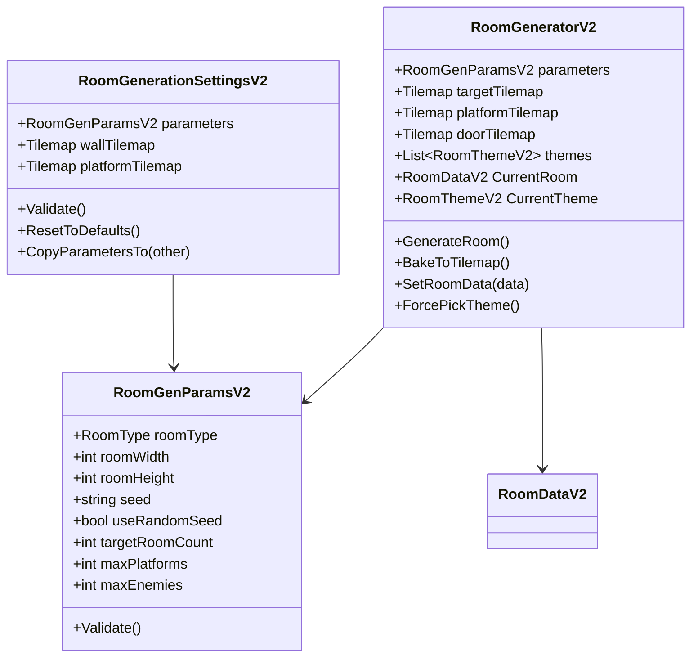
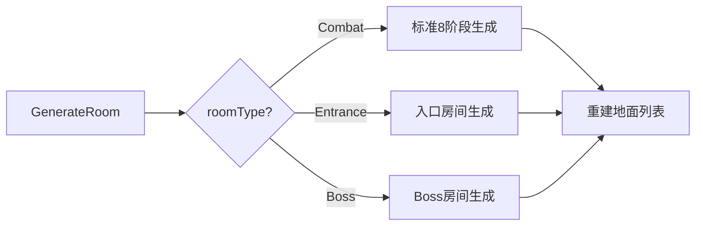
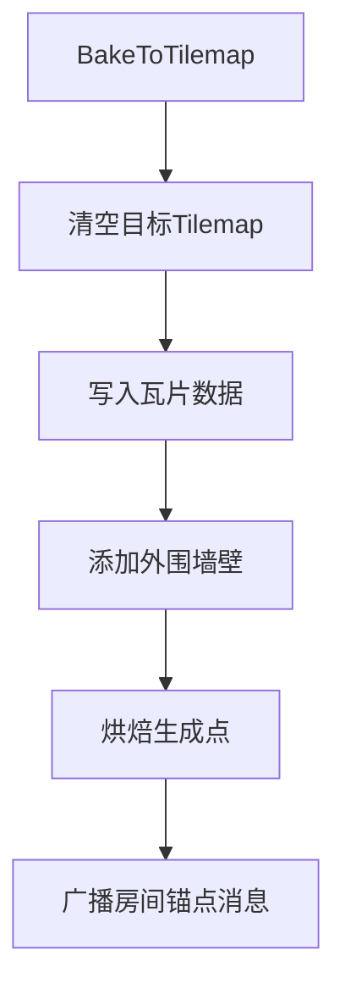
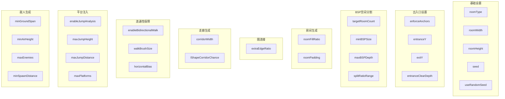
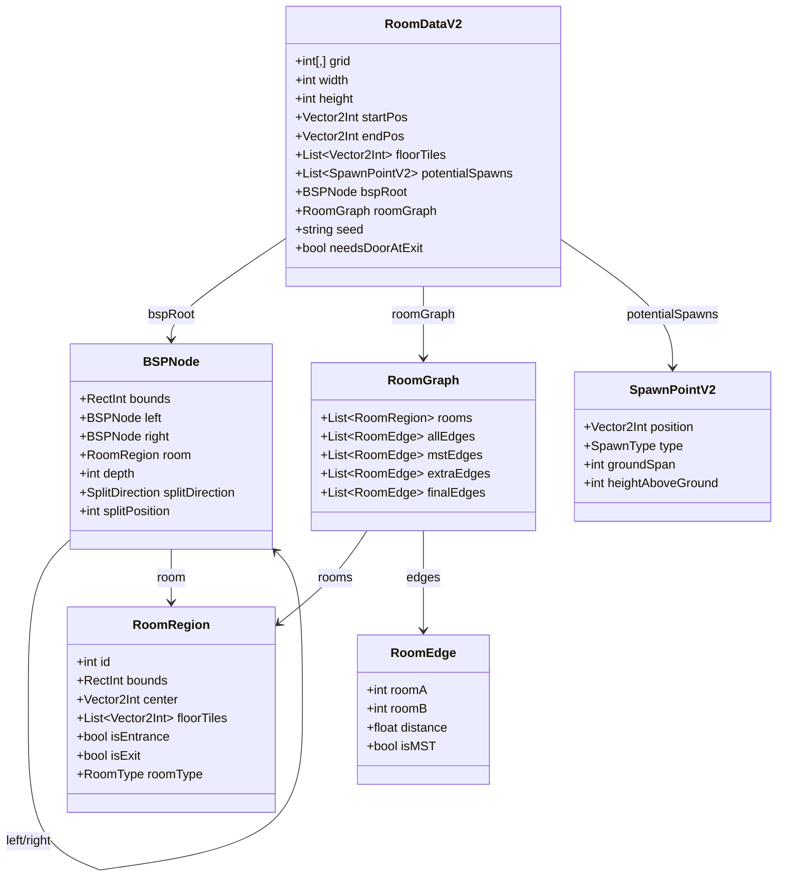
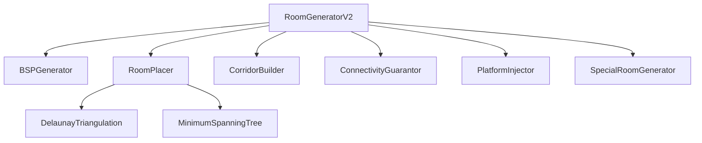
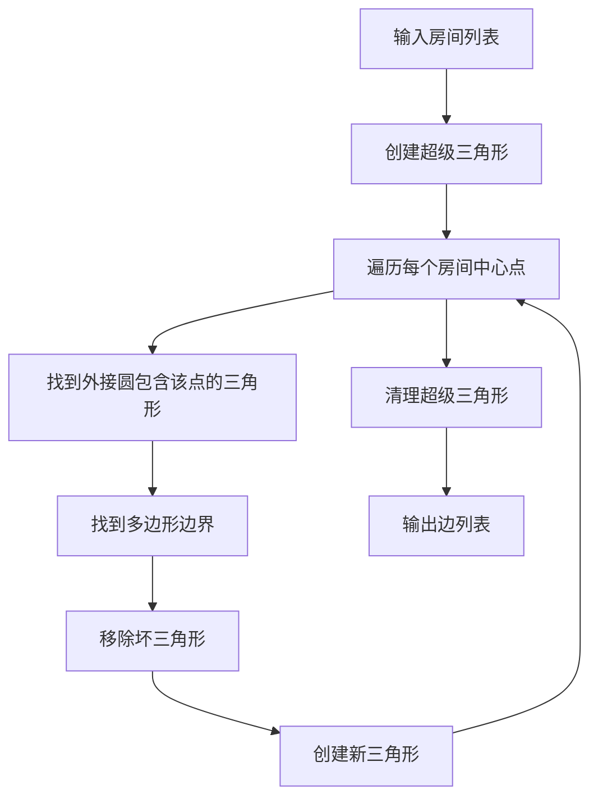
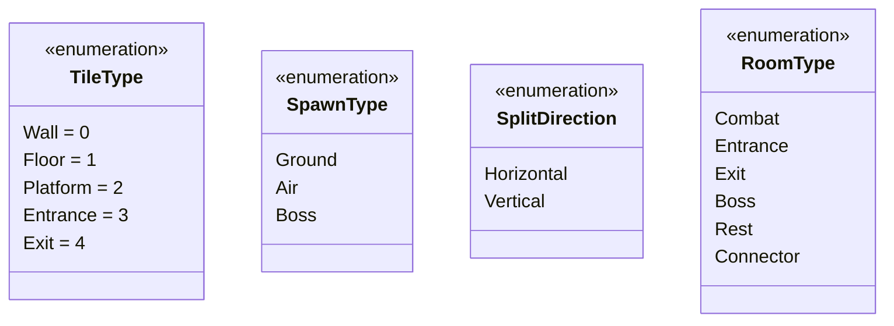
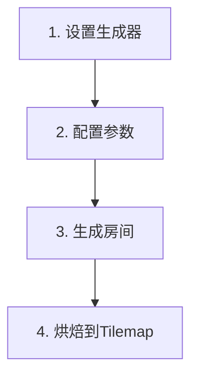

# 房间生成器 V2 API 参考文档

## 目录

1. [命名空间](#命名空间)
2. [核心类](#核心类)
3. [数据结构](#数据结构)
4. [生成器模块](#生成器模块)
5. [工具类](#工具类)
6. [枚举类型](#枚举类型)
7. [使用示例](#使用示例)

---

## 命名空间

```csharp
namespace CryptaGeometrica.LevelGeneration.SmallRoomV2
```

所有 V2 版本的房间生成相关类都位于此命名空间下。

---

## 核心类

### 类关系图



### RoomGeneratorV2

房间生成器主控制器，继承自 `MonoBehaviour`。

```csharp
public class RoomGeneratorV2 : MonoBehaviour
```

#### 公共字段

| 字段 | 类型 | 说明 |
|------|------|------|
| `parameters` | `RoomGenParamsV2` | 生成参数配置 |
| `targetTilemap` | `Tilemap` | 墙壁层 Tilemap |
| `platformTilemap` | `Tilemap` | 平台层 Tilemap |
| `doorTilemap` | `Tilemap` | 门层 Tilemap |
| `themes` | `List<RoomThemeV2>` | 视觉主题列表 |

#### 公共属性

| 属性 | 类型 | 说明 |
|------|------|------|
| `CurrentRoom` | `RoomDataV2` | 获取当前生成的房间数据（只读） |
| `CurrentTheme` | `RoomThemeV2` | 获取当前选中的主题（只读） |

#### 公共方法

##### GenerateRoom()

生成房间（完整流程）。

```csharp
public void GenerateRoom()
```

**生成流程：**



**示例：**
```csharp
var generator = GetComponent<RoomGeneratorV2>();
generator.parameters.roomWidth = 50;
generator.parameters.roomHeight = 30;
generator.GenerateRoom();
```

##### BakeToTilemap()

将生成的房间数据烘焙到 Tilemap。

```csharp
public void BakeToTilemap()
```

**烘焙流程：**



##### SetRoomData(RoomDataV2 data)

设置房间数据（用于编辑器预览）。

```csharp
public void SetRoomData(RoomDataV2 data)
```

| 参数 | 类型 | 说明 |
|------|------|------|
| `data` | `RoomDataV2` | 要设置的房间数据 |

##### ForcePickTheme()

强制重新选择主题。

```csharp
public void ForcePickTheme()
```

---

### RoomGenParamsV2

房间生成参数配置类。

```csharp
[Serializable]
public class RoomGenParamsV2
```

#### 参数分组



#### 基础设置

| 字段 | 类型 | 默认值 | 说明 |
|------|------|--------|------|
| `roomType` | `RoomType` | `Combat` | 房间类型 |
| `roomWidth` | `int` | `40` | 房间宽度 (20-100) |
| `roomHeight` | `int` | `25` | 房间高度 (15-60) |
| `seed` | `string` | `""` | 随机种子 |
| `useRandomSeed` | `bool` | `true` | 是否使用随机种子 |

#### 出入口设置

| 字段 | 类型 | 默认值 | 说明 |
|------|------|--------|------|
| `enforceAnchors` | `bool` | `true` | 确保出入口区域被清理 |
| `entranceY` | `int` | `-1` | 左侧入口Y坐标（-1表示随机） |
| `exitY` | `int` | `-1` | 右侧出口Y坐标（-1表示随机） |
| `entranceClearDepth` | `int` | `5` | 出入口清理深度 (3-8) |

#### BSP 空间分割

| 字段 | 类型 | 默认值 | 说明 |
|------|------|--------|------|
| `targetRoomCount` | `int` | `4` | 目标房间数量 (3-8) |
| `minBSPSize` | `int` | `8` | BSP叶节点最小尺寸 (6-16) |
| `maxBSPDepth` | `int` | `6` | 最大分割深度 (3-8) |
| `splitRatioRange` | `Vector2` | `(0.35, 0.65)` | 分割比例范围 |

#### 房间生成

| 字段 | 类型 | 默认值 | 说明 |
|------|------|--------|------|
| `roomFillRatio` | `float` | `0.65` | 房间填充率 (0.5-0.95) |
| `roomPadding` | `int` | `2` | 房间边距 (1-4) |

#### 图连接

| 字段 | 类型 | 默认值 | 说明 |
|------|------|--------|------|
| `extraEdgeRatio` | `float` | `0.2` | 额外边比例 (0-0.5) |

#### 走廊生成

| 字段 | 类型 | 默认值 | 说明 |
|------|------|--------|------|
| `corridorWidth` | `int` | `3` | 走廊宽度 (2-5) |
| `lShapeCorridorChance` | `float` | `0.7` | L形走廊概率 (0-1) |

#### 连通性保障

| 字段 | 类型 | 默认值 | 说明 |
|------|------|--------|------|
| `enableBidirectionalWalk` | `bool` | `true` | 启用双向游走 |
| `walkBrushSize` | `int` | `3` | 游走刷子尺寸 (2-5) |
| `horizontalBias` | `float` | `0.7` | 水平移动偏好 (0.5-0.9) |

#### 平台注入

| 字段 | 类型 | 默认值 | 说明 |
|------|------|--------|------|
| `enableJumpAnalysis` | `bool` | `true` | 启用跳跃可达性分析 |
| `maxJumpHeight` | `int` | `5` | 玩家最大跳跃高度 (3-8) |
| `maxJumpDistance` | `int` | `7` | 玩家最大跳跃距离 (4-10) |
| `maxPlatforms` | `int` | `6` | 最大平台数量 (0-12) |
| `minPlatformWidth` | `int` | `3` | 最小平台宽度 (2-5) |
| `maxPlatformWidth` | `int` | `6` | 最大平台宽度 (4-10) |
| `platformExclusionRadius` | `int` | `4` | 平台排斥半径 (3-8) |
| `maxHorizontalJump` | `int` | `5` | 最大水平跳跃距离 (3-8) |
| `playerJumpForce` | `float` | `8` | 玩家跳跃力 (5-12) |
| `hasDoubleJump` | `bool` | `true` | 允许二段跳 |

#### 敌人生成

| 字段 | 类型 | 默认值 | 说明 |
|------|------|--------|------|
| `minGroundSpan` | `int` | `4` | 最小地面连续长度 (3-8) |
| `minAirHeight` | `int` | `4` | 最小空中高度 (3-8) |
| `maxEnemies` | `int` | `5` | 最大敌人数量 (0-10) |
| `minSpawnDistance` | `int` | `6` | 敌人最小间距 (3-10) |

#### 安全区设置

| 字段 | 类型 | 默认值 | 说明 |
|------|------|--------|------|
| `edgePadding` | `int` | `2` | 边缘留空 (1-4) |

#### 方法

##### Validate()

验证并修正参数。

```csharp
public void Validate()
```

---

### RoomGenerationSettingsV2

房间生成配置文件（ScriptableObject）。

```csharp
[CreateAssetMenu(fileName = "NewRoomGenSettingsV2", menuName = "自制工具/程序化关卡/房间生成配置文件 v0.2")]
public class RoomGenerationSettingsV2 : ScriptableObject
```

#### 字段

| 字段 | 类型 | 说明 |
|------|------|------|
| `parameters` | `RoomGenParamsV2` | 生成参数 |
| `wallTilemap` | `Tilemap` | 墙壁层 Tilemap 引用 |
| `platformTilemap` | `Tilemap` | 平台层 Tilemap 引用 |

#### 方法

| 方法 | 说明 |
|------|------|
| `Validate()` | 验证配置 |
| `ResetToDefaults()` | 重置为默认参数 |
| `CopyParametersTo(other)` | 复制参数到另一个配置 |

---

## 数据结构

### 数据结构关系图



### RoomDataV2

房间数据容器。

```csharp
[Serializable]
public class RoomDataV2
```

#### 字段

| 字段 | 类型 | 说明 |
|------|------|------|
| `grid` | `int[,]` | 二维网格数据（存储TileType枚举值） |
| `width` | `int` | 房间宽度 |
| `height` | `int` | 房间高度 |
| `startPos` | `Vector2Int` | 入口位置（左侧） |
| `endPos` | `Vector2Int` | 出口位置（右侧） |
| `floorTiles` | `List<Vector2Int>` | 所有地面格子列表 |
| `potentialSpawns` | `List<SpawnPointV2>` | 所有敌人生成点 |
| `bspRoot` | `BSPNode` | BSP树根节点 |
| `roomGraph` | `RoomGraph` | 房间连接图 |
| `seed` | `string` | 生成时使用的随机种子 |
| `needsDoorAtExit` | `bool` | 是否需要在出口处放置门 |

#### 属性

| 属性 | 类型 | 说明 |
|------|------|------|
| `TotalTiles` | `int` | 总格子数 |
| `FloorCount` | `int` | 地面格子数 |
| `Openness` | `float` | 开阔度（地面占比） |
| `RoomCount` | `int` | 房间数量 |
| `PlatformCount` | `int` | 平台数量 |

#### 方法

| 方法 | 返回值 | 说明 |
|------|--------|------|
| `SetTile(x, y, type)` | `void` | 设置指定位置的瓦片类型 |
| `GetTile(x, y)` | `TileType` | 获取指定位置的瓦片类型 |
| `IsValid(x, y)` | `bool` | 检查坐标是否有效 |
| `IsWalkable(x, y)` | `bool` | 检查指定位置是否可通行 |
| `IsSolid(x, y)` | `bool` | 检查指定位置是否是实心块 |
| `Fill(type)` | `void` | 填充整个网格为指定类型 |
| `FillRect(rect, type)` | `void` | 填充矩形区域 |
| `DigRect(rect)` | `void` | 挖掘矩形区域 |
| `DigBrush(x, y, size)` | `void` | 挖掘指定位置（使用刷子尺寸） |
| `DigBrushWallsOnly(x, y, size)` | `void` | 挖掘指定位置（只挖墙壁） |
| `RebuildFloorTiles()` | `void` | 重建地面格子列表 |
| `CalculateOpenness()` | `float` | 计算开阔度 |
| `GetTileStats()` | `Dictionary<TileType, int>` | 统计各类型瓦片数量 |

### BSPNode

BSP 树节点。

```csharp
[Serializable]
public class BSPNode
```

#### 字段

| 字段 | 类型 | 说明 |
|------|------|------|
| `bounds` | `RectInt` | 节点边界 |
| `left` | `BSPNode` | 左子节点 |
| `right` | `BSPNode` | 右子节点 |
| `room` | `RoomRegion` | 关联的房间（仅叶节点） |
| `depth` | `int` | 节点深度 |
| `splitDirection` | `SplitDirection` | 分割方向 |
| `splitPosition` | `int` | 分割位置 |

#### 属性

| 属性 | 类型 | 说明 |
|------|------|------|
| `IsLeaf` | `bool` | 是否为叶节点 |
| `Center` | `Vector2Int` | 节点中心点 |
| `Width` | `int` | 节点宽度 |
| `Height` | `int` | 节点高度 |

#### 方法

| 方法 | 返回值 | 说明 |
|------|--------|------|
| `GetLeaves()` | `List<BSPNode>` | 收集所有叶节点 |
| `GetRooms()` | `List<RoomRegion>` | 获取所有房间 |
| `GetRoomFromSubtree()` | `RoomRegion` | 获取子树中的一个房间 |
| `Contains(point)` | `bool` | 检查点是否在节点边界内 |
| `Overlaps(other)` | `bool` | 检查是否与另一个矩形相交 |

### RoomGraph

房间连接图。

```csharp
[Serializable]
public class RoomGraph
```

#### 字段

| 字段 | 类型 | 说明 |
|------|------|------|
| `rooms` | `List<RoomRegion>` | 所有房间列表 |
| `allEdges` | `List<RoomEdge>` | Delaunay边（所有潜在连接） |
| `mstEdges` | `List<RoomEdge>` | MST边（必要连接） |
| `extraEdges` | `List<RoomEdge>` | 额外边（形成环路） |
| `finalEdges` | `List<RoomEdge>` | 最终边（MST + Extra） |

#### 方法

| 方法 | 返回值 | 说明 |
|------|--------|------|
| `GetRoom(id)` | `RoomRegion` | 根据 ID 获取房间 |
| `GetConnectedRooms(roomId)` | `List<RoomRegion>` | 获取相连的所有房间 |
| `GetEdgesForRoom(roomId)` | `List<RoomEdge>` | 获取相连的所有边 |
| `AreConnected(roomA, roomB)` | `bool` | 检查两个房间是否直接相连 |
| `AddEdge(edge)` | `void` | 添加边（自动去重） |
| `BuildFinalEdges()` | `void` | 构建最终边列表 |
| `GetEntranceRoom()` | `RoomRegion` | 获取入口房间 |
| `GetExitRoom()` | `RoomRegion` | 获取出口房间 |
| `Clear()` | `void` | 清空所有数据 |

### RoomEdge

房间连接边。

```csharp
[Serializable]
public struct RoomEdge : IEquatable<RoomEdge>
```

#### 字段

| 字段 | 类型 | 说明 |
|------|------|------|
| `roomA` | `int` | 房间 A 的 ID（较小的 ID） |
| `roomB` | `int` | 房间 B 的 ID（较大的 ID） |
| `distance` | `float` | 两个房间中心点之间的距离 |
| `isMST` | `bool` | 是否是最小生成树的边 |

### RoomRegion

房间区域数据。

```csharp
[Serializable]
public class RoomRegion
```

#### 字段

| 字段 | 类型 | 说明 |
|------|------|------|
| `id` | `int` | 房间唯一 ID |
| `bounds` | `RectInt` | 房间边界 |
| `center` | `Vector2Int` | 房间中心点 |
| `floorTiles` | `List<Vector2Int>` | 房间内所有地面格子 |
| `isEntrance` | `bool` | 是否包含入口 |
| `isExit` | `bool` | 是否包含出口 |
| `bspBounds` | `RectInt` | 所属 BSP 节点边界 |
| `roomType` | `RoomType` | 房间类型 |

#### 属性

| 属性 | 类型 | 说明 |
|------|------|------|
| `Width` | `int` | 房间宽度 |
| `Height` | `int` | 房间高度 |
| `Area` | `int` | 房间面积 |
| `Left` | `int` | 左边界 X |
| `Right` | `int` | 右边界 X |
| `Bottom` | `int` | 下边界 Y |
| `Top` | `int` | 上边界 Y |

#### 方法

| 方法 | 返回值 | 说明 |
|------|--------|------|
| `Contains(point)` | `bool` | 检查点是否在房间内 |
| `Overlaps(rect)` | `bool` | 检查是否与另一个矩形相交 |
| `DistanceTo(other)` | `float` | 计算到另一个房间的距离 |
| `GetRandomEdgePoint(random, padding)` | `Vector2Int` | 获取边界上的随机点 |
| `GetClosestPointTo(target)` | `Vector2Int` | 获取最接近目标点的边界点 |
| `RecalculateCenter()` | `void` | 重新计算中心点 |

### SpawnPointV2

敌人生成点数据。

```csharp
[Serializable]
public struct SpawnPointV2
```

#### 字段

| 字段 | 类型 | 说明 |
|------|------|------|
| `position` | `Vector2Int` | 生成点位置（网格坐标） |
| `type` | `SpawnType` | 生成点类型 |
| `groundSpan` | `int` | 可用的连续地面长度（仅地面类型） |
| `heightAboveGround` | `int` | 距地面高度（仅空中类型） |

### RoomThemeV2

房间视觉主题。

```csharp
[Serializable]
public struct RoomThemeV2
```

#### 字段

| 字段 | 类型 | 说明 |
|------|------|------|
| `themeName` | `string` | 主题名称 |
| `wallTile` | `TileBase` | 墙壁瓦片 |
| `platformTile` | `TileBase` | 平台瓦片 |
| `singlePlatformTile` | `TileBase` | 单格平台瓦片 |
| `doorTile` | `TileBase` | 门瓦片 |
| `backgroundTile` | `TileBase` | 背景瓦片 |
| `themeColor` | `Color` | 主题颜色（编辑器预览用） |

### RoomAnchorsData

房间锚点数据（用于消息广播）。

```csharp
public struct RoomAnchorsData
```

#### 字段

| 字段 | 类型 | 说明 |
|------|------|------|
| `startGridPos` | `Vector2Int` | 入口网格坐标 |
| `endGridPos` | `Vector2Int` | 出口网格坐标 |
| `startWorldPos` | `Vector3` | 入口世界坐标 |
| `endWorldPos` | `Vector3` | 出口世界坐标 |
| `startDirection` | `Vector2Int` | 入口方向 |
| `endDirection` | `Vector2Int` | 出口方向 |

---

## 生成器模块

### 生成器模块关系图



### BSPGenerator

BSP 空间分割生成器。

```csharp
public class BSPGenerator
```

#### 构造函数

```csharp
public BSPGenerator(RoomGenParamsV2 parameters, System.Random random)
```

#### 属性

| 属性 | 类型 | 说明 |
|------|------|------|
| `TotalNodes` | `int` | 总节点数 |
| `LeafNodes` | `int` | 叶节点数 |
| `MaxDepthReached` | `int` | 实际达到的最大深度 |

#### 方法

| 方法 | 返回值 | 说明 |
|------|--------|------|
| `Generate(bounds)` | `BSPNode` | 生成 BSP 树 |
| `Generate()` | `BSPNode` | 使用默认边界生成 BSP 树 |

#### 静态方法

| 方法 | 返回值 | 说明 |
|------|--------|------|
| `GetAllLeaves(root)` | `List<BSPNode>` | 获取所有叶节点 |
| `GetNodesAtDepth(root, depth)` | `List<BSPNode>` | 获取指定深度的所有节点 |
| `FindLeafContaining(root, point)` | `BSPNode` | 查找包含指定点的叶节点 |
| `FindAdjacentLeafPairs(root)` | `List<(BSPNode, BSPNode)>` | 查找相邻的叶节点对 |

### RoomPlacer

房间放置器。

```csharp
public class RoomPlacer
```

#### 构造函数

```csharp
public RoomPlacer(RoomGenParamsV2 parameters, System.Random random)
```

#### 方法

| 方法 | 返回值 | 说明 |
|------|--------|------|
| `PlaceRooms(bspRoot, roomData)` | `List<RoomRegion>` | 在所有 BSP 叶节点中放置房间 |
| `MarkEntranceExitRooms(rooms, startPos, endPos)` | `void` | 标记入口和出口所在的房间 |

#### 静态方法

| 方法 | 返回值 | 说明 |
|------|--------|------|
| `GetConnectionPoints(roomA, roomB)` | `(Vector2Int, Vector2Int)` | 获取两个房间之间的最佳连接点 |
| `AreAdjacent(roomA, roomB, tolerance)` | `bool` | 检查两个房间是否相邻 |
| `GetConnectionDirection(from, to)` | `Vector2Int` | 获取房间的连接方向 |

### CorridorBuilder

走廊生成器。

```csharp
public class CorridorBuilder
```

#### 构造函数

```csharp
public CorridorBuilder(RoomGenParamsV2 parameters, System.Random random)
```

#### 属性

| 属性 | 类型 | 说明 |
|------|------|------|
| `CorridorsBuilt` | `int` | 已生成的走廊数量 |
| `TotalTilesDug` | `int` | 挖掘的总瓦片数 |

#### 方法

| 方法 | 返回值 | 说明 |
|------|--------|------|
| `BuildCorridors(roomGraph, roomData)` | `void` | 根据房间图生成所有走廊 |
| `BuildCorridor(roomA, roomB, roomData)` | `void` | 在两个房间之间生成走廊 |

#### 静态方法

| 方法 | 返回值 | 说明 |
|------|--------|------|
| `CanConnectDirectly(from, to, roomData, width)` | `bool` | 检查两点之间是否可以直线连接 |

### ConnectivityGuarantor

连通性保障器。

```csharp
public class ConnectivityGuarantor
```

#### 构造函数

```csharp
public ConnectivityGuarantor(RoomGenParamsV2 parameters, System.Random random)
```

#### 属性

| 属性 | 类型 | 说明 |
|------|------|------|
| `ForwardSteps` | `int` | 正向游走步数 |
| `BackwardSteps` | `int` | 反向游走步数 |
| `TotalTilesDug` | `int` | 挖掘的总瓦片数 |

#### 方法

| 方法 | 返回值 | 说明 |
|------|--------|------|
| `EnsureConnectivity(roomData)` | `void` | 执行双向随机游走确保连通性 |

#### 静态方法

| 方法 | 返回值 | 说明 |
|------|--------|------|
| `VerifyConnectivity(roomData)` | `bool` | 验证入口到出口是否连通 |
| `CountReachableTiles(roomData)` | `int` | 获取从入口可达的所有格子数量 |

### PlatformInjector

平台注入器。

```csharp
public class PlatformInjector
```

#### 构造函数

```csharp
public PlatformInjector(RoomGenParamsV2 parameters, System.Random random)
```

#### 属性

| 属性 | 类型 | 说明 |
|------|------|------|
| `PlatformsPlaced` | `int` | 放置的平台数量 |
| `GapsAnalyzed` | `int` | 分析的落差数量 |
| `UnreachableFixed` | `int` | 修复的不可达区域数量 |

#### 方法

| 方法 | 返回值 | 说明 |
|------|--------|------|
| `InjectPlatforms(roomData)` | `void` | 执行平台注入 |

### SpecialRoomGenerator

特殊房间生成器（静态类）。

```csharp
public static class SpecialRoomGenerator
```

#### 静态方法

| 方法 | 返回值 | 说明 |
|------|--------|------|
| `GenerateEntranceRoom(roomData, parameters, random)` | `void` | 生成入口房间 |
| `GenerateBossRoom(roomData, parameters, random)` | `void` | 生成 Boss 房间 |

---

## 工具类

### DelaunayTriangulation

Delaunay 三角剖分工具类。

```csharp
public class DelaunayTriangulation
```

#### 静态方法

##### Triangulate(List\<RoomRegion\> rooms)

对房间列表执行 Delaunay 三角剖分。

```csharp
public static List<RoomEdge> Triangulate(List<RoomRegion> rooms)
```

**算法流程：**



### MinimumSpanningTree

最小生成树算法工具类。

```csharp
public class MinimumSpanningTree
```

#### 静态方法

| 方法 | 返回值 | 说明 |
|------|--------|------|
| `Kruskal(rooms, edges)` | `List<RoomEdge>` | 使用 Kruskal 算法计算最小生成树 |
| `SelectExtraEdges(allEdges, mstEdges, ratio, random)` | `List<RoomEdge>` | 从非 MST 边中选择额外的边 |
| `IsConnected(rooms, edges)` | `bool` | 检查图是否连通 |

---

## 枚举类型

### 枚举类型关系图



### TileType

瓦片类型枚举。

```csharp
public enum TileType
{
    Wall = 0,      // 墙壁（实心，不可通行）
    Floor = 1,     // 地面（空气，可通行）
    Platform = 2,  // 单向平台（可从下方穿过）
    Entrance = 3,  // 入口区域
    Exit = 4       // 出口区域
}
```

### SpawnType

敌人生成点类型枚举。

```csharp
public enum SpawnType
{
    Ground,  // 地面敌人
    Air,     // 空中敌人
    Boss     // Boss 敌人
}
```

### SplitDirection

BSP 分割方向枚举。

```csharp
public enum SplitDirection
{
    Horizontal,  // 水平分割（上下分）
    Vertical     // 垂直分割（左右分）
}
```

### RoomType

房间类型枚举（位于 `CryptaGeometrica.LevelGeneration.MultiRoom` 命名空间）。

```csharp
public enum RoomType
{
    Combat,     // 战斗房间
    Entrance,   // 入口房间
    Exit,       // 出口房间
    Boss,       // Boss 房间
    Rest,       // 休息房间
    Connector   // 连接房间
}
```

---

## 使用示例

### 基础使用流程



### 基础使用

```csharp
using CryptaGeometrica.LevelGeneration.SmallRoomV2;
using UnityEngine;
using UnityEngine.Tilemaps;

public class RoomGeneratorExample : MonoBehaviour
{
    public Tilemap wallTilemap;
    public Tilemap platformTilemap;
    
    private RoomGeneratorV2 generator;
    
    void Start()
    {
        // 获取或创建生成器
        generator = GetComponent<RoomGeneratorV2>();
        if (generator == null)
        {
            generator = gameObject.AddComponent<RoomGeneratorV2>();
        }
        
        // 配置参数
        generator.parameters = new RoomGenParamsV2
        {
            roomWidth = 50,
            roomHeight = 30,
            targetRoomCount = 5,
            maxPlatforms = 8,
            maxEnemies = 6
        };
        
        // 配置 Tilemap
        generator.targetTilemap = wallTilemap;
        generator.platformTilemap = platformTilemap;
        
        // 生成并烘焙
        generator.GenerateRoom();
        generator.BakeToTilemap();
    }
}
```

### 使用固定种子

```csharp
// 使用固定种子生成相同的房间
generator.parameters.useRandomSeed = false;
generator.parameters.seed = "my_fixed_seed_123";
generator.GenerateRoom();
```

### 访问生成数据

```csharp
// 生成房间后访问数据
generator.GenerateRoom();

RoomDataV2 roomData = generator.CurrentRoom;

// 获取房间统计
Debug.Log($"房间尺寸: {roomData.width} x {roomData.height}");
Debug.Log($"开阔度: {roomData.Openness:P1}");
Debug.Log($"房间数量: {roomData.RoomCount}");
Debug.Log($"生成点数量: {roomData.potentialSpawns.Count}");

// 遍历生成点
foreach (var spawn in roomData.potentialSpawns)
{
    Debug.Log($"生成点: {spawn.position}, 类型: {spawn.type}");
}

// 遍历房间
foreach (var room in roomData.roomGraph.rooms)
{
    Debug.Log($"房间 {room.id}: {room.bounds}, 类型: {room.roomType}");
}
```

### 生成不同类型的房间

```csharp
// 生成入口房间
generator.parameters.roomType = RoomType.Entrance;
generator.parameters.roomWidth = 30;
generator.parameters.roomHeight = 20;
generator.GenerateRoom();

// 生成 Boss 房间
generator.parameters.roomType = RoomType.Boss;
generator.parameters.roomWidth = 80;
generator.parameters.roomHeight = 50;
generator.GenerateRoom();

// 生成战斗房间
generator.parameters.roomType = RoomType.Combat;
generator.parameters.roomWidth = 50;
generator.parameters.roomHeight = 30;
generator.GenerateRoom();
```

### 自定义主题

```csharp
// 创建主题
RoomThemeV2 myTheme = new RoomThemeV2
{
    themeName = "地牢主题",
    wallTile = dungeonWallTile,
    platformTile = dungeonPlatformTile,
    singlePlatformTile = dungeonSinglePlatformTile,
    backgroundTile = dungeonBackgroundTile,
    themeColor = Color.gray
};

// 添加到生成器
generator.themes = new List<RoomThemeV2> { myTheme };
```

### 验证连通性

```csharp
generator.GenerateRoom();

// 验证连通性
bool isConnected = ConnectivityGuarantor.VerifyConnectivity(generator.CurrentRoom);
Debug.Log($"连通性: {(isConnected ? "通过" : "失败")}");

// 获取可达格子数
int reachableTiles = ConnectivityGuarantor.CountReachableTiles(generator.CurrentRoom);
Debug.Log($"可达格子数: {reachableTiles}");
```

---

