# 房间生成器 V2 (RoomGeneratorV2)

## 功能概述

房间生成器 V2 是一个基于 **BSP 空间分割 + 图连接 + 双向随机游走 + 跳跃可达性分析** 的程序化房间生成系统。它能够生成具有多个子房间、走廊连接、单向平台和敌人生成点的复杂 2D 横版关卡。

---

## 目录

1. [核心特性](#核心特性)
2. [生成流程](#生成流程)
3. [房间类型](#房间类型)
4. [瓦片类型图例](#瓦片类型图例)
5. [生成点类型图例](#生成点类型图例)
6. [编辑器使用指南](#编辑器使用指南)
7. [参数配置说明](#参数配置说明)

---

## 核心特性

| 特性 | 描述 |
|------|------|
| **BSP 空间分割** | 使用二叉空间分割算法将房间区域递归划分为更小的子区域 |
| **Delaunay 三角剖分** | 生成房间之间的潜在连接边，确保连接的合理性 |
| **Kruskal 最小生成树** | 从潜在连接中选择必要的连接，保证所有房间连通 |
| **双向随机游走** | 入口→出口 + 出口→入口 双向游走，确保玩家可通行 |
| **跳跃可达性分析** | 基于玩家跳跃能力分析垂直落差，自动注入单向平台 |
| **敌人生成点识别** | 自动识别适合地面敌人和空中敌人的生成位置 |
| **多房间类型支持** | 支持战斗房、入口房、Boss房等不同类型的房间生成 |

---

## 生成流程

### 阶段 1-4：结构生成

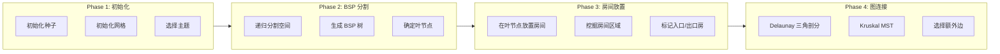

### 阶段 5-8：细节处理

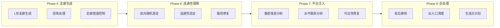

### 标准战斗房间生成流程详解

1. **Phase 1: 初始化**
   - 初始化随机种子（支持固定种子重现）
   - 创建网格数据结构，填充为全墙壁
   - 确定出入口 Y 坐标位置
   - 随机选择视觉主题

2. **Phase 2: BSP 空间分割**
   - 使用二叉空间分割算法递归划分空间
   - 根据宽高比决定水平或垂直分割
   - 在配置的比例范围内随机选择分割位置
   - 达到最小尺寸或目标房间数时停止

3. **Phase 3: 房间放置**
   - 在每个 BSP 叶节点内创建房间区域
   - 房间尺寸基于填充率计算，带随机变化
   - 挖掘房间区域（设置为地面瓦片）
   - 标记包含入口/出口的房间

4. **Phase 4: 图连接**
   - 对房间中心点执行 Delaunay 三角剖分
   - 使用 Kruskal 算法计算最小生成树
   - 按配置比例选择额外边形成环路
   - 构建最终连接边列表

5. **Phase 5: 走廊生成**
   - 根据连接边在房间之间生成走廊
   - 支持 L 形走廊（先水平后垂直或反之）
   - 在拐角处额外挖掘确保转弯顺畅
   - 走廊宽度可配置（默认 3 格）

6. **Phase 6: 连通性保障**
   - 执行入口→出口方向的随机游走
   - 执行出口→入口方向的随机游走
   - 使用 BFS 验证连通性
   - 游走时只挖掘墙壁，保留已有平台

7. **Phase 7: 平台注入**
   - 在每个房间内部注入阶梯式平台
   - 按列分析垂直落差，在超过跳跃高度处注入平台
   - 分析水平跳跃距离，在过宽处添加平台
   - 验证可达性并修复不可达区域

8. **Phase 8: 后处理**
   - 使用 BFS 移除从入口不可达的孤岛
   - 清理出入口安全区（确保玩家可通行）
   - 识别地面敌人生成点（连续地面 + 头顶空间）
   - 识别空中敌人生成点（开放空间 + 距地面高度）

---

## 房间类型

### 1. 战斗房间 (Combat)

标准的程序化生成房间，包含完整的 8 阶段生成流程。

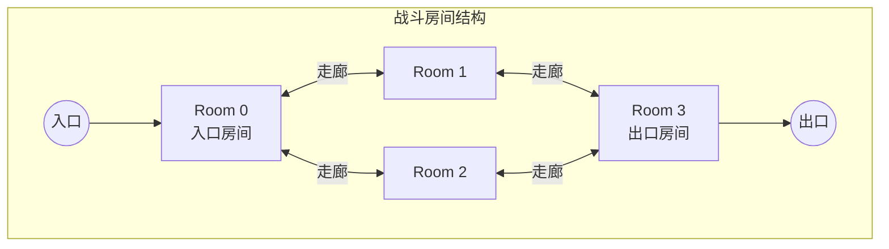

**图例说明：**
| 符号 | 含义 |
|------|------|
| 圆形节点 | 出入口 |
| 矩形框 | 房间区域 |
| 双向箭头 | 走廊连接 |

### 2. 入口房间 (Entrance)

简单矩形房间，完整平坦地面，无平台，无怪物生成点。

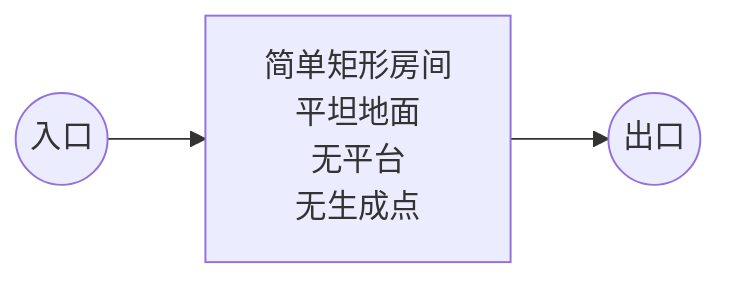

**特点：**
- 简单矩形结构
- 完整平坦地面
- 无平台
- 无怪物生成点
- 左右两侧开放

### 3. Boss 房间 (Boss)

大型竞技场，完整平坦地面，只有 Boss 生成点，出口有门封闭。

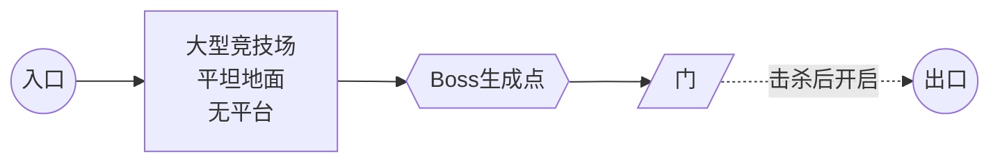

**特点：**
- 大型矩形竞技场
- 完整平坦地面
- 只有 Boss 生成点
- 右侧出口有门封闭
- 门在 Boss 击杀后消失

---

## 瓦片类型图例

### 瓦片类型定义

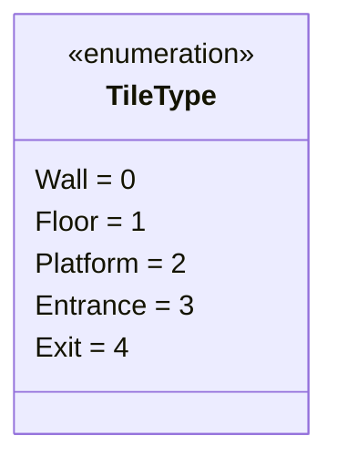

### 瓦片类型说明

| 类型 | 枚举值 | 描述 | 特性 |
|------|--------|------|------|
| **Wall** | 0 | 墙壁 | 实心，不可通行，用于房间边界和地面 |
| **Floor** | 1 | 地面/空气 | 空气区域，可通行，玩家和敌人可自由移动 |
| **Platform** | 2 | 单向平台 | 可从下方穿过，玩家可站立，可下跳穿过 |
| **Entrance** | 3 | 入口 | 标记房间的入口位置 |
| **Exit** | 4 | 出口 | 标记房间的出口位置 |

### 单向平台工作原理

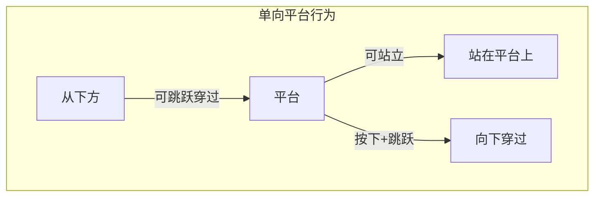

**玩家可以：**
- 从下方跳跃穿过平台
- 站在平台上
- 按下+跳跃从平台下落

### 房间结构示意

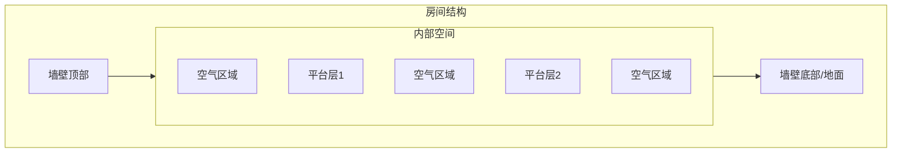

**说明：**
- 外围是墙壁边界
- 内部是可通行空气
- 平台呈阶梯式分布

---

## 生成点类型图例

### 生成点类型定义

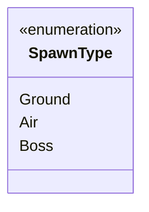

### 生成点类型说明

| 类型 | 颜色 | 条件 | 适合敌人 |
|------|------|------|----------|
| **Ground** | 青色 (Cyan) | 位于地面上方，有足够连续地面长度 (≥ minGroundSpan)，头顶有足够空间 (≥ 2 格) | 锐枪手、盾卫等地面单位 |
| **Air** | 粉色 (Magenta) | 周围开放（上下左右都是空气），距地面高度 ≥ minAirHeight，随机概率筛选 (15%) | 飞蛾等空中单位 |
| **Boss** | 黄色 (Yellow) | 仅在 Boss 房间中生成，位于房间中央偏右，距离右墙约 10 格 | Boss 单位 |

### 生成点分布示意

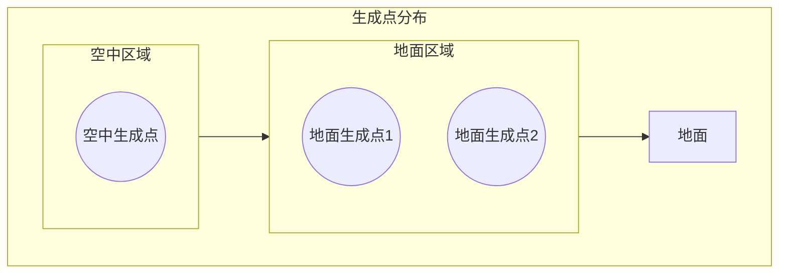

### 生成点筛选规则

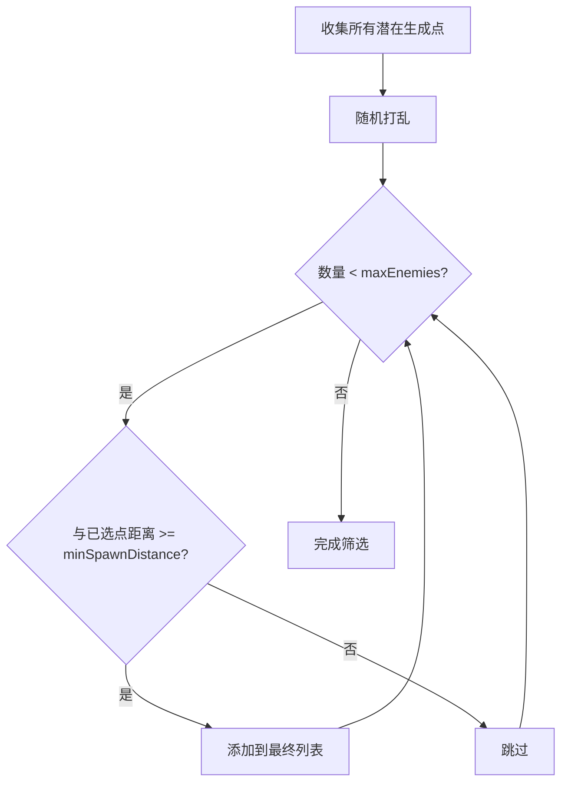

---

## 编辑器使用指南

### 打开编辑器窗口

**菜单路径:** `自制工具 → 程序化关卡 → 程序化房间生成V2 → Room Generator V2`

### 界面布局

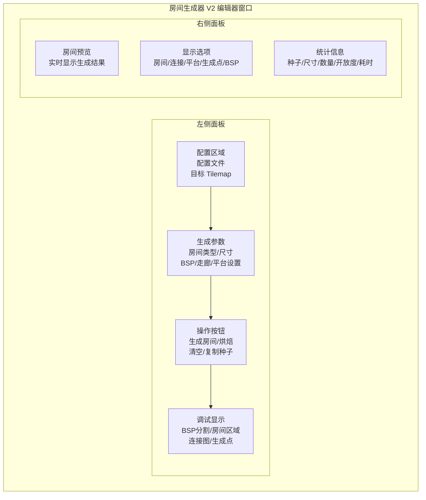

### 操作流程

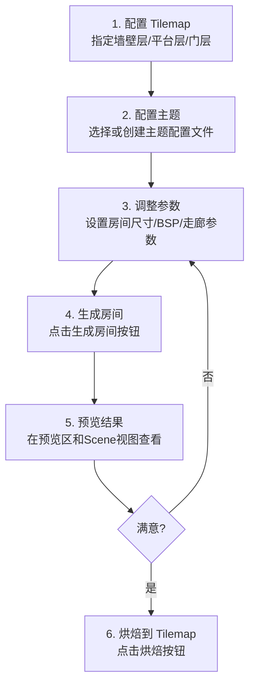

---

## 参数配置说明

### 基础设置

| 参数 | 类型 | 默认值 | 范围 | 说明 |
|------|------|--------|------|------|
| roomType | RoomType | Combat | - | 房间类型（战斗/入口/Boss） |
| roomWidth | int | 40 | 20-100 | 房间宽度（格子数） |
| roomHeight | int | 25 | 15-60 | 房间高度（格子数） |
| seed | string | "" | - | 随机种子 |
| useRandomSeed | bool | true | - | 是否使用随机种子 |

### 出入口设置

| 参数 | 类型 | 默认值 | 范围 | 说明 |
|------|------|--------|------|------|
| enforceAnchors | bool | true | - | 确保出入口区域被清理 |
| entranceY | int | -1 | - | 左侧入口Y坐标（-1表示随机） |
| exitY | int | -1 | - | 右侧出口Y坐标（-1表示随机） |
| entranceClearDepth | int | 5 | 3-8 | 出入口清理深度 |

### BSP 空间分割

| 参数 | 类型 | 默认值 | 范围 | 说明 |
|------|------|--------|------|------|
| targetRoomCount | int | 4 | 3-8 | 目标房间数量 |
| minBSPSize | int | 8 | 6-16 | BSP 叶节点最小尺寸 |
| maxBSPDepth | int | 6 | 3-8 | 最大分割深度 |
| splitRatioRange | Vector2 | (0.35, 0.65) | 0.3-0.7 | 分割比例范围 |

### 房间生成

| 参数 | 类型 | 默认值 | 范围 | 说明 |
|------|------|--------|------|------|
| roomFillRatio | float | 0.65 | 0.5-0.95 | 房间占 BSP 叶节点的比例 |
| roomPadding | int | 2 | 1-4 | 房间与 BSP 边界的最小距离 |

### 图连接

| 参数 | 类型 | 默认值 | 范围 | 说明 |
|------|------|--------|------|------|
| extraEdgeRatio | float | 0.2 | 0-0.5 | 在 MST 基础上额外添加的边比例 |

### 走廊生成

| 参数 | 类型 | 默认值 | 范围 | 说明 |
|------|------|--------|------|------|
| corridorWidth | int | 3 | 2-5 | 走廊宽度（玩家2×2，建议至少3） |
| lShapeCorridorChance | float | 0.7 | 0-1 | L形走廊概率 |

### 连通性保障

| 参数 | 类型 | 默认值 | 范围 | 说明 |
|------|------|--------|------|------|
| enableBidirectionalWalk | bool | true | - | 启用双向游走 |
| walkBrushSize | int | 3 | 2-5 | 游走刷子尺寸 |
| horizontalBias | float | 0.7 | 0.5-0.9 | 水平移动偏好 |

### 平台注入

| 参数 | 类型 | 默认值 | 范围 | 说明 |
|------|------|--------|------|------|
| enableJumpAnalysis | bool | true | - | 启用跳跃可达性分析 |
| maxJumpHeight | int | 5 | 3-8 | 玩家最大跳跃高度 |
| maxJumpDistance | int | 7 | 4-10 | 玩家最大跳跃距离 |
| maxPlatforms | int | 6 | 0-12 | 最大平台数量 |
| minPlatformWidth | int | 3 | 2-5 | 最小平台宽度 |
| maxPlatformWidth | int | 6 | 4-10 | 最大平台宽度 |
| platformExclusionRadius | int | 4 | 3-8 | 平台排斥半径 |
| maxHorizontalJump | int | 5 | 3-8 | 最大水平跳跃距离 |
| playerJumpForce | float | 8 | 5-12 | 玩家跳跃力 |
| hasDoubleJump | bool | true | - | 允许二段跳 |

### 敌人生成

| 参数 | 类型 | 默认值 | 范围 | 说明 |
|------|------|--------|------|------|
| minGroundSpan | int | 4 | 3-8 | 地面敌人生成点需要的最小连续地面 |
| minAirHeight | int | 4 | 3-8 | 空中敌人生成点距地面的最小高度 |
| maxEnemies | int | 5 | 0-10 | 最大敌人数量 |
| minSpawnDistance | int | 6 | 3-10 | 敌人最小间距 |

### 安全区设置

| 参数 | 类型 | 默认值 | 范围 | 说明 |
|------|------|--------|------|------|
| edgePadding | int | 2 | 1-4 | 边缘留空 |

---

## 版本信息

- **版本**: v0.2
- **命名空间**: `CryptaGeometrica.LevelGeneration.SmallRoomV2`
- **依赖**: Unity 2021.3+, Odin Inspector, Sirenix

---

