# 房间生成器 V2 规则文档

## 1. 生成规则总览

本文档详细描述房间生成器 V2 在各个阶段遵循的规则和约束条件。

---

## 2. BSP 空间分割规则

### 2.1 终止条件规则

BSP 分割在满足以下任一条件时停止：

| 规则编号 | 条件 | 说明 |
|----------|------|------|
| BSP-001 | `depth >= maxBSPDepth` | 达到最大分割深度 |
| BSP-002 | `width < minBSPSize × 2` | 宽度不足以继续分割 |
| BSP-003 | `height < minBSPSize × 2` | 高度不足以继续分割 |
| BSP-004 | `leafNodes >= targetRoomCount && random < 0.7` | 达到目标房间数后有70%概率停止 |

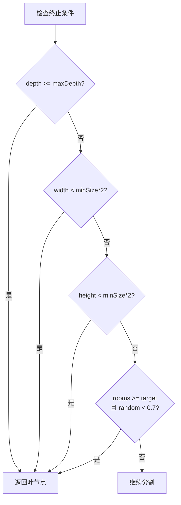

### 2.2 分割方向规则

| 规则编号 | 条件 | 分割方向 | 说明 |
|----------|------|----------|------|
| BSP-005 | `aspectRatio > 1.25` | Vertical (垂直) | 太宽，左右分割 |
| BSP-006 | `aspectRatio < 0.8` | Horizontal (水平) | 太高，上下分割 |
| BSP-007 | `0.8 <= aspectRatio <= 1.25` | Random | 接近正方形，随机选择 |

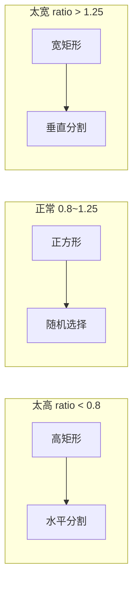

### 2.3 分割位置规则

| 规则编号 | 规则 | 说明 |
|----------|------|------|
| BSP-008 | `splitRatio ∈ [splitRatioRange.x, splitRatioRange.y]` | 分割比例在配置范围内随机 |
| BSP-009 | `splitPos >= origin + minBSPSize` | 分割后左/下侧至少 minBSPSize |
| BSP-010 | `splitPos <= max - minBSPSize` | 分割后右/上侧至少 minBSPSize |

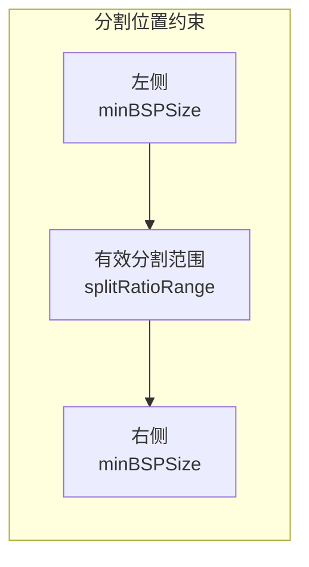

---

## 3. 房间放置规则

### 3.1 房间尺寸规则

| 规则编号 | 规则 | 说明 |
|----------|------|------|
| ROOM-001 | `roomSize = leafSize × roomFillRatio × (1 ± 0.1)` | 基础尺寸带±10%随机变化 |
| ROOM-002 | `roomSize >= corridorWidth + 3` | 至少能容纳走廊+余量 |
| ROOM-003 | `roomSize <= leafSize - roomPadding × 2` | 不超过叶节点减去边距 |

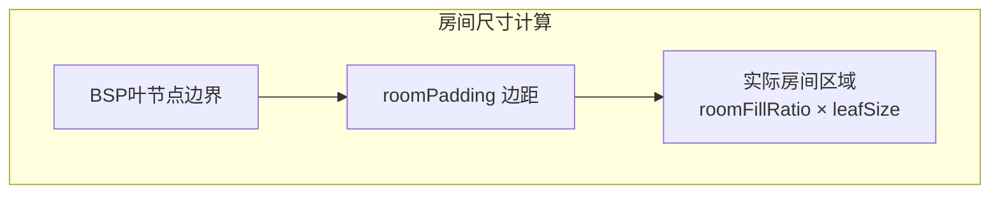

### 3.2 房间位置规则

| 规则编号 | 规则 | 说明 |
|----------|------|------|
| ROOM-004 | `roomX >= leafX + roomPadding` | 左边距约束 |
| ROOM-005 | `roomY >= leafY + roomPadding` | 下边距约束 |
| ROOM-006 | `roomX + roomWidth <= leafXMax - roomPadding` | 右边距约束 |
| ROOM-007 | `roomY + roomHeight <= leafYMax - roomPadding` | 上边距约束 |
| ROOM-008 | 在有效范围内随机偏移 | 避免房间总是居中 |

### 3.3 入口/出口房间标记规则

| 规则编号 | 规则 | 说明 |
|----------|------|------|
| ROOM-009 | 距离 startPos 最近的房间标记为入口房间 | `isEntrance = true` |
| ROOM-010 | 距离 endPos 最近的房间标记为出口房间 | `isExit = true` |
| ROOM-011 | 入口房间类型设为 `RoomType.Entrance` | 用于后续处理 |
| ROOM-012 | 出口房间类型设为 `RoomType.Exit` | 用于后续处理 |

---

## 4. 图连接规则

### 4.1 Delaunay 三角剖分规则

| 规则编号 | 规则 | 说明 |
|----------|------|------|
| GRAPH-001 | 使用房间中心点作为顶点 | 不使用边界点 |
| GRAPH-002 | 只有2个房间时直接连接 | 跳过三角剖分 |
| GRAPH-003 | 移除包含超级三角形顶点的三角形 | 清理辅助结构 |
| GRAPH-004 | 边去重（使用 HashSet） | 避免重复边 |

### 4.2 最小生成树规则

| 规则编号 | 规则 | 说明 |
|----------|------|------|
| GRAPH-005 | 按距离升序排序边 | 优先选择短边 |
| GRAPH-006 | 使用并查集检测环路 | 只添加不形成环的边 |
| GRAPH-007 | MST边数 = 房间数 - 1 | 达到后停止 |
| GRAPH-008 | MST边标记 `isMST = true` | 区分必要连接 |

### 4.3 额外边选择规则

| 规则编号 | 规则 | 说明 |
|----------|------|------|
| GRAPH-009 | `extraCount = round(mstEdges.count × extraEdgeRatio)` | 额外边数量 |
| GRAPH-010 | 前半部分选择最短的非MST边 | 优先短边 |
| GRAPH-011 | 后半部分随机选择非MST边 | 增加随机性 |
| GRAPH-012 | `finalEdges = mstEdges + extraEdges` | 最终边列表 |

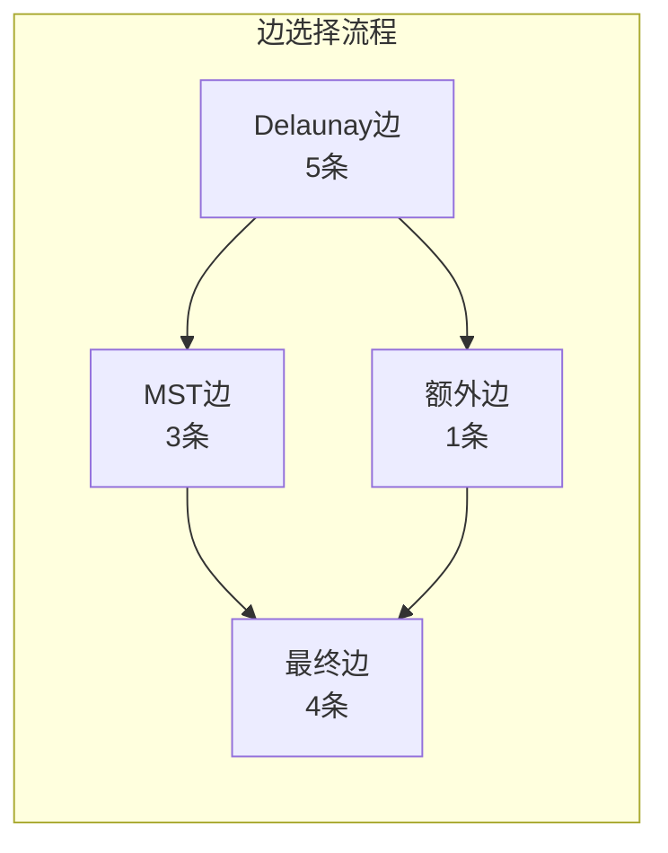

---

## 5. 走廊生成规则

### 5.1 走廊类型规则

| 规则编号 | 规则 | 说明 |
|----------|------|------|
| CORR-001 | `random < lShapeCorridorChance` → L形走廊 | 默认70%概率 |
| CORR-002 | L形走廊随机选择先水平或先垂直 | 50%概率 |
| CORR-003 | 走廊宽度 = `corridorWidth` | 默认3格 |

### 5.2 走廊路径规则

| 规则编号 | 规则 | 说明 |
|----------|------|------|
| CORR-004 | 起点 = roomA.GetClosestPointTo(roomB.center) | 从A边界最近点 |
| CORR-005 | 终点 = roomB.GetClosestPointTo(roomA.center) | 到B边界最近点 |
| CORR-006 | 拐角处额外挖掘正方形区域 | 确保转弯顺畅 |

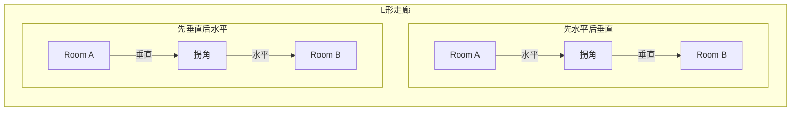

### 5.3 走廊宽度规则

| 规则编号 | 规则 | 说明 |
|----------|------|------|
| CORR-007 | `corridorWidth >= 3` | 至少容纳玩家(2×2)+余量 |
| CORR-008 | 走廊中心线两侧各挖 `halfWidth` 格 | 对称挖掘 |
| CORR-009 | 边界检查：只挖有效坐标 | 防止越界 |

---

## 6. 连通性保障规则

### 6.1 双向游走规则

| 规则编号 | 规则 | 说明 |
|----------|------|------|
| CONN-001 | 正向游走：startPos → endPos | 入口到出口 |
| CONN-002 | 反向游走：endPos → startPos | 出口到入口 |
| CONN-003 | 只挖墙壁，保留平台 | `DigBrushWallsOnly` |
| CONN-004 | 刷子尺寸 = `walkBrushSize` | 默认3格 |

### 6.2 移动方向规则

| 规则编号 | 规则 | 说明 |
|----------|------|------|
| CONN-005 | `random < horizontalBias && dx != 0` → 水平移动 | 默认70%水平偏好 |
| CONN-006 | `dy != 0` → 垂直移动 | 否则垂直移动 |
| CONN-007 | `dx != 0 && dy == 0` → 强制水平移动 | 已在目标Y轴上 |
| CONN-008 | 默认移动方向由 `preferRight` 决定 | 正向向右，反向向左 |

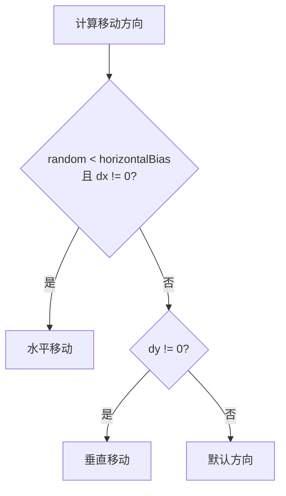

### 6.3 终止条件规则

| 规则编号 | 规则 | 说明 |
|----------|------|------|
| CONN-009 | `|current - target| <= brushSize/2` → 到达 | 允许误差 |
| CONN-010 | `steps >= maxSteps` → 强制终止 | `maxSteps = (w+h)×3` |
| CONN-011 | 边界约束：`clamp(pos, halfBrush+1, size-halfBrush-2)` | 防止越界 |

---

## 7. 平台注入规则

### 7.1 保护区规则

| 规则编号 | 规则 | 说明 |
|----------|------|------|
| PLAT-001 | 入口周围 6 格范围不放置平台 | 入口保护区 |
| PLAT-002 | 出口周围 6 格范围不放置平台 | 出口保护区 |
| PLAT-003 | 平台之间最小间距 = `platformExclusionRadius` | 默认4格 |

### 7.2 垂直落差规则

| 规则编号 | 规则 | 说明 |
|----------|------|------|
| PLAT-004 | `gapHeight > maxJumpHeight` → 需要平台 | 超过跳跃高度 |
| PLAT-005 | `effectiveJumpHeight = hasDoubleJump ? maxJumpHeight×2-2 : maxJumpHeight` | 考虑二段跳 |
| PLAT-006 | `platformsNeeded = ceil(gapHeight / effectiveJumpHeight)` | 计算需要的平台数 |
| PLAT-007 | 平台间距 = `max(gapHeight/(platformsNeeded+1), 3)` | 最小间距3格 |

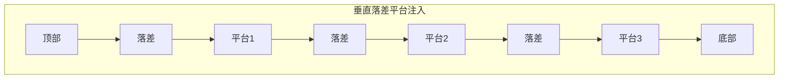

### 7.3 水平跳跃规则

| 规则编号 | 规则 | 说明 |
|----------|------|------|
| PLAT-008 | `horizontalGap > maxHorizontalJump` → 需要平台 | 超过水平跳跃距离 |
| PLAT-009 | 平台放置在水平落差中点 | `midX = (lastSolidX + x) / 2` |

### 7.4 平台尺寸规则

| 规则编号 | 规则 | 说明 |
|----------|------|------|
| PLAT-010 | `platformWidth ∈ [minPlatformWidth, maxPlatformWidth]` | 宽度范围 |
| PLAT-011 | 30%概率使用随机宽度，否则使用最小宽度 | 增加变化 |
| PLAT-012 | 平台居中放置 | `x ∈ [centerX-halfWidth, centerX+halfWidth]` |

### 7.5 平台有效性规则

| 规则编号 | 规则 | 说明 |
|----------|------|------|
| PLAT-013 | 位置必须是 `TileType.Floor` | 只能放在空气中 |
| PLAT-014 | 不在排斥区内 | 检查 `exclusionZones` |
| PLAT-015 | 头顶有足够空间（2格） | 玩家高度 |
| PLAT-016 | 有足够的连续空气宽度 | `>= minPlatformWidth` |

### 7.6 平台数量规则

| 规则编号 | 规则 | 说明 |
|----------|------|------|
| PLAT-017 | `platformsPlaced < maxPlatforms` | 不超过最大数量 |
| PLAT-018 | 达到上限后停止注入 | 所有注入循环都检查 |

---

## 8. 敌人生成点规则

### 8.1 地面生成点规则

| 规则编号 | 规则 | 说明 |
|----------|------|------|
| SPAWN-001 | 位置是 `TileType.Floor` | 必须是空气 |
| SPAWN-002 | 下方是实心块（墙壁或平台） | `IsSolid(x, y-1)` |
| SPAWN-003 | 头顶有2格空间 | `Floor(x, y+1) && Floor(x, y+2)` |
| SPAWN-004 | 连续地面长度 >= `minGroundSpan` | 默认4格 |
| SPAWN-005 | 生成点位于连续地面中心 | `centerX = (startX + endX) / 2` |

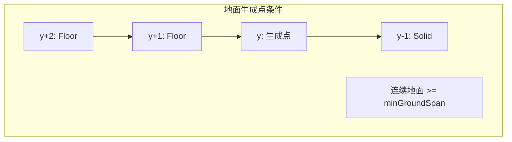

### 8.2 空中生成点规则

| 规则编号 | 规则 | 说明 |
|----------|------|------|
| SPAWN-006 | 位置是 `TileType.Floor` | 必须是空气 |
| SPAWN-007 | 四周都是空气 | 上下左右都是 Floor |
| SPAWN-008 | 距地面高度 >= `minAirHeight` | 默认4格 |
| SPAWN-009 | 随机概率筛选 (15%) | `random < 0.15` |
| SPAWN-010 | 边距约束：距边界至少2格 | 避免边缘 |

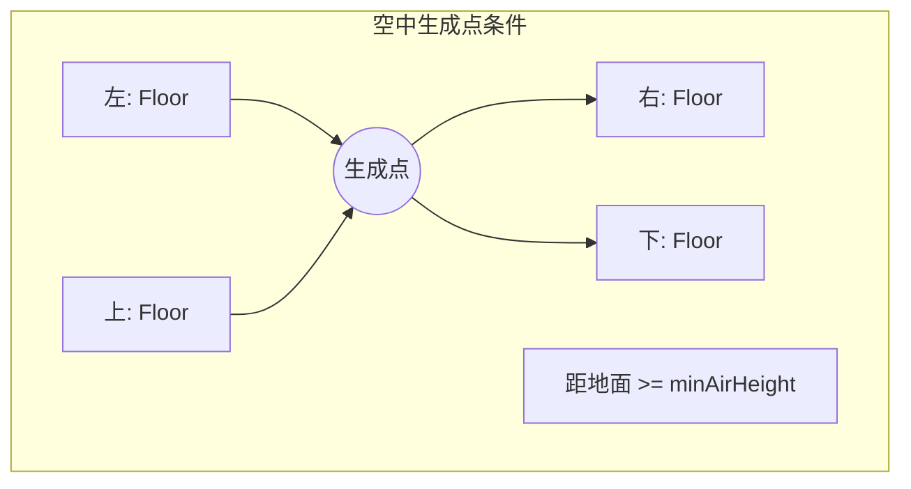

### 8.3 Boss 生成点规则

| 规则编号 | 规则 | 说明 |
|----------|------|------|
| SPAWN-011 | 仅在 Boss 房间生成 | `roomType == RoomType.Boss` |
| SPAWN-012 | 位置：房间中央偏右 | `x = width - wallThickness - 10` |
| SPAWN-013 | 高度：地面上方1格 | `y = groundLevel + 1` |
| SPAWN-014 | 类型标记为 `SpawnType.Boss` | 区分普通生成点 |

### 8.4 生成点筛选规则

| 规则编号 | 规则 | 说明 |
|----------|------|------|
| SPAWN-015 | 随机打乱生成点列表 | Fisher-Yates 洗牌 |
| SPAWN-016 | 总数不超过 `maxEnemies` | 默认5个 |
| SPAWN-017 | 任意两点距离 >= `minSpawnDistance` | 默认6格 |
| SPAWN-018 | 按顺序筛选，跳过距离过近的点 | 保证间距 |

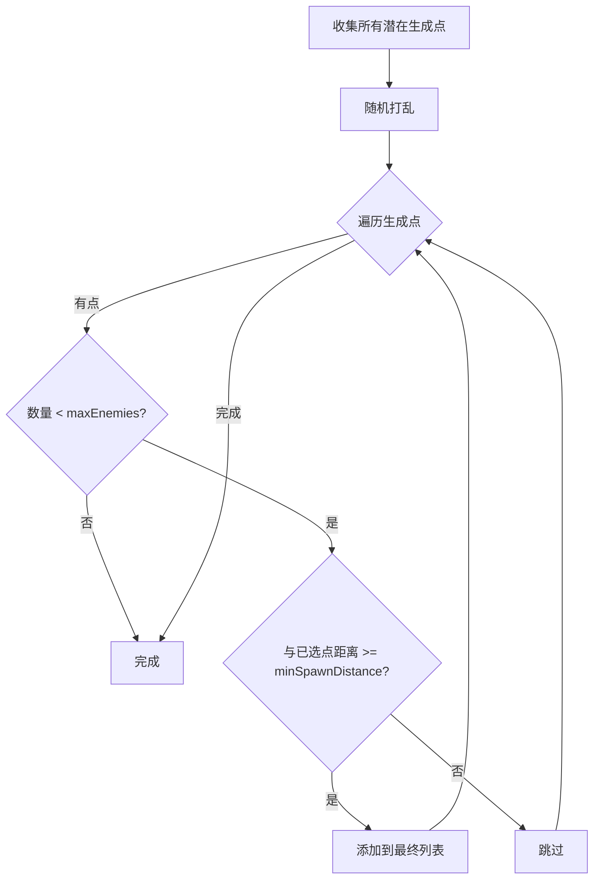

---

## 9. 后处理规则

### 9.1 孤岛移除规则

| 规则编号 | 规则 | 说明 |
|----------|------|------|
| POST-001 | 从 startPos 开始 BFS 标记可达区域 | 四方向扩展 |
| POST-002 | 非墙壁且不可达的格子设为墙壁 | 移除孤岛 |

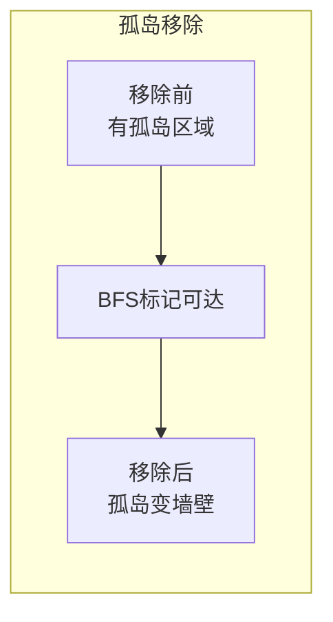

### 9.2 出入口清理规则

| 规则编号 | 规则 | 说明 |
|----------|------|------|
| POST-003 | 入口清理深度 = `entranceClearDepth` | 默认5格 |
| POST-004 | 清理高度 = 3格 | 玩家高度(2) + 余量(1) |
| POST-005 | 清理区域设为 Floor | 确保可通行 |
| POST-006 | 清理区域下方设为 Wall | 确保有地面 |

---

## 10. 特殊房间规则

### 10.1 入口房间规则

| 规则编号 | 规则 | 说明 |
|----------|------|------|
| SPEC-001 | 简单矩形结构 | 无 BSP 分割 |
| SPEC-002 | 完整平坦地面 | 地面层保持为墙壁 |
| SPEC-003 | 无平台 | 不执行平台注入 |
| SPEC-004 | 无怪物生成点 | `potentialSpawns.Clear()` |
| SPEC-005 | 左右两侧开放 | 3格高通道 |
| SPEC-006 | `needsDoorAtExit = false` | 不需要门 |

### 10.2 Boss 房间规则

| 规则编号 | 规则 | 说明 |
|----------|------|------|
| SPEC-007 | 大型矩形竞技场 | 无 BSP 分割 |
| SPEC-008 | 完整平坦地面 | 地面层保持为墙壁 |
| SPEC-009 | 无平台 | 不执行平台注入 |
| SPEC-010 | 只有 Boss 生成点 | 1个 SpawnType.Boss |
| SPEC-011 | 左侧开放，右侧有门 | 门在 Boss 击杀后消失 |
| SPEC-012 | `needsDoorAtExit = true` | 需要在出口放置门 |

---

## 11. 参数约束规则

### 11.1 自动修正规则

| 规则编号 | 规则 | 说明 |
|----------|------|------|
| PARAM-001 | `roomWidth = max(roomWidth, minBSPSize × 2)` | 确保可分割 |
| PARAM-002 | `roomHeight = max(roomHeight, minBSPSize × 2)` | 确保可分割 |
| PARAM-003 | `corridorWidth = max(corridorWidth, 3)` | 至少容纳玩家 |
| PARAM-004 | `walkBrushSize = max(walkBrushSize, 3)` | 至少容纳玩家 |
| PARAM-005 | `platformWidthRange.x = max(platformWidthRange.x, 3)` | 最小平台宽度 |
| PARAM-006 | 如果 `platformWidthRange.x > y`，交换 x 和 y | 确保范围有效 |

---

## 12. 规则优先级

当规则冲突时，按以下优先级处理：

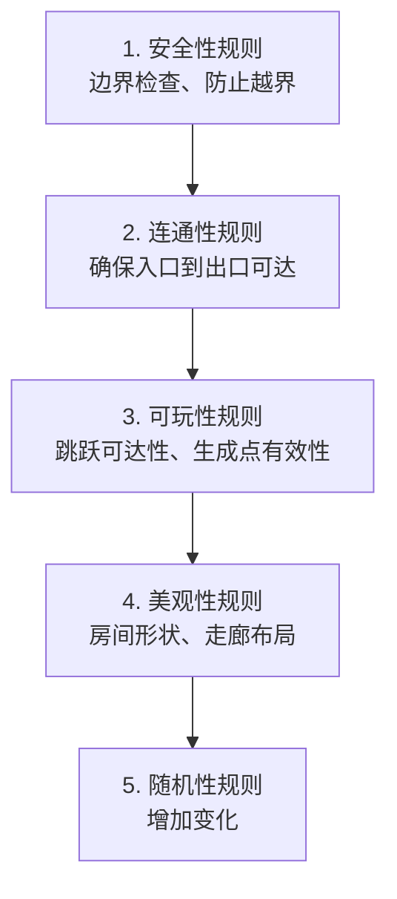

---

*文档版本: v0.2*
*最后更新: 2024*
