# 房间生成器 V2 技术设计文档

## 1. 系统架构

### 1.1 整体架构图

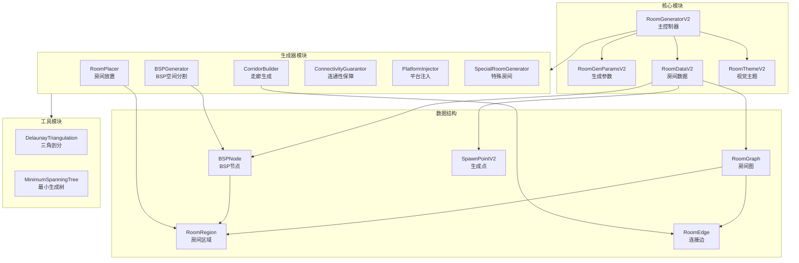

### 1.2 目录结构

```
SmallRoom v0.2/
├── Core/                           # 核心模块
│   ├── RoomGeneratorV2.cs          # 主生成器控制器
│   ├── RoomGenParamsV2.cs          # 生成参数配置
│   └── TileTypeV2.cs               # 瓦片类型枚举
│
├── Data/                           # 数据结构
│   ├── RoomDataV2.cs               # 房间数据容器
│   ├── BSPNode.cs                  # BSP树节点
│   ├── RoomGraph.cs                # 房间连接图
│   ├── RoomRegion.cs               # 房间区域
│   └── SpawnPointV2.cs             # 敌人生成点
│
├── Generators/                     # 生成器模块
│   ├── BSPGenerator.cs             # BSP空间分割
│   ├── RoomPlacer.cs               # 房间放置器
│   ├── CorridorBuilder.cs          # 走廊生成器
│   ├── ConnectivityGuarantor.cs    # 连通性保障器
│   ├── PlatformInjector.cs         # 平台注入器
│   └── SpecialRoomGenerator.cs     # 特殊房间生成器
│
├── Settings/                       # 配置模块
│   └── RoomGenerationSettingsV2.cs # ScriptableObject配置
│
├── Utils/                          # 工具模块
│   ├── DelaunayTriangulation.cs    # Delaunay三角剖分
│   └── MinimumSpanningTree.cs      # 最小生成树算法
│
└── Documentation/                  # 文档
    ├── README_RoomGeneratorV2.md   # 功能说明文档
    ├── TECHNICAL_DESIGN.md         # 技术设计文档（本文档）
    ├── RULES.md                    # 规则文档
    └── API_REFERENCE.md            # API参考文档
```

---

## 2. 核心数据结构

### 2.1 RoomDataV2 (房间数据)

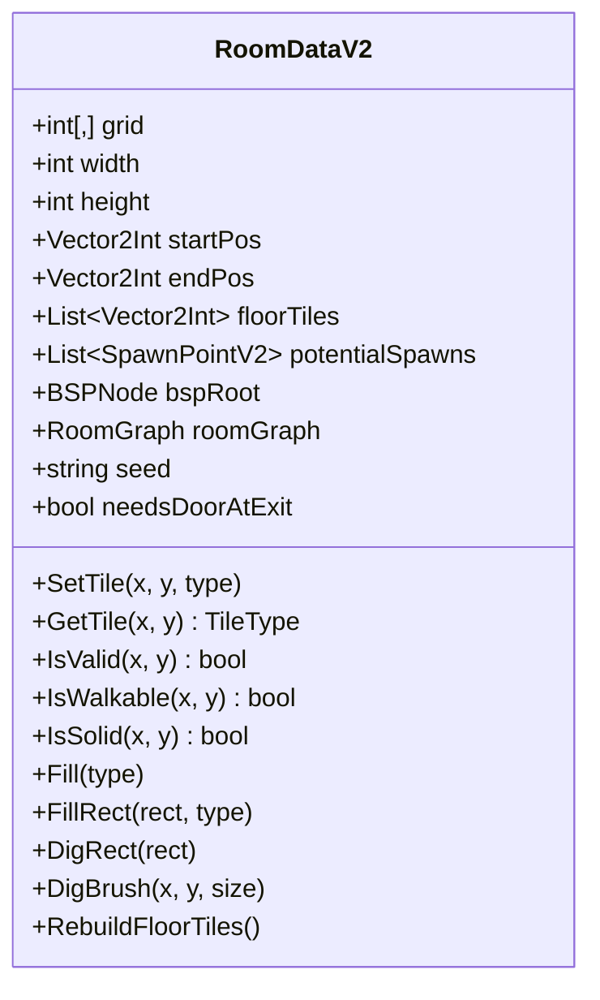

**数据流向图：**

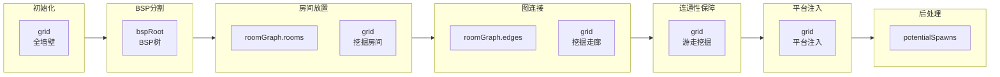

### 2.2 BSPNode (BSP树节点)

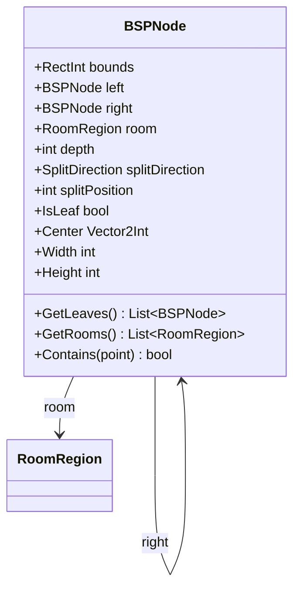

**BSP树结构示意：**

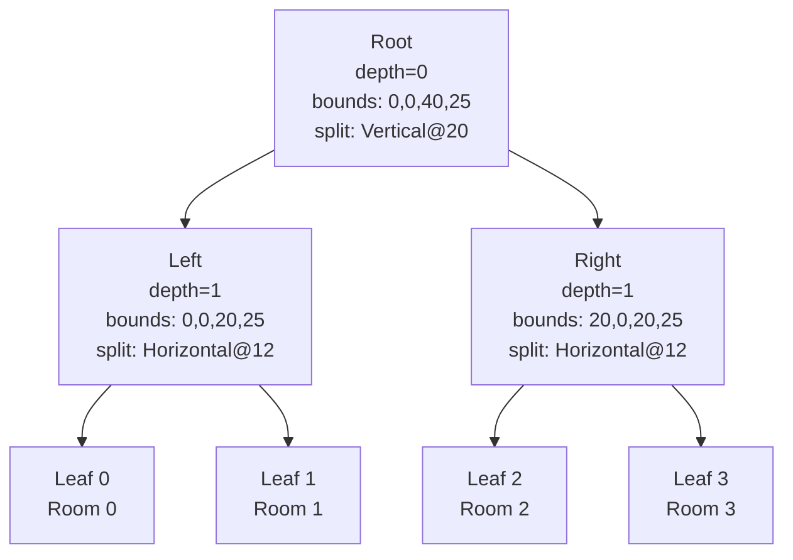

### 2.3 RoomGraph (房间连接图)

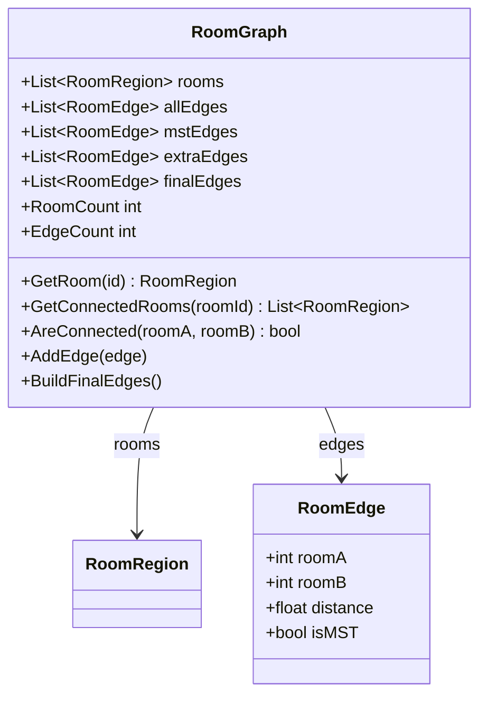

**图连接示意：**

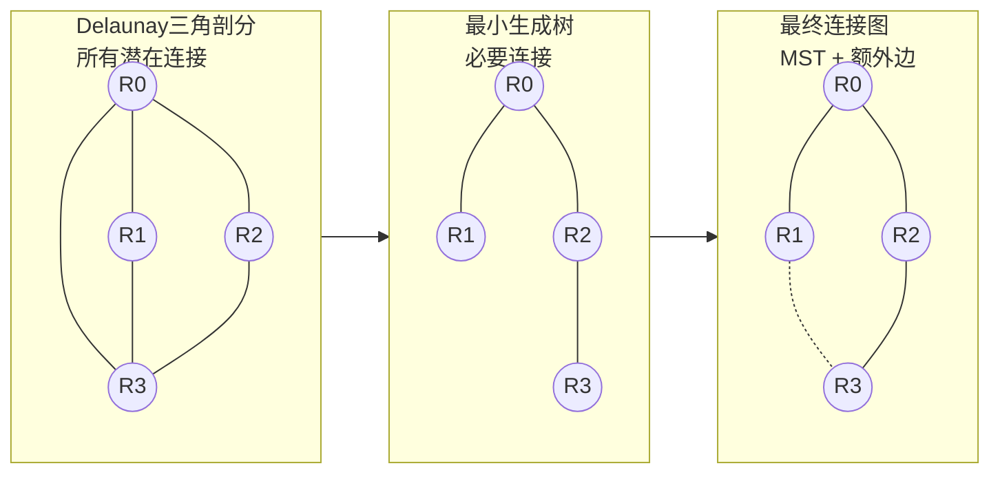

### 2.4 RoomRegion (房间区域)

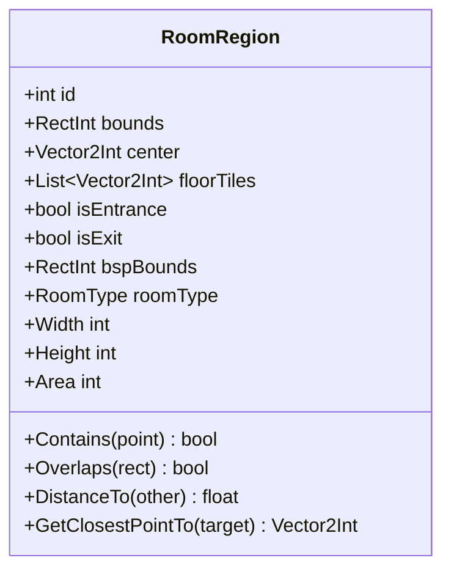

---

## 3. 核心算法

### 3.1 BSP空间分割算法

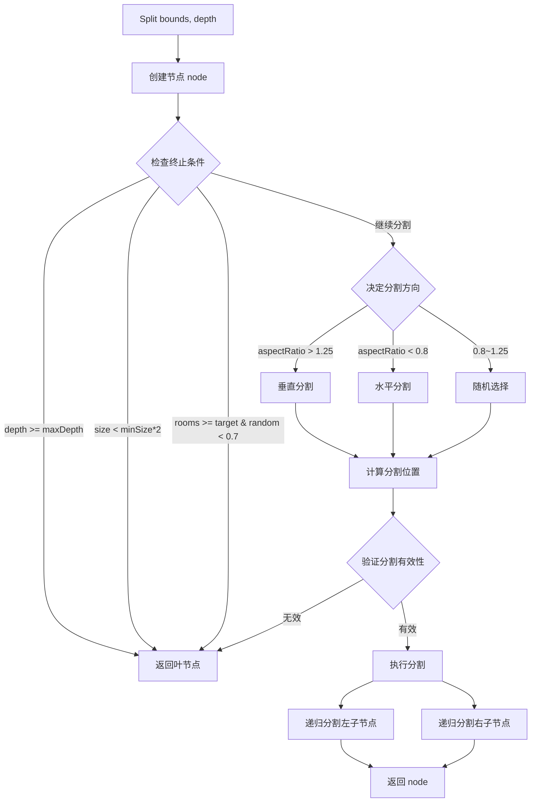

**分割方向决策：**

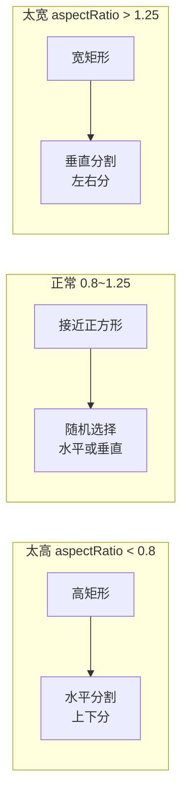

### 3.2 Delaunay三角剖分 (Bowyer-Watson算法)

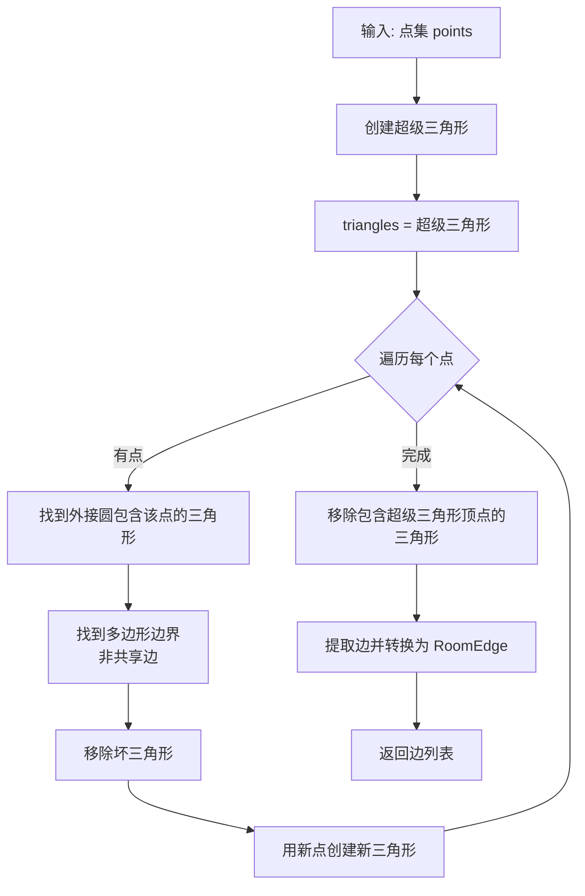

**外接圆判断：**

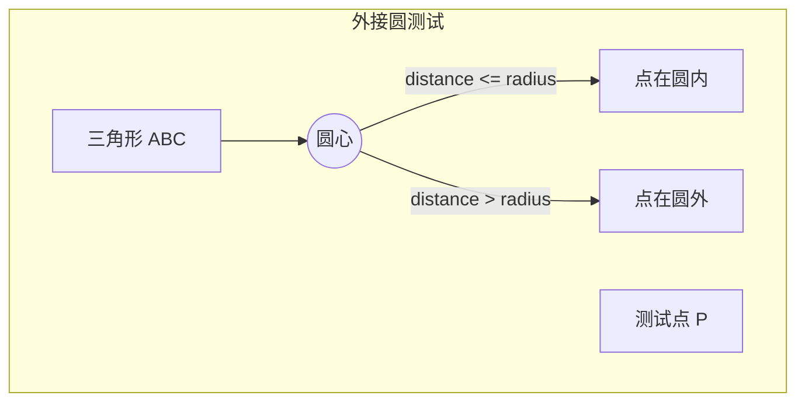

### 3.3 Kruskal最小生成树算法

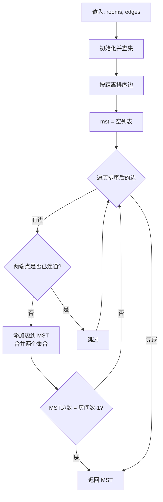

**并查集操作：**

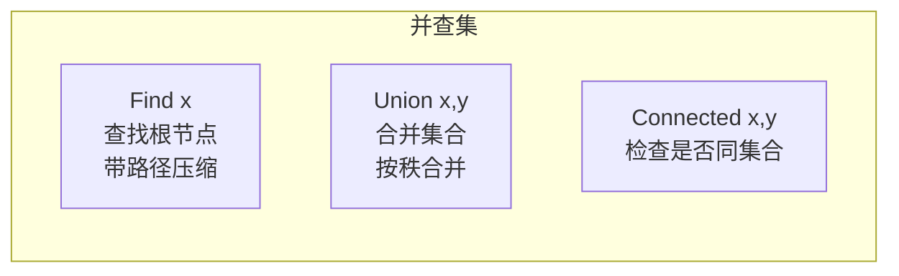

### 3.4 双向随机游走算法

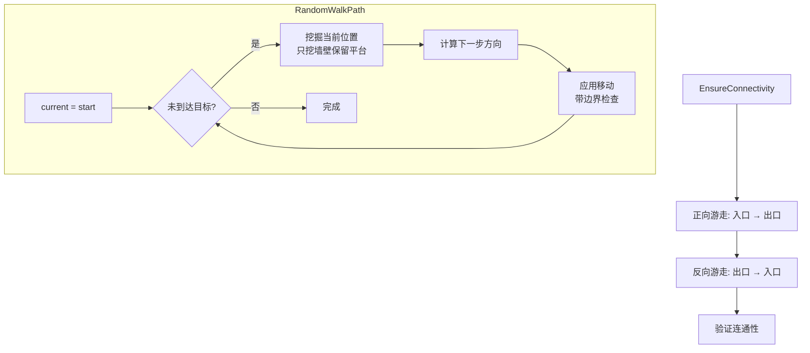

**移动方向决策：**

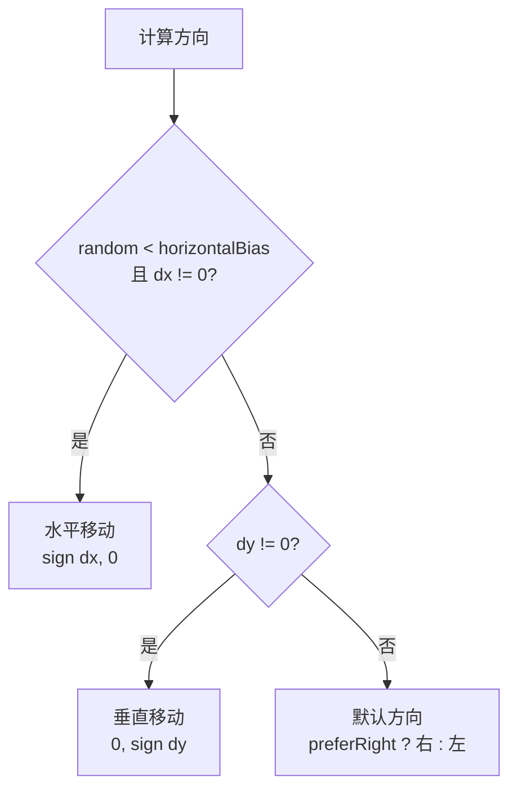

### 3.5 跳跃可达性分析算法

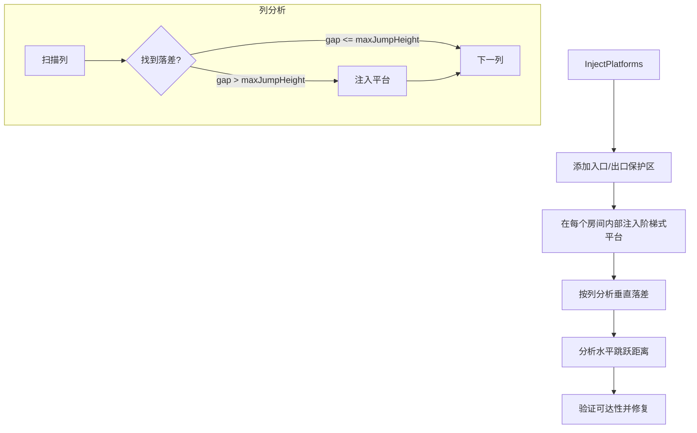

**平台注入示意：**

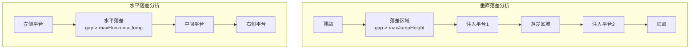

---

## 4. 模块职责

### 4.1 模块依赖关系

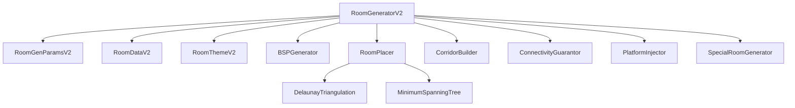

### 4.2 各模块职责

| 模块 | 职责 | 输入 | 输出 |
|------|------|------|------|
| **RoomGeneratorV2** | 协调各生成器模块的执行顺序 | RoomGenParamsV2 | RoomDataV2 |
| **BSPGenerator** | 递归分割空间生成BSP树 | RoomGenParamsV2, Random | BSPNode |
| **RoomPlacer** | 在BSP叶节点内创建房间区域 | BSPNode, RoomDataV2 | List\<RoomRegion\> |
| **CorridorBuilder** | 根据RoomGraph生成走廊 | RoomGraph, RoomDataV2 | 修改后的grid |
| **ConnectivityGuarantor** | 执行双向随机游走确保连通性 | RoomDataV2 | 修改后的grid |
| **PlatformInjector** | 分析落差并注入平台 | RoomDataV2 | 修改后的grid |
| **SpecialRoomGenerator** | 生成入口房间和Boss房间 | RoomDataV2, RoomGenParamsV2 | 修改后的RoomDataV2 |

---

## 5. 性能考虑

### 5.1 时间复杂度

| 阶段 | 算法 | 时间复杂度 | 说明 |
|------|------|------------|------|
| BSP分割 | 递归分割 | O(n) | n = 叶节点数 |
| 房间放置 | 遍历叶节点 | O(n) | n = 叶节点数 |
| Delaunay | Bowyer-Watson | O(n²) | n = 房间数 |
| MST | Kruskal | O(E log E) | E = 边数 |
| 走廊生成 | 遍历边 | O(E × W) | W = 走廊宽度 |
| 连通性 | 随机游走 | O(W × H) | W,H = 房间尺寸 |
| 平台注入 | 列扫描 | O(W × H) | W,H = 房间尺寸 |
| 后处理 | BFS | O(W × H) | W,H = 房间尺寸 |

### 5.2 空间复杂度

| 数据结构 | 空间复杂度 | 说明 |
|----------|------------|------|
| grid | O(W × H) | 二维网格 |
| BSP树 | O(2n - 1) | n = 叶节点数 |
| RoomGraph | O(n + E) | n = 房间数, E = 边数 |
| floorTiles | O(W × H) | 最坏情况 |
| potentialSpawns | O(maxEnemies) | 有上限 |

---

## 6. 扩展点

### 6.1 新增房间类型

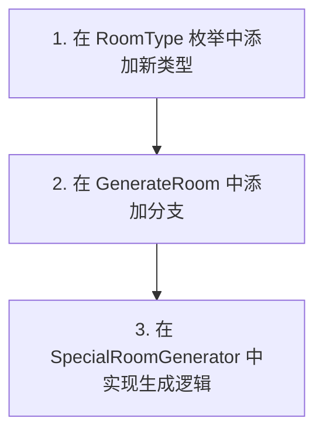

### 6.2 新增生成器模块

```mermaid
flowchart TD
    CREATE[1. 创建新的生成器类]
    INTEGRATE[2. 在 RoomGeneratorV2 中集成]
    CALL[3. 在生成流程中调用]
    
    CREATE --> INTEGRATE --> CALL
```

---

## 7. 版本历史

| 版本 | 日期 | 变更内容 |
|------|------|----------|
| v0.1 | - | 初始版本，基础随机游走 |
| v0.2 | - | 重构：BSP分割 + 图连接 + 跳跃分析 |

---

