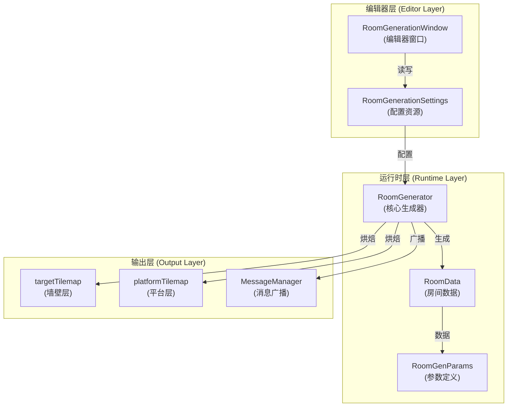
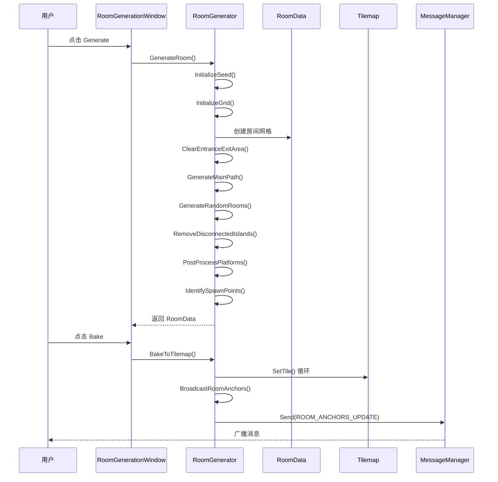
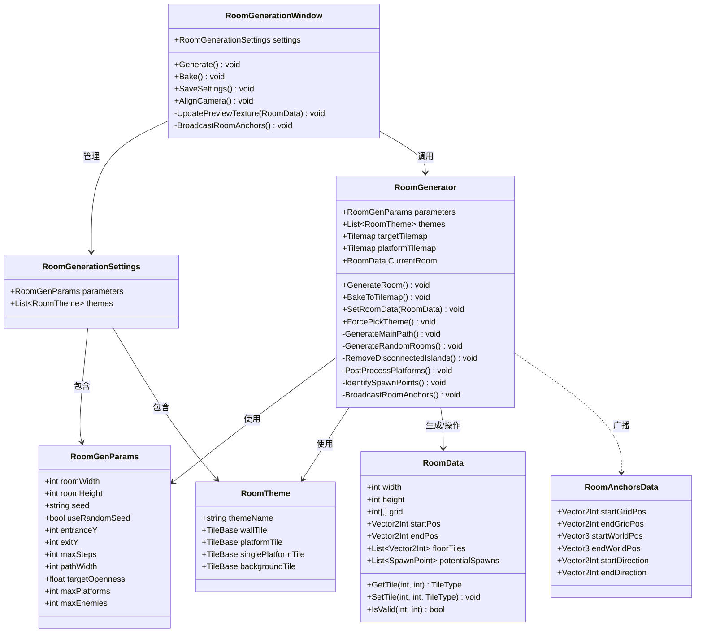
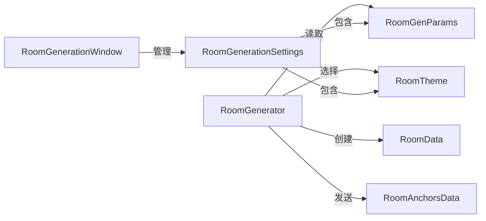

# 房间生成器 (Room Generator) v0.1 - 技术方案文档

## 1. 系统架构概览

### 1.1 整体架构图



### 1.2 生成流程时序图



---

## 2. 核心类设计

### 2.1 类图



### 2.2 核心类详解

#### RoomGenerator (核心生成器)

**职责**：

- 协调整个房间生成流程
- 管理房间数据和主题
- 烘焙到 Tilemap
- 广播出入口信息

**关键方法**：

- `GenerateRoom()`：执行完整的生成管线
- `BakeToTilemap()`：将房间数据转换为 Tilemap 瓦片
- `BroadcastRoomAnchors()`：发送或记录出入口信息

#### RoomData (房间数据)

**职责**：

- 存储房间的网格数据
- 提供瓦片查询和设置接口
- 维护地面列表和生成点列表

**关键属性**：

- `grid[,]`：二维网格，存储每个位置的 `TileType`
- `startPos / endPos`：出入口位置
- `potentialSpawns`：敌人生成点列表

#### RoomGenParams (参数定义)

**职责**：

- 定义所有可配置的生成参数
- 支持 Odin Inspector 编辑

**参数分类**：

- 基础设置：房间尺寸、种子
- 出入口设置：位置、强制生成
- 路径生成：游走步数、转向概率
- 房间挖掘：小厅尺寸、目标开阔度
- 平台生成：数量、宽度范围
- 敌人生成：最大数量、最小距离

---

## 3. 关键算法详解

### 3.1 主路径生成 (GenerateMainPath)

**目标**：确保从入口到出口的连通性

**算法步骤**：

1. 从 `startPos` 开始
2. 每步随机选择方向（70% 水平，30% 垂直）
3. 挖掘当前位置（宽度为 `pathWidth`）
4. 重复直到到达 `endPos`

**特点**：

- 偏向水平移动，避免形成深坑
- 垂直移动时强制后续水平移动
- 保证主路径绝对连通

```csharp
// 伪代码
while (current.x < target.x)
{
    Dig(current.x, current.y, pathWidth, pathWidth);

    if (Random.value < 0.7f)  // 70% 水平
        current.x++;
    else if (dy > 0)          // 30% 垂直
        current.y += Sign(dy);
}
```

### 3.2 随机房间生成 (GenerateRandomRooms)

**目标**：在主路径基础上增加房间多样性

**算法步骤**：

1. 生成初始大洞（`initialHolesCount` 个）
2. 循环生成随机房间直到达到 `targetOpenness`
3. 每次随机选择位置和尺寸，调用 `Dig()`

**特点**：

- 基于开阔度目标的迭代生成
- 避免在出入口附近生成房间
- 支持概率控制（`roomSpawnChance`）

### 3.3 孤岛移除 (RemoveDisconnectedIslands)

**目标**：清理无法从入口到达的区域

**算法步骤**：

1. 从 `startPos` 进行 BFS/DFS 洪泛填充
2. 标记所有可达的格子
3. 将不可达的非墙壁格子转换为墙壁

**时间复杂度**：O(width × height)

```csharp
// 伪代码
bool[,] reachable = new bool[width, height];
Queue<Vector2Int> queue = new Queue<Vector2Int>();
queue.Enqueue(startPos);
reachable[startPos.x, startPos.y] = true;

while (queue.Count > 0)
{
    Vector2Int p = queue.Dequeue();
    foreach (var neighbor in Get4Neighbors(p))
    {
        if (!reachable[neighbor.x, neighbor.y] &&
            GetTile(neighbor) != TileType.Wall)
        {
            reachable[neighbor.x, neighbor.y] = true;
            queue.Enqueue(neighbor);
        }
    }
}
```

### 3.4 单向平台生成 (PostProcessPlatforms)

**目标**：在垂直落差处自动生成平台

**算法步骤**：

1. 扫描每个 X 坐标，记录最后一个实心块的 Y 位置
2. 检测垂直落差 > 3 的区域
3. 在合适位置生成 3~5 格宽的平台
4. 使用排斥区防止平台聚集

**约束条件**：

- 平台下方必须有 2 格高的净空（供通行）
- 避免与出入口相邻
- 平台间距至少 4 格

### 3.5 敌人生成点识别 (IdentifySpawnPoints)

**分为两类**：

**地面生成点 (Ground Spawn)**：

- 条件：连续地面 ≥ `minGroundSpan` 格，下方有实心块，上方有 2 格净空
- 位置：连续地面的中点

**空中生成点 (Air Spawn)**：

- 条件：周围 1 格内都是地面，距地面高度 ≥ `minAirHeight`
- 概率：20% 随机选择（避免过密集）

**筛选**：

- 最多保留 `maxEnemies` 个
- 相邻生成点间距 ≥ `minSpawnDistance`

### 3.6 烘焙到 Tilemap (BakeToTilemap)

**目标**：将房间数据转换为 Unity Tilemap

**关键特性**：

1. **双 Tilemap 分离**：

   - `targetTilemap`：墙壁、地面、细长结构
   - `platformTilemap`：单向平台

2. **细长结构检测**：

   - 横梁：上下都不是墙 → 使用 `singlePlatformTile`
   - 立柱：左右都不是墙 → 使用 `singlePlatformTile`

3. **出入口走廊延伸**：

   - 在 Padding 区域检查是否对齐出入口 Y 坐标
   - 对齐则留空（不填墙），形成通透走廊
   - 其他 Padding 区域填充墙壁（支撑 Rule Tile）

4. **世界坐标转换**：
   ```csharp
   Vector3 worldPos = tilemap.CellToWorld(
       new Vector3Int(gridX, gridY, 0)
   ) + tilemap.tileAnchor;
   ```

---

## 4. 依赖关系

### 4.1 内部依赖



### 4.2 外部依赖

| 依赖                    | 来源                | 用途         |
| ----------------------- | ------------------- | ------------ |
| `UnityEngine.Tilemaps`  | Unity 内置          | Tilemap 操作 |
| `UnityEditor`           | Unity 内置          | 编辑器窗口   |
| `Sirenix.OdinInspector` | Odin Inspector 插件 | 参数编辑 UI  |
| `MessageManager`        | 项目内              | 消息广播     |
| `MessageDefine`         | 项目内              | 消息定义     |

### 4.3 命名空间

```csharp
namespace CryptaGeometrica.LevelGeneration.SmallRoom
{
    // 核心生成器
    public class RoomGenerator : MonoBehaviour { }
    public class RoomData { }
    public class RoomGenParams { }
    public struct RoomTheme { }
    public class RoomGenerationSettings : ScriptableObject { }

    // 枚举
    public enum TileType { Wall, Floor, Platform }
    public enum SpawnType { Ground, Air }
    public struct SpawnPoint { }
}
```

---

## 5. 数据流向

### 5.1 生成阶段数据流

```
RoomGenParams
    ↓
GenerateRoom()
    ├→ InitializeGrid() → RoomData (空网格 + Anchors)
    ├→ GenerateMainPath() → RoomData (主路径)
    ├→ GenerateRandomRooms() → RoomData (随机房间)
    ├→ RemoveDisconnectedIslands() → RoomData (清理孤岛)
    ├→ PostProcessPlatforms() → RoomData (添加平台)
    └→ IdentifySpawnPoints() → RoomData (标记生成点)
```

### 5.2 烘焙阶段数据流

```
RoomData
    ↓
BakeToTilemap()
    ├→ 遍历 grid[,]
    ├→ 检测细长结构
    ├→ 处理 Padding 区域
    ├→ SetTile() 到 targetTilemap
    ├→ SetTile() 到 platformTilemap
    └→ BroadcastRoomAnchors()
        ├→ CellToWorld() 转换坐标
        └→ Send(ROOM_ANCHORS_UPDATE)
```

---

## 6. 扩展点

### 6.1 可扩展的生成算法

当前系统可轻松集成以下算法：

1. **细胞自动机**：在 `PostProcessPlatforms` 后调用，平滑边缘
2. **柏林噪声**：控制地面起伏高度
3. **BSP 分割**：作为 `GenerateRandomRooms` 的替代方案
4. **语法生成**：定义房间逻辑链（如"先拿钥匙再开门"）

### 6.2 自定义钩子

```csharp
// 在 GenerateRoom() 中添加钩子
protected virtual void OnBeforeGenerate() { }
protected virtual void OnAfterGenerate() { }
protected virtual void OnBeforeBake() { }
protected virtual void OnAfterBake() { }
```

---

## 7. 性能分析

### 7.1 时间复杂度

| 步骤                      | 复杂度                                    | 说明                          |
| ------------------------- | ----------------------------------------- | ----------------------------- |
| GenerateMainPath          | O(width)                                  | 单次游走                      |
| GenerateRandomRooms       | O(iterations × width × height)            | 迭代次数取决于 targetOpenness |
| RemoveDisconnectedIslands | O(width × height)                         | BFS 洪泛填充                  |
| PostProcessPlatforms      | O(width × height)                         | 扫描所有格子                  |
| IdentifySpawnPoints       | O(width × height)                         | 扫描所有格子                  |
| BakeToTilemap             | O((width + padding) × (height + padding)) | 遍历所有瓦片                  |

### 7.2 空间复杂度

- `grid[,]`：O(width × height)
- `floorTiles`：O(width × height)（最坏情况）
- `potentialSpawns`：O(maxEnemies)

### 7.3 优化建议

- 使用对象池缓存 `RoomData`
- 预计算 Tilemap 的 CellToWorld 转换
- 在大规模生成时使用异步协程

---

## 8. 测试策略

### 8.1 单元测试

```csharp
[Test]
public void TestMainPathConnectivity()
{
    // 验证 startPos 到 endPos 的连通性
}

[Test]
public void TestEntranceExitClearing()
{
    // 验证出入口区域被正确清理
}

[Test]
public void TestSpawnPointGeneration()
{
    // 验证生成点数量 ≤ maxEnemies
}
```

### 8.2 集成测试

- 验证烘焙后的 Tilemap 与预览一致
- 验证消息广播的坐标准确性
- 验证不同参数组合的稳定性

---

_Last Updated: v0.1_
