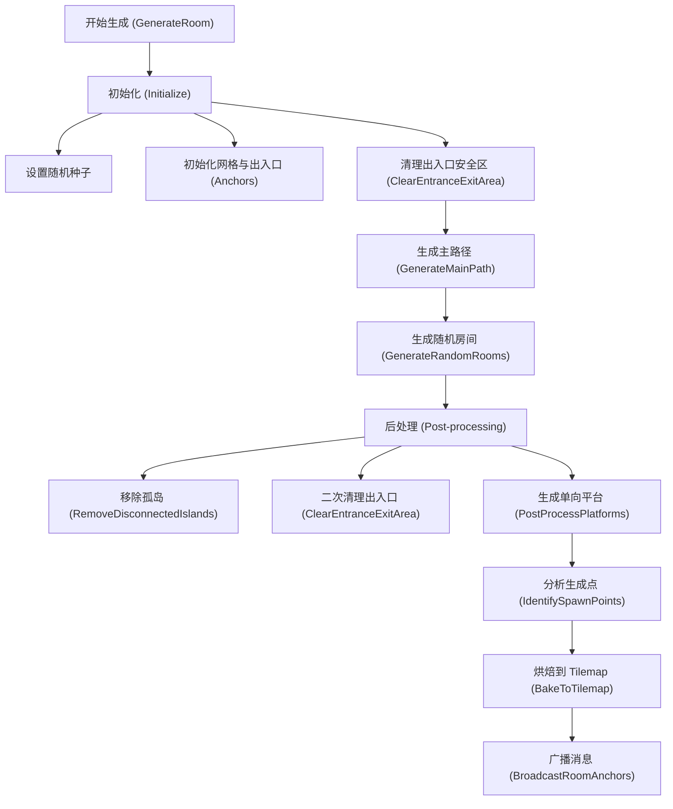
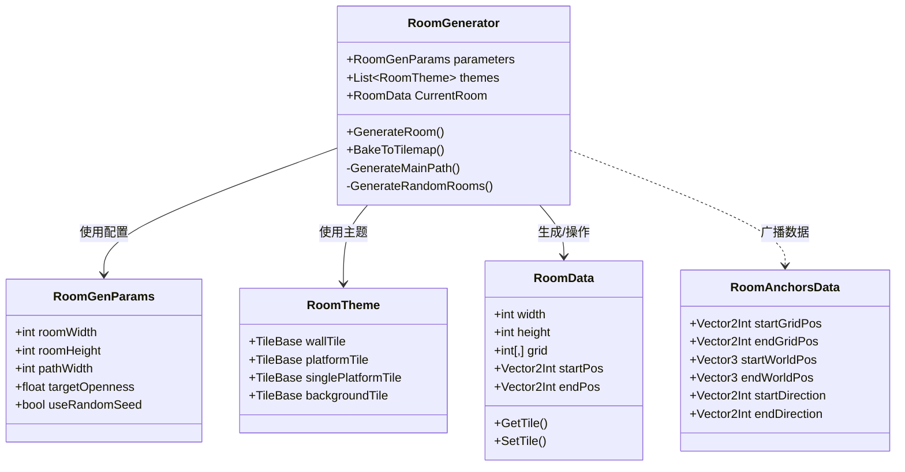

# 房间生成器 (Room Generator) v0.1 开发文档

## 1. 概述

`RoomGenerator` 是一个用于程序化生成 2D 侧视视角（Side-scrolling）关卡房间的工具。v0.1 版本专注于生成结构化的、连通的单一房间，支持自定义主题、自动烘焙到 Tilemap、以及与游戏运行时的消息系统集成。

主要特点包括：

- **路径优先生成**：确保入口到出口的主路径畅通。
- **混合生成策略**：结合随机游走（Random Walk）与随机房间挖掘（Random Rooms）以获得多样化的结构。
- **安全检测**：自动清理出入口区域，防止“堵门”现象。
- **Tilemap 自动分层**：自动将墙壁（Wall）和单向平台（Platform）烘焙到不同的 Tilemap Layer，以支持不同的碰撞逻辑（Composite Collider vs Platform Effector）。
- **编辑器集成**：提供可视化的编辑器窗口，支持预览、参数配置持久化、以及自动对齐摄像机。
- **运行时广播**：生成完成后自动广播出入口位置，便于放置角色或连接其他系统。

---

## 2. 核心架构与流程

### 2.1 生成管线流程图 (Generation Pipeline)

### 2.2 核心类图 (Class Diagram)

---

## 3. 功能详解

### 3.1 主路径生成 (Main Path Generation)

为了保证关卡的可玩性，算法首先生成一条从左侧入口 (`StartPos`) 到右侧出口 (`EndPos`) 的主路径。

- **策略**：使用改进的随机游走算法，偏向于向目标 X 方向移动。
- **防死角**：在垂直移动时，强制进行后续的水平移动或挖掘，防止形成无法跳出的深坑。
- **宽度控制**：路径宽度由 `pathWidth` 参数控制（默认 2 格），确保玩家可以通过。

### 3.2 出入口安全区 (Entrance/Exit Safety)

为了防止随机生成的墙壁堵住出入口，生成器在两个阶段执行 `ClearEntranceExitArea`：

1. **预处理**：在生成路径前，强制将出入口向内延伸 4 格的区域设为空气（Floor）。
2. **后处理**：在所有随机生成结束后，再次清理该区域，确保没有任何后续步骤意外覆盖了通道。
3. **边缘延伸**：在烘焙阶段（Bake），会将出入口的通道延伸到房间边界之外（Padding 区域），形成视觉上的通透走廊。

### 3.3 单向平台生成 (One-Way Platforms)

- **双 Tilemap 输出**：
  - **Wall Tilemap**：存放实体墙壁、地面。
  - **Platform Tilemap**：存放单向平台。支持 `PlatformEffector2D`。
- **智能放置**：仅在垂直落差较大（>3 格）且有足够水平空间的位置生成平台。
- **排斥区**：平台生成后会标记排斥区，防止平台过于密集。

### 3.4 消息广播系统 (Message Broadcast)

生成完成后，系统会通过 `MessageManager` 广播 `ROOM_ANCHORS_UPDATE` 消息。

- **触发时机**：仅在 `Application.isPlaying` 模式下发送消息；在 Editor 模式下直接打印详细 Log。
- **数据内容** (`RoomAnchorsData`)：
  - 网格坐标 (Grid Pos)
  - 世界坐标 (World Pos, 自动转换)
  - 出入口方位 (Direction: Left/Right)

---

## 4. 编辑器工具 (Editor Tools)

### 4.1 Room Generation Window

位于 `自制工具/程序化关卡/程序化房间生成`。

- **配置文件**：支持拖拽 `RoomGenerationSettings` 资源文件，实现配置持久化。
- **预览功能**：点击 **Generate** 可在窗口内实时预览生成的房间结构（小地图）。
- **烘焙功能**：点击 **Bake** 将预览的房间直接实例化到当前场景。
- **摄像机对齐**：Bake 后自动将 Scene/Game View 摄像机移动到房间中心并调整缩放。

### 4.2 Room Generation Settings

位于 `Create/自制工具/程序化关卡/房间生成配置文件`。

- 这是一个 `ScriptableObject`，用于保存所有的生成参数（尺寸、种子、敌人数量）和视觉主题（Tiles）。

---

## 5. 待优化项 (TODO)

- [ ] 支持更多方向的出入口（上/下）。
- [ ] 增加更多种类的房间结构模板。
- [ ] 优化敌人生存点的筛选逻辑。
